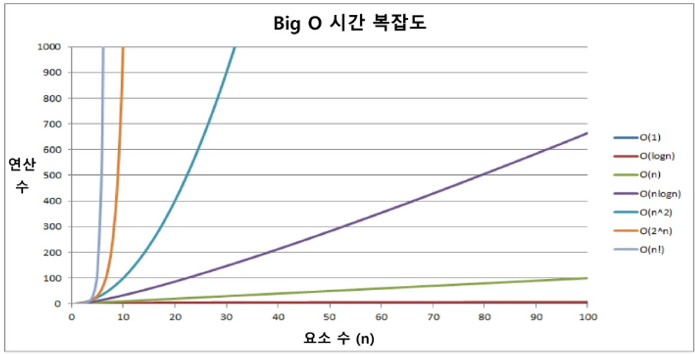

# 알고리즘

## 1. 알고리즘 정의
- 유한한 단계를 통해 문제를 해결하기 위한 절차나 방법
- 컴퓨터가 어떤 일을 수행하기 위한 단계적 방법
- 어떤 문제를 해결하기 위한 절차

 

## 2. 표현 방법
- 슈도코드 (의사코드)
- 순서도

 

## 3. 무엇이 좋은 알고리즘인가?
- 정확성 : 얼마나 정확하게 동작하는가?
- 작업량 : 얼마나 적은 연산으로 원하는 결과를 얻어내는가?
- 메모리 사용량 : 얼마나 적은 메모리를 사용하는가?
- 단순성 : 얼마나 단순한가?
- 최적성 : 더 이상 개선할 여지 없이 최적화되었는가?

 

## 4. 성능
- 주어진 문제를 해결하기 위해 여러 개의 다양한 알고리즘이 가능   -> 어떤 알고리즘을 사용해야 하는가?
- 성능 분석 필요 !
    - 많은 문제에서 성능 분석의 기준으로 알고리즘 작업량을 비교한다.
- 알고리즘 작업량 표현 시 시간복잡도 사용

 

## 5. 시간 복잡도
- 실제 걸리는 시간을 측정
- 실행되는 명령문의 개수를 계산

 

## 6. 빅-오 (O) 표기법
- 시간복잡도 함수 중 가장 큰 영향력을 주는 n에 대한 항만을 표시
- 계수는 생략하여 표시
- ex) n개의 데이터를 입력 받아 저장한 후 각 데이터에 1씩 증가시킨 후 각 데이터를화면에 출력하는 시간의 복잡도는?
    `O(n)`

 

