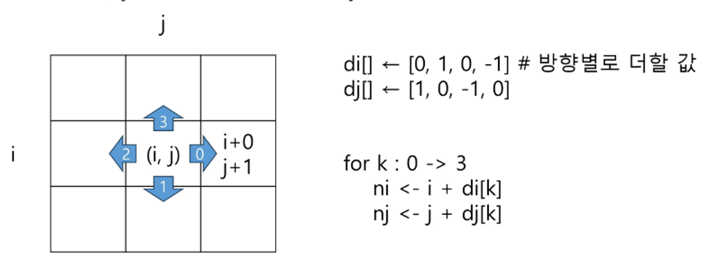
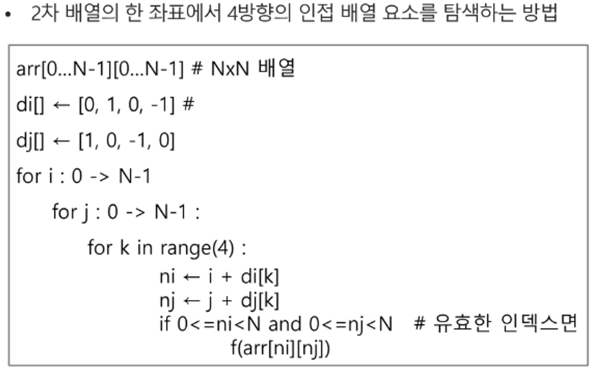

# 1. 배열

##  1) 배열이란?
- 일정한 자료형의 변수들을 하나의 이름으로 열거하여 사용하는 자료구조
- 6개의 변수를 사용해야 하는 경우, 이를 배열로 바꾸어 사용하는 예


## 2) 배열의 필요성
- 프로그램 내에서 여러 개의 변수가 필요할 때, 일일이 다른 변수명을 이용하여 자료에 접근하는 것은 매우 비효율적일 수 있다.
- 배열을 사용하면 하나의 선언을 통해 둘 이상의 변수를 선언할 수 있다.
- 닩순히 변수 선언을 의미하는 것이 아니라, 다수의 변수로는 하기 힘든 작업을 배열을 활용해 쉽게 할 수 있다.

<br><br>

# 2. 1차원 배열
## 1) 1차원 배열의 선언과 접근
- 별도의 선언 방법이 없으면 변수에 처음 값을 할당할 때 생성
- 이름 : 프로그램에서 사용한 배열의 이름
- ex) `Arr = list()`, `Arr = []`, `Arr = [1,2,3]`, `Arr = [0] * 10`
- 1차원 배열의 접근
    - `Arr[0] = 10` : 배열 Arr의 0번 원소에 10을 저장하라
    - `Arr[idx] = 20` : 배열 Arr의 idx번 원소에 20을 저장하라


## 2) 입력받은 정수를 1차원 배열에 저장하는 법

```python
# 첫 줄에 양수의 개수 N이 주어진다. (5<=N<=1000)
# 다음 줄에 빈칸으로 구분된 N개의 양수 Ai가 주어진다. (1<=Ai<=1000000)

N = int(input())
arr = list(map(int, input().split()))
```

<br><br>

# 3. 2차원 배열
## 1) 2차원 배열의 선언
- 1차원 List를 묶어놓은 List
- 2차원 이상의 다차원 List는 차원에 따라 index를 선언
- 2차원 List의 선언 : 세로 길이 (행의 개수), 가로 길이 (열의 개수)를 필요로 함.
Python에서는 데이터 초기화를 통해 변수 선언과 초기화가 가능
- `arr = [[0, 1, 2, 3], [4, 5, 6, 7]]` (2행 4열의 2차원 리스트)
    ```python
    '''
    3
    1 2 3
    4 5 6
    7 8 9
    '''

    N = int(input())
    arr = [list(map(int, input().split())) for _ in range(N)]

    '''
    3
    123
    456
    789
    '''
    N = int(input())
    arr = [list(map(int, input())) for _ in range(N)]
    ```
## 2) 2차원 배열의 접근
| 배열 순회 : n*m 배열의 n*m개의 모든 원소를 빠짐 없이 조사하는 방법

- 행 우선 순회
    ```python
    # i 행의 좌표
    # j 열의 좌표

    for i in range(n):
        for j in range(m):
            f(array]i][j]) # 필요한 연산 수행
    ```

- 열 우선 순회
    ```python
    # i 행의 좌표
    # j 열의 좌표

    for j in range(m):
        for i in range(n):
            f(array]i][j]) # 필요한 연산 수행
    ```
- 지그재그 순회
    ```python
    # i 행의 좌표
    # j 열의 좌표

    for i in range(n):
        for j in range(m):
            f(array[i][j+(m-1-2*j)*(i%2)]) # 필요한 연산 수행
    ```
- 델타를 이용한 2차 배열 탐색
    - 2차 배열의 한 좌표에서 4방향의 인접 배열 요소를 탐색하는 방법
    - 인덱스 `(i, j)`인 칸의 상하좌우 칸 `(ni, nj)`

    

    

## 3) 2차원 배열의 활용 - 전치행렬
- 대각성분을 기준으로 대칭으로 자리를 바꾼 행렬
```python
# i : 행의 좌표, len(arr)
# j : 열의 좌표, len(arr[0])

arr = [[1,2,3], [4,5,6], [7,8,9]] # 3*3행렬

for i in range(3):
	for j in range(3):
		if i < j :
			arr[i][j], arr[j][i] = arr[j][i], arr[i][j]
```

## 4) i, j의 크기에 따라 접근하는 원소 비교
- `i < j` : 대각 성분 기준 위쪽 성분들
- `i == j` : 기울기가 1인 대각 성분
- `i > j` : 대각 성분 기준 아래쪽 성분들
- `2-i == j` : 기울기가 -1인 대각 성분
