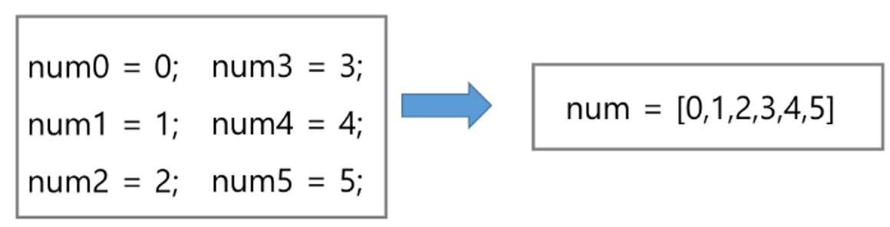

# 1. 배열 1

##  1) 배열이란?
- 일정한 자료형의 변수들을 하나의 이름으로 열거하여 사용하는 자료구조
- 6개의 변수를 사용해야 하는 경우, 이를 배열로 바꾸어 사용하는 예



<br>

## 2) 배열의 필요성
- 프로그램 내에서 여러 개의 변수가 필요할 때, 일일이 다른 변수명을 이용하여 자료에 접근하는 것은 매우 비효율적일 수 있다.
- 배열을 사용하면 하나의 선언을 통해 둘 이상의 변수를 선언할 수 있다.
- 닩순히 변수 선언을 의미하는 것이 아니라, 다수의 변수로는 하기 힘든 작업을 배열을 활용해 쉽게 할 수 있다.

<br>

## 3) 1차원 배열의 선언과 접근
- 별도의 선언 방법이 없으면 변수에 처음 값을 할당할 때 생성
- 이름 : 프로그램에서 사용한 배열의 이름
- ex) `Arr = list()`, `Arr = []`, `Arr = [1,2,3]`, `Arr = [0] * 10`
- 1차원 배열의 접근
    - `Arr[0] = 10` : 배열 Arr의 0번 원소에 10을 저장하라
    - `Arr[idx] = 20` : 배열 Arr의 idx번 원소에 20을 저장하라

<br>

## 4) 입력받은 정수를 1차원 배열에 저장하는 법

```python
# 첫 줄에 양수의 개수 N이 주어진다. (5<=N<=1000)
# 다음 줄에 빈칸으로 구분된 N개의 양수 Ai가 주어진다. (1<=Ai<=1000000)

N = int(input())
arr = list(map(int, input().split()))
```
<br>

# 2. 정렬
- 2개 이상의 자료를 특정 기준에 의해 작은 값부터 큰 값 (오름차순), 혹은 그 반대의 순서대로 (내림차순) 재배열하는 것
- 키 : 자료를 정렬하는 기준이 되는 특정 값
- 대표적인 정렬 방식의 종류
    - **버블 정렬 (Bubble Sort)**
    - **카운팅 정렬 (Counting Sort)**
    - **선택 정렬 (Selection Sort)**
    - 퀵 정렬 (Quick Sort)
    - 삽입 정렬 (Insertion Sort)
    - 병합 정렬 (Merge Sort)

<br>

## 1) 버블 정렬 `Bubble Sort`

- 인접한 두 개의 원소를 비교하며 자리를 계속 교환하는 방식
- 정렬 과정
    - 첫 번째 원소부터 인접한 원소끼리 계속 자리를 교환하면서 맨 마지막 자리까지 이동한다.
    - 한 단계가 끝나면 가장 큰 원소가 마지막 자리로 정렬된다.
    - 교환하며 자리를 이동하는 모습이 물 위에 올라오는 거품 모양과 같다고 하여 버블정렬이라고 한다.
- 시간 복잡도 : `(n^2)`
- 기준인덱스를 바꿔가는 방식, <br> 0 부터 늘려가는 방식

## 2) 카운팅 정렬 `Counting Sort`
- 집합에 각 항목이 몇 개씩 있는지 세는 작업을 하며, 선형 공간에 정렬하는 효율적인 알고리즘
- 제한사항
    - 정수나 정수로 표현할 수 있는 자료에 대해서만 적용 가능
        - 각 항목의 발생 횟수를 기록하기 위해, 정수 항목으로 인덱스되는 카운트들의 인덱스되는 카운트들의 배열을 사용하기 때문

    - 카운트들을 위한 충분한 공간을 할당하려면 집합 내의 가장 큰 정수를 알아야 한다.
- 시간 복잡도 : O(n+k)
    - n은 리스트 길이
    - k는 정수의 최댓값
- 정렬과정
    - 1단계 : Data에서 각 항목들의 발생횟수를 세고, 정수 항목들로 직접 인덱스되는 카운트 배열 counts에 저장한다.
    - 2단계 : 정렬된 집합에서 각 항목의 앞에 위치할 항목의 개수를 반영하기 위해 counts의 원소를 조정한다.
    - 3단계 : counts[1]을 감소시키고 Temp에 1을 삽입한다.
- 버블 정렬에 비해 효율적이지만, 코드는 복잡함.
    - N만큼 count 길이를 만들고 시작하니까, 메모리 낭비임.
