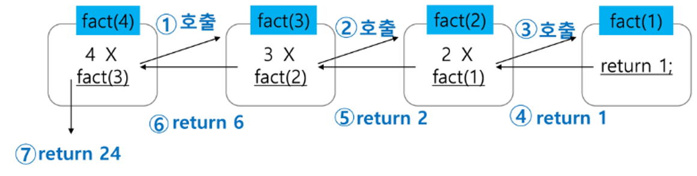

# 스택

## 1. 스택

### 1) 스택의 특성

- 물건을 쌓아 올리듯 자료를 쌓아 올린 형태의 자료구조이다.
- 스택에 저장된 자료는 선형 구조를 갖는다.
    - 선형구조 : 자료 간의 관계가 1대1의 관계를 갖는다.
    - 비선형구조 : 자료 간의 관계가 1대N의 관계를 갖는다. (ex. 트리)
- 스택에 자료를 삽입하거나 스택에서 자료를 꺼낼 수 있다.
- **마지막에 삽입한 자료를 가장 먼저 꺼낸다.**
    - 후입선출 (LIFO. Last-In-First-Out) 이라고 부른다.
    - 예를 들어 스택에 1,2,3 순으로 자료를 삽입한 후 꺼내면 역순으로 3,2,1 순으로 꺼낼 수 있다.

### 2) 스택을 프로그램에서 구현하기 위해 필요한 **자료구조**와 **연산**

- 자료구조 : 자료를 선형으로 저장할 저장소
    - 배열 사용 가능
    - 저장소 자체를 스택이라 부르기도 한다.
    - 스택에서 마지막으로 삽입된 원소의 위치를 top이라 부른다.
- 연산
    - 삽입 : 저장소에 자료를 저장한다. 보통 push라고 부른다.
    - 삭제 : 저장소에서 자료를 꺼낸다. 꺼낸 자료는 삽입한 자료의 역순으로 꺼낸다. 보통 pop이라고 부른다.
    - 스택이 공백인지 아닌지를 확인하는 연산 : isEmpty
    - 스택의 top에 있는 item(원소)을 반환하는 연산 : peek

### 3) 스택의 구현

- 스택의 삽입/삭제 과정
    - 빈 스택에 원소 A, B, C를 차례로 삽입 후 한번 삭제하는 연산 과정
    - top을 하나 올리고, 마지막에 저장된 위치 찾기
- 스택의 push 알고리즘
    - append 메소드를 통해 리스트의 마지막에 데이터를 삽입
        
        ```python
        def push(item):
            s.append(item)
            
        #############################
        
        def push(item, size):
            global top
            top += 1
            if top == size:
                print('overflow!')
            else:
                stack[top] = item
        
        size = 10
        stack = [0] * size
        top = -1
        
        push(10, size)
        top += 1  # push(20)
        stack[top] = 20
        ```
        
- 스택의 pop 알고리즘

```python
def my_pop():
    if len(s) == 0:
        # underflow
        return
    else:
        return s.pop()
        
###################################

def my_pop():
    global top
    if top == -1:
        print('underflow')
        return 0
    else:
        top -= 1
        return stack[top+1]
print(my_pop())

if top > -1 : # my_pop()
    top -= 1
    print(stack[top+1])

```

### 4) 스택구현의 고려사항

- 1차원 배열을 사용하여 구현할 경우 구현이 용이하다는 장점이 있지만 스택의 크기를 변경하기가 어렵다는 단점이 있다.
- 해결 방법 : 저장소를 동적으로 할당하여 스택을 구현하는 방법이 있다.
    - 동적 연결리스트를 이용하여 구현하는 방법 !!
    - 구현이 복잡하지만, 메모리를 효율적으로 사용한다는 장점이 있다.

### 5) 스택의 응용 1 : 괄호검사

- 문제
    - 괄호의 종류 : 대괄호, 중괄호, 소괄호
    - 조건
        - 왼쪽 괄호의 개수와 오른쪽 괄호의 개수가 같아야 한다.
        - 같은 괄호에서 왼쪽 괄호는 오른쪽 괄호보다 먼저 나와야 한다.
        - 괄호 사이에는 포함관계만 존재한다.
- 스택을 이용한 괄호 검사
    
    
- 괄호를 조사하는 알고리즘 개요
    - 문자열에 있는 괄호를 차례대로 조사하면서 왼쪽 괄호를 만나면 스택에 삽입하고, 오른쪽 괄호를 만나면 스택에서 top 괄호를 삭제한 후 오른쪽 괄호와 짝이 맞는지를 검사한다.
    - 이 때, 스택이 비어 있으면 조건 1 또는 조건 2에 위배되고 괄호의 짝이 맞지 않으면 조건 3에 위배된다.
    - 마지막 괄호까지를 조사한 후에도 스택에 괄호가 남아있으면 조건 1에 위배된다.

### 6) 스택의 응용 2 : function call

- 프로그램에서의 함수 호출과 복귀에 따른 수행 순서를 관리
- 가장 마지막에 호출된 함수가 가장 먼저 실행을 완료하고 복귀하는 후입선출 구조이므로, 후입선출 구조의 스택을 이용하여 수행 순서 관리
- 함수 호출이 발생하면 호출한 함수 수행에 필요한 지역변수, 매개변수 및 수행 후 복귀할 주소 등의 정보를 스택 프레임(stack frame)에 저장하여 시스템 스택에 삽입

## 2. 재귀호출

### 1) 정의

- 필요한 함수가 자신과 같은 경우 자신을 다시 호출하는 구조
- 함수에서 실행해야 하는 작업의 특성에 따라 일반적인 호출방식보다 재귀호출방식을 사용하여 함수를 만들면 프로그램의 크기를 줄이고 간단하게 작성

### 2) 예시 1 : factorial

- n에 대한 factorial : 1부터 n까지 모든 자연수를 곱하여 구하는 연산. 마지막에 구한 하위 값을 이용하여 상위 값을 구하는 작업을 반복

- factorial 함수에서 n=4인 경우의 실행
    



### 3) 예시 2 : 피보나치

- 피보나치 수열 : 0과 1로 시작하고 이전 두 수의 합을 다음 항으로 하는 수열
    - 0, 1, 1, 2, 3, 5, 8, 13….
- 피보나치 수열의 i번재 값을 계산하는 함수 F를 정의하면 다음과 같다
    
    
- 위의 정의로부터 피보나치 수열의 i번째 항을 반환하는 함수를 재귀함수로 구현할 수 있다.
- 피보나치 수를 구하는 재귀함수

```python
def fibo(n):
    if n < 2:
        return n
    else:
        return fibo(n-1) + fibo(n-2)
```

## 3. 재귀호출 연습


## 4. Memoization

> 피보나치 수를 구하는 함수를 재귀함수로 구현하면,
**엄청난 중복 호출이 존재한다.**
> 

### 1) 정의

- 메모이제이션(memoization)은 컴퓨터 프로그램을 실행할 때 이전에 계산한 값을 메모리에 저장해서 매번 다시 계산하지 않도록 하여 전체적인 실행속도를 빠르게 하는 기술.
- 동적 계획법의 핵심이 되는 기술
- memoize 의 파생어 (메모리에 넣기의 의미)
- 피보나치 수를 구하는 알고리즘에서 fibo(n)의 값을 계산하자마자 저장하면(memoize), 실행시간을 O(n)으로 줄일 수 있다.

### 2) memoization 방법을 적용한 알고리즘

```python
# memo를 위한 배열을 할당하고, 모두 0으로 초기화한다.
# memo[0]을 0으로 memp[1]는 1로 초기화한다.
# memo[0]=0 과 fibo(0)=0은 똑같은 말

def fibo(n):
    global memo   # memo는 리스트이기 때문에 없어도 됨.
    if n >= 2 and memo[n] == 0: # fibo(n)이 계산된 적이 없으면,,,,
        memo[n] = fibo(n-1) + fibo(n-2)
    return memo[n]
    
memo = [0]*(n+1)
memo[0] = 0
memo[1] = 1
```

## 5. DP (Dynamic Programming)

### 1) 정의

- 동적계획 알고리즘: 그리디 알고리즘과 같이 최적화 문제를 해결하는 알고리즘
- 먼저 입력 크기가 작은 부분 문제들을 모두 해결한 후에 그 해들을 이용하여 보다 큰 크기의 부분 문제들을 해결하여, 최종적으로 원래 주어진 입력의 문제를 해결하는 알고리즘

### 2) 피보나치 수 DP 적용

> 피보나치 수는 부분 문제의 답으로부터 본 문제의 답을 얻을 수 있으므로 최적 부분 구조로 이루어져 있다.
> 
- 문제를 부분 문제로 분할한다.
    
    
    
- 부분 문제로 나누는 일을 끝냈으면 가장 작은 부분 문제부터 해를 구한다.
- 그 결과는 테이블에 저장하고, 테이블에 저장된 부분 문제의 해를 이용하여 상위 문제의 해를 구한다.
    
    

### 3) DP의 구현 방식

- recursive 방식 : `fib1()`
- iterative 방식 : `fib2()`
- memoization을 재귀적 구조에 사용하는 것보다 반복적 구조로 DP를 구현한 것이 성능 면에서 보다 효율적이다.
- 재귀적 구조는 내부에 시스템 호출 스택을 사용하는 오버헤드가 발생하기 때문이다.

## 6. DFS (깊이우선탐색)

### 1) 정의

- 비선형구조인 그래프 구조는 그래프로 표현된 모든 자료를 빠짐없이 검색하는 것이 중요
- 두 가지 방법
    - 깊이 우선 탐색 (Depth First Search, DFS)
    - 너비 우선 탐색 (Breadth First Search, BFS)
- 시작 정점의 한 방향으로 갈 수 있는 경로가 있는 곳까지 깊이 탐색해 가다가 더 이상 갈 곳이 없게 되면, 가장 마지막에 만났던 갈림길 간선이 있는 정점으로 되돌아와서 다른 방향의 정점으로 탐색을 계속 반복하여 결국 모든 정점을 방문하는 순회방법
- 가장 마지막에 만났던 갈림길의 정점으로 되돌아가서 다시 깊이 우선 탐색을 반복해야 하므로 후입선출 구조의 스택 사용

### 2) DFS 알고리즘

- 시작 정점 v를 결정하여 방문한다.
- 정점 v에 인접한 정점 중에서
    - 방문하지 않은 정점 w가 있으면, 정점 v를 스택에 push하고 정점 w를 방문한다. 그리고 w를 v로 하여 다시 두번째 동그라미 단계를 반복한다.
    - 방문하지 않은 정점이 없으면, 탐색의 방향을 바꾸기 위해 스택을 pop하여 받은 가장 마지막 방문 정점을 v로 하여 다시 두번째 동그라미 단계를 반복한다.
- 스택이 공백이 될 때까지 두번째 동그라미를 단계를 반복한다.

### 3) DFS 예

- 초기상태 : 배열 visited 를 False로 초기화하고, 공백 스택을 생성
- 

---

김준호 강사님

### 인접행렬 (adjacency matrix)

- n*m 크기의 정사각형 행렬
- 노드들 간의 연결 관계를 행렬로 표기한 것
- 무방향 그래프에서는
    - 정점 i와 j 사이에 간선이 있다면 matrix[i][j] = matrix[j][i] = 1, 없으면 0

```python
from pprint import pprint
# 노드 정보
node = ['', 'A', 'B', 'C', 'D', 'E', 'F', 'G']

# 인접행렬
#       A, B, C, D, E, F, G
matrix = [
    [0, 0, 0, 0, 0, 0, 0, 0],  # 첫 행열 무시
    [0, 0, 1, 1, 0, 0, 0, 0],  # A
    [0, 1, 0, 0, 1, 1, 0, 0],  # B
    [0, 1, 0, 0, 0, 1, 0, 0],  # C
    [0, 0, 1, 0, 0, 0, 1, 0],  # D
    [0, 0, 1, 1, 0, 0, 1, 0],  # E
    [0, 0, 0, 0, 1, 1, 0, 1],  # F
    [0, 0, 0, 0, 0, 0, 1, 0],  # G
]

def DFS(s, V):  # vertex
    # stack에 시작 정점을 push
    stack = [s]
    # 방문 여부를 체크하는 리스트
    visited = [0] * (V+1)  # 0번째는 계속 무시하면서 갈 것

    # 탐색 시작 (스택이 빌 때까지 DFS 진행 = 스택에 값이 있는 동안 진행)
    while stack:
        # 현재 조사할 노드
        current = stack.pop()  # 처음엔 A -> B

        # 정점 조사 시작
        # 방문하지 않은 노드라면
        if visited[current] == 0:
            visited[current] = 1  # 방문 표시
            print(node[current])  # 방문한 노드 출력

            # 현재 노드에서 갈 수 있는 다음 노드들을 스택에 추가
            # V 부터 1까지 역순으로 확인(작은 번호의 노드가 스택으로)
            for next in range(V, 0, -1):
                # 다음 노드가 간선이 연결이 되어 있고,
                # + 방문한 적이 없다면,
                if matrix[current][next] == 1 and visited[next] == 0:
                    # stack에 push
                    stack.append(next)

DFS(1, 7)

# 인접행렬 만들기
# V : 노드의 개수 7
# E : 간선의 개수 8
V, E = map(int, input().split())

adj_matrix = [[0]*(V+1) for _ in range(V+1)]

# 노드별간선 정보
data = list(map(int, input().split()))

# 간선의 개수만큼 반복하면서 넣기
for n in range(E):
    i, j = data[n*2], data[n*2+1]
    adj_matrix[i][j] = 1
    adj_matrix[j][i] = 1

pprint(adj_matrix)
```

### stack 풀이

```python
from pprint import pprint
'''
7 8
1 2 1 3 2 4 2 5 4 6 5 6 6 7 3 7
'''

# 정점의 개수, 간선의 개수
V, E = map(int, input().split())

# 간선 정보
data = list(map(int, input().split()))
print(data)

def DFS(start):
    stack = [start]  # 시작 지점
    visited = [0] * (V+1)  # 방문 여부를 체크하는 리스트

    # True인 동안 돈다. (= False일 때까지 돈다.)
    while stack:  # 스택에 값이 있는 동안 반복 (스택이 빌 때까지 반복)
        current = stack.pop()  # 현재 조사할 노드

        # 방문했는지 안했는지 확인 (방문하지 않은 노드라면!!!!)
        if visited[current] == 0:
            visited[current] = 1  # 방문 표기
            print(current)   # 방문한 노드 출력 (결과)

            # 현재 노드에서 갈 수 있는 다음 노드들을 찾아야 함
            # - 찾아서 스택에 넣어야 함.
            for next_node in range(V, 0, -1):
                # 다음 노드들 중에
                # 1. 현재 노드와 간선으로 연결되어 있는지
                # 2. 방문한 적이 없는지
                if matrix[current][next_node] == 1 and visited[next_node] == 0:
                    stack.append(next_node)

# 인접행렬 생성
# - 빈 도화지 만들기
matrix = [[0]*(V+1) for _ in range(V+1)]
# pprint(matrix)

for i in range(E):
    n1 = data[i*2]
    n2 = data[i*2+1]
    matrix[n1][n2] = 1
    matrix[n2][n1] = 1
pprint(matrix)

DFS(1)
```

---

## 7. 스택 예제

### 1) 계산기

- Step1. 중위표기식의 후위표기식 변환 방법
    - 방법 1
        - 수식의 각 연산자에 대해 우선순위에 따라 괄호를 사용하여 다시 표현한다.
        - 각 연산자를 그에 대응하는 오른쪽 괄호의 뒤로 이동시킨다.
        - 괄호를 제거한다.
    - 방법 2
        - 입력 받은 중위 표기식에서 토큰을 읽는다.
        - 토큰이 피연산자이면 토큰을 출력한다.
        - 토큰이 연산자(괄호포함)일 때,
        이 토큰이 스택의 top에 저장되어 있는 연산자보다 우선순위가 높으면 push하고
        그렇지 않다면 스택의 top의 연산자의 우선순위가 토큰의 우선순위보다 작을 때까지 스택에서 pop한 후 토큰의 연산자를 push한다.
        만약 top에 연산자가 없으면 push한다.
        - 토큰이 오른쪽 괄호 `)`이면 스택 top에 왼쪽 괄호 `(`가 올 때까지 스택에 pop 연산을 수행하고 pop한 연산자를 출력한다. 왼쪽 괄호를 만나면 pop만 하고 출력하지는 않는다.
        - 중위 표기식에 더 읽을 것이 없다면 중지하고, 더 읽을 것이 있다면 1부터 다시 반복한다.
        - 스택에 남아 있는 연산자를 모두 pop하여 출력한다.
        스택 밖의 왼쪽 괄호는 우선 순위가 가장 높으며, 스택 안의 왼쪽 괄호는 우선 순위가 가장 낮다.
- Step2. 후위표기법의 수식을 스택을 이용하여 계산
    - 피연산자를 만나면 스택에 push한다.
    - 연산자를 만나면 필요한 만큼의 피연산자를 스택에서 pop하여 연산하고, 연산결과를 다시 스택에 push한다.
    - 수식이 끝나면, 마지막으로 스택을 pop하여 출력한다.

### 2) 백트래킹

- 정의
    - 해를 찾는 도중에 ‘막히면’ (즉, 해가 아니면) 되돌아가서 다시 해를 찾아가는 기법이다.
    - 백트래킹 기법은 최적화 (optimizstion)문제와 결정 (decision) 문제 해결 가능
    - 결정 문제 : 문제의 조건을 만족하는 해가 존재하는지의 여부를 ‘yes’ 또는 ‘no’가 답하는 문제
        - 미로 찾기, n-Queen 문제, Map coloring, 부부 집합의 합 (Subset Sum) 문제 등
- 백트래킹과 깊이우선탐색의 차이
    - 어떤 노드에서 출발하는 경로가 해결책으로 이어질 것 같지 않으면 더 이상 그 경로를 따라가지 않음으로써 시도 횟수를 줄임. (Prunning 가지치기)
    - 깊이우선탐색이 모든 경로를 추적하는데 비해 백트래킹은 불필요한 경로를 조기에 차단
    - 깊이우선탐색을 가하기에는 경우의 수가 너무나 많음. 즉, N! 가지의 경우의 수를 가진 문제에 대해 깊이우선탐색을 가하면 당연히 처리 불가능한 문제
    - 백트래킹 알고리즘을 적용하면 일반적으로 경우의 수가 줄어들지만 이 역시 최악의 경우에는 여전히 지수함수 시간(Exponential Time)을 요하므로 처리 불가능
- 모든 후보를 검사하는 것이 아님 !!!!
- 백트래킹 기법
    - 어떤 노드의 유망성을 점검한 후에 유망(promising)하지 않다고 결정되면 그 노드의 부모로 되돌아가(backtracking) 다음 자식 노드로 감
    - 어떤 노드를 방문하였을 때, 그 노드를 포함한 경로가 해답이 될 수 없으면 그 노드는 유망하지 않다고 하며, 반대로 해답의 가능성이 있으면 유망하다고 한다.
    - 가지치기 (pruning) : 유명하지 않은 노드가 포함되는 경로는 더 이상 고려하지 않는다.
- 백트래킹을 이용한 알고리즘
    - 상태 공간 트리의 깊이 우선 검색을 실시한다.
    - 각 노드가 유망한지를 점검한다.
    - 만일 그 노드가 유망하지 않으면, 그 노드의 부모 노드로 돌아가서 검색을 계속한다.
- 상태 공간 트리
    
    
    - 순수한 깊이 우선 검색 = 155노드
    - 백트래킹 = 27노드

### 3) 부분집합

- 어떤 집합의 공집합과 자기자신을 포함한 모든 부분집합을 powerset이라고 하며 구하고자 하는 어떤 집합의 원소 개수가 n일 경우 부분집합의 개수는 2^n개이다.
- 백트래킹 기법으로 powersert을 만들어보자.
    - 앞에서 설명한 일반적인 백트래킹 접근 방법을 이용한다.
    - n개의 원소가 들어있는 집합의 2^n개의 부분잡합을 만들 때는, true 또는 false 값을 가지는 항목들로 구성된 n개의 배열을 만드는 방법을 이용
    - 여기서 배열의 i번째 항목은 i번째의 원소가 부분집합의 값인지 아닌지를 나타내는 값이다.
- powerset을 구하는 백트래킹 알고리즘
    
    ```python
    def backtrack(a, k, n):  # a 주어진 배열, k 결정할 원소, n 원소 개수
        c = [0] * MAXCANDIDATES
    
        if k == n:
            process_solution(a, k)  # 답이면 원하는 작업을 한다
        else:
            ncandidates = construct_candidates(a, k, n, c)
            for i in range(ncandidates):
                a[k] = c[i]
                backtrack(a, k + 1, n)
                
    def construct_candidates(a, k, n, c):
        c[0] = True
        c[1] = False
        return 2
    
    def process_solution(a, k):
        for i in range(k):
            if a[i]:
                print(num[i], end = ' ')
        print()
    
    MAXCANDIDATES = 2
    NMAX = 4
    a = [0] * NMAX
    num = [1,2,3,4]
    backtrack(a, 0, NMAX )
    
    ```
    

### 4) 순열

- 집합 {1, 2, 3}에서 모든 순열을 생성하는 함수
    - 동일한 숫자가 포함되지 않았을 때, 각 자리 수 별로 loop을 이용해 아래와 같이 구현 가능
    
    ```python
    for i1 in range(1, 4):
        for i2 in range(1, 4):
            if i2 != i1:
                # print(i1, i2)
                for i3 in range(1, 4):
                    if i3 != i1 and i3 != i2:
                        print(i1, i2, i3)
    ```
    

- 백트래킹을 이용하여 {1, 2, 3, …, NMAX}
    - 접근 방법은 앞의 부분집합을 구하는 방법과 유사하다.
        
        ```python
        
        ```
        

### 5) 가지치기 (부분집합의 합)

- 집합 {1, 2, 3}의 원소에 대해 각 부분집합에서 포함 여부를 트리로 표현
- i 원소의 포함 여부를 결정하면 i까지의 부분 집합의 합 Si를 결정할 수 있음
- S_(i-1)이 찾고자 하는 부분집합의 합보다 크면 남은 원소를 고려할 필요가 없음
  

- A[i] 원소를 부분 집합의 원소로 고려하는 재귀 함수 (A는 서로 다른 자연수의 집합)
    
- 추가 고려 사항
    
    
    - 남은 원소의 합을 다 더해도 찾는 값 T 미만인 경우 중단