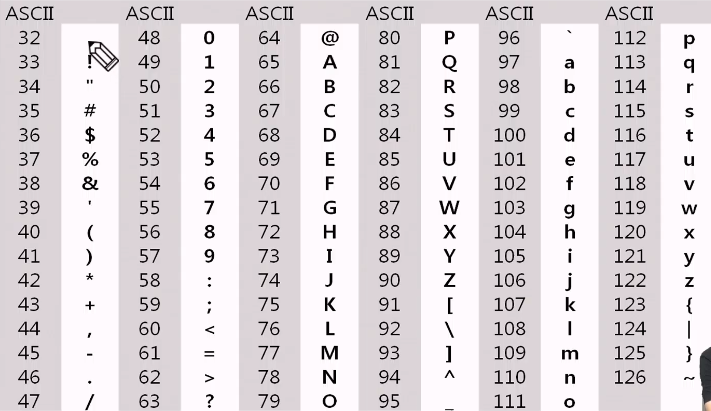
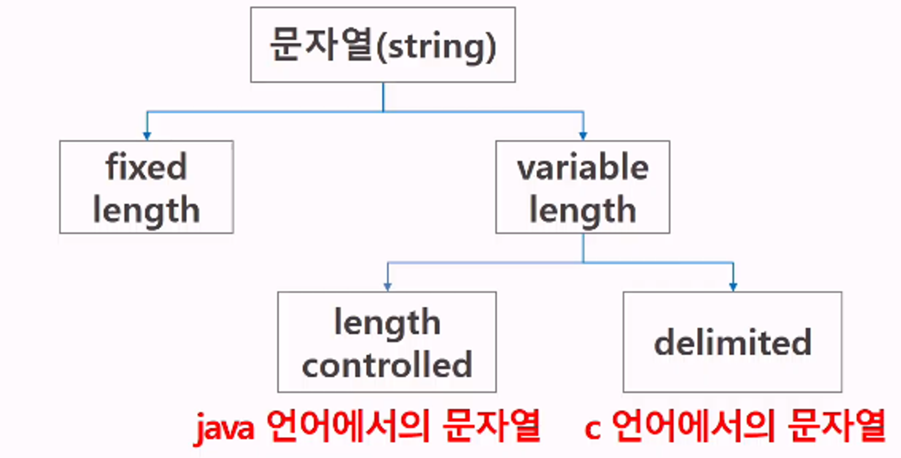

# 문자열 (String)

## 1. 문자의 표현

### 1) 컴퓨터에서의 문자 표현

- 글자를 메모리에 저장할 때, 각 문자에 대해 대응되는 숫자를 메모리에 저장함.
- 코드체계
    - 영어가 대소문자 합쳐서 52자이므로 6(2^6가지)비트면 모두 표현 가능
    - 000000 → ‘a’
    000001 → ‘b’
- 네트워크 발전 전에는, 미국의 각 지역 별로 코드 체계를 정해 놓고 사용했다.
- 네트워크가 발전하면서 서로 간 정보를 주고 받을 때 정보를 달리 해석한다는 문제 발생
- 혼동을 피하기 위해 표준안 만듦.
→ 1967년, 미국에서 ASCII (American Standard Code for Information Interchange)라는 문자 인코딩 표준이 제정됨.
- ASCII는 7-bit 인코딩으로 128문자를 표현하며 33개의 출력 불가능한 제어 문자들과 공백을 비롯한 95개의 출력 가능한 문자들로 이루어짐.

<br>

### 2) 출력 가능한 아스키 문자 (32~126)



<br>

### 3) 확장 아스키

- 표준 문자 이외의 악센트 문자, 도형 문자, 특수 문자, 특수 기호 등 부가적인 문자를 128개 추가할 수 있게 하는 부호
- 표준 아스키 : 7-bit를 사용하여 문자를 표현하는 데 비해
확장 아스키 : 1Byte내의 8-bit를 모두 사용함으로써 추가적인 문자를 표현 가능
- 컴퓨터 생산자와 SW 개발자가 다양한 문자에 할당할 수 있게 함.
할당된 확장 부호는 표준 아스키와 같이 서로 다른 프로그램이나 컴퓨터 사이에 교환되지 못함.
- 표준 아스키 : 마이크로컴퓨터 하드웨어 및 소프트웨어 사이에서 세계적으로 통용됨
확장 아스키 : 프로그램, 컴퓨터, 프린터가 해독할 수 있게 설계되어 있어야만 올바로 해독될 수 있음.

<br>

### 4) 유니코드

- 개요
    - 오늘날, 대부분의 컴퓨터는 ASCII형식을 사용한다.
    - 컴퓨터의 발전하면서 각 국가들은 자국의 문자를 표현하기 위해 코드체계를 만들어 사용하게 됨.
    → 국가 간 정보를 주고 받을 때 문제 발생
    → 자국의 코드체계를 타 국가가 가지고 있지 않으면 정보를 잘못 해석할 수 밖에 없음
    - 유니코드 마련 : 다국어 처리를 위한 표준
- 유니코드도 다시 Character Set으로 분류된다
    - UCS-2 (Universal Character Set 2)
    - UCS-4 (Universal Character Set 4)
    - 유니코드를 저장하는 변수의 크기를 정의
    - 그러나, 바이트 순서에 대해 표준화지 못했음
    파일 인식 시 이 파일이 UCS-2, UCS-4인지 인식하고 각 경우를 구분해서 모두 다르게 구현해야 하는 문제 발생
    - 그래서 유니코드의 적당한 외부 인코딩이 필요하게 되었다.

<br>

### 5) 유니코드 인코딩 (UTF : Unicode Transformation Format)

- UTF-8 (in web) : 가변 길이 문자
    - MIN : 8bit
    - MAX : 32bit (1Byte*4)
- UTF-16 (in Windows, java)
    - MIN : 16bit
    - MAX : 32bit (2 Byte *2)
- UTF-32 (in unix)
    - MIN : 32bit
    - MAX : 32bit (4Byte*1)

<br>

### 6) Python 인코딩

- 2.x 버전 : ASCII → #-*-coding:utf-8 -*- (첫줄에 명시)
- 3.x 버전 : 유니코드 UTF-8 → 생략 가능
- 다른 인코딩 방식으로 처리 시 첫 줄에 작성하는 위 항목에 원하는 인코딩 방식을 지정해주면 됨.

<br>

## 2. 문자열

### 1) 문자열의 분류



### 2) C언어에서 문자열 처리

- 문자열은 문자들의 배열 형태로 구현된 응용 자료형
- 문자배열에 문자열을 저장할 때는 항상 마지막에 끝을 표시하는 널문자(’\0’)를 넣어줘야 한다.

```c
char ary[]={'a', 'b', 'c', '\0'};
또는
char ary[] = "abc";
```

- 문자열 처리에 필요한 연산을 함수 형태로 제공한다.
    
    `strlen(), strcpy(), strcmp()`
    
<br>

### 3) java에서 String 클래스에 대한 메모리 배치 예

- java.lang.String 클래스에는 기본적인 객체 메타 데이터 외에도 네 가지 필드들이 포함되어 있음
- hash값(hash), 문자열의 길이(count), 문자열 데이터의 시작점(offse), 그리고 실제 문자열 배열에 대한 참조(value)이다.

<br>

### 4) Python에서 문자열 처리

- char 타입 없음
- 텍스트 데이터의 취급방법이 통일되어 있음
- 문자열 기호
    - ‘ ’, “ ”, ‘’’ ‘’’, “”” “””
    - 연결 : +
    - 반복 : *
- 문자열은 시퀀스 자료형으로 분류되고, 시퀀스 자료형에서 사용할 수 있는 인덱싱, 슬라이싱 연산들을 사용할 수 있음
- 문자열 클래스에서 제공되는 메소드
    
    `replace(), split(), isalpha(), find()`
    
- 문자열은 튜플과 같이 요소값을 변경할 수 없음 (immutable)

<br>

### 5) 문자열 뒤집기

- 자기 문자열에서 뒤집는 방법
    - swap을 위한 임시 변수가 필요함.
    - 반복 수행을 문자열 길의 반만을 수행해야 한다.
    - 문자열 길이 : 9
    9/2 = 4.5 ⇒ 4회 반복
- 새로운 빈 문자열을 만들어 소스의 뒤에서부터 읽어서 타겟에 쓰는 방법

<br>

### 6) 문자열 비교

- C : strcmp() 함수
- Java : equals() 메소드 제공
    - 문자열 비교에서 == 연산은 메모리 참조가 같은지를 묻는 것
- 파이썬 : ==연산자와 is연산자 제공
    - ==연산자는 내부적으로 특수 메서드 __eq__()를 호출
    
    ```python
    # s1과 나머지 문자열을 ==, is로 비교한 결과 확인해보기
    s1 = 'abc'
    s2 = 'abc'
    s3 = 'def'
    s4 = s1
    s5 = s1[:2] + 'c' # 인덱싱 슬라이스를 해서 만들게 되면 내용은 같은데 참조위치는 다름
    
    print(s1==s2) # True
    print(s1 is s2) # True
    print(s1==s5) # True
    print(s1 is s5) # False
    
    # is : 같은 참조값인지 확인
    # == : 같은 값인지 확인
    ```
    
<br>


## 3. 패턴 매칭

## 4. 문자열 암호화

## 5. 문자열 압축