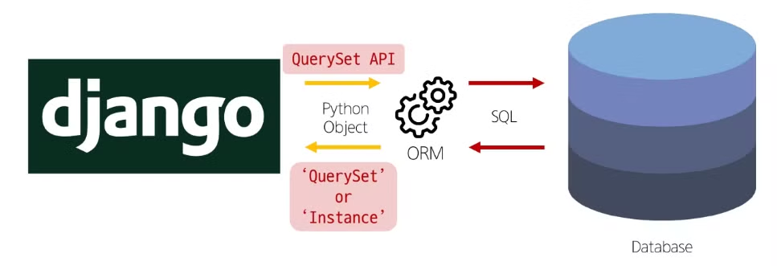
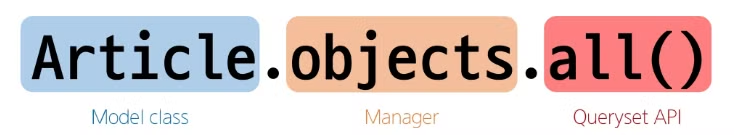
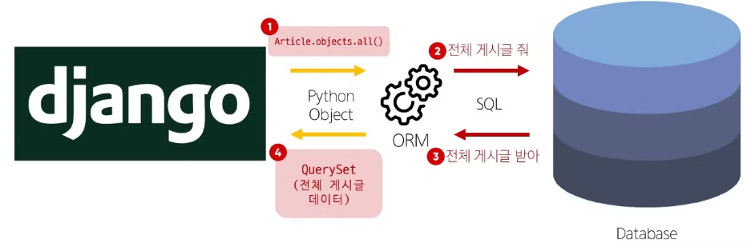

# ORM

## 1. ORM (Object-Relational-Mapping)

- 정의
    - 객체 지향 프로그래밍 언어를 사용하여 호환되지 않는 유형의 시스템 간에 데이터를 변환하는 기술
- 역할
    - Django 와 DB 간 사용하는 언어가 다르기 때문에 소통 불가

## 2. QuerySet API

### 1) 정의



- ORM에서 데이터를 검색, 필터링ㅇ, 정렬 및 그룹화하는 데 사용하는 도구
- API를 사용하여 SQL이 아닌 Python 코드로 데이터를 처리

### 2) QuerySet API 구문



- QuerySet API 구문 동작 예시
    
    
    

### 3) 용어 정리

- **Query**
    - 데이터베이스에 특정한 데이터를 보여달라는 요청
    - “쿼리문을 작성한다.”
        - 원하는 데이터를 얻기 위해 데이터베이스에 요청을 보낼 코드를 작성한다.
    - 파이썬으로 작성한 코드가 ORM에 의해 SQL로 변환되어 데이터베이스에 전달되며, 데이터베이스의 응답 데이터를 ORM이 QuerySet이라는 자료 형태로 변환하여 우리에게 전달
- **QuerySet**
    - 데이터베이스에게서 전달 받은 객체 목록 (데이터 모음)
        - 순회가 가능한 데이터로서 1개 이상의 데이터를 불러와 사용할 수 있음
    - Django ORM을 통해 만들어진 자료형
    - 단, 데이터베이스가 단일한 객체를 반환할 때는 QuerySet이 아닌 모델(Class)의 인스턴스로 반환됨
- **QuerySet API**
: python의 모델 클래스와 인스턴스를 활용해 DB에 데이터를 저장, 조회, 수정, 삭제하는 것 (CRUD)
- CRUD : 소프트웨어가 가지는 기본적인 데이터 처리 기능
    - Create (저장)
    - Read (조회)
    - Update (갱신)
    - Delete (삭제)

## 3. QuerySet API 실습

### 1) 사전 준비

- 외부 라이브러리 설치 및 설정
    - `pip install ipython`
    - `pip install django-extensions`
    - `pip freeze > requirements.txt`
    
    ```python
    # settings.py
    
    INSTALLED_APPS = [
    		'articles',
    		'django_extensions',
    		...,
    ]
    ```
    
- Django shell 실행
    - `python [manage.py](http://manage.py) shell_plus`
    - Django shell
        - Django 환경 안에서 실행되는 python shell
        - 입력하는 QuerySetAPI 구문이 Django 프로젝트에 영향을 미침

### 3) 데이터 생성 Create (3가지 방법)

- 첫 번째 방법
    - `save()` : 객체를 데이터베이스에 저장하는 인스턴스 메서드
    
    ```python
    # 특정 테이블에 새로운 행을 추가하여 데이터 추가
    article = Article() # Article(class)로부터 article(instance) 생성
    article
    
    article.title = 'first'  # 인스턴스 변수(title)에 값을 할당
    article.content = 'django!'  # 인스턴스 변수 (content)에 값을 할당
    
    # save를 하지 않으면 아직 DB에 값이 저장되지 않음
    article.save()
    article
    article.id
    article.pk
    Article.objects.all
    
    # 인스턴스 article을 활용하여 인스턴스 변수 활용하기
    article.title  # 'first'
    article.content  # 'django!'
    article.created_at  # datetime.datetime(2023, 6, 30, 6, 55, 42, 322526, tzinfo=datetime.timezone.utc)
    ```
    
- 두 번째 방법
    - save 메서드를 호출해야 비로소 DB에 데이터가 저장됨
    - 테이블에 한 행(레코드)이 쓰여진 것
    
    ```python
    article = Article(title='second', content='django!')
    
    # 아직 저장되어있지 않음
    # save를 호출해야 저장됨
    article.save()
    article
    Article.objects.all
    ```
    
- 세 번째 방법
    - QuerySet API 중 `create()` 메서드 활용
    
    ```python
    # 위 2가지 방법과 달리 바로 저장 이후 바로 생성된 데이터가 반환된다.
    
    Article.objects.create(title='third', content='django!')
    ```
    

### 4) 데이터 조회 (3가지)

- Return new QuerySets
    - `all()` : 전체 데이터 조회
    
    ```python
    Article.objects.all()
    
    # <QuerySet [<Article: Article object (1)>, <Article: Article object (2)>, <Article: Article object (3)>]>
    ```
    
    - `filter()` : 주어진 매개변수와 일치하는 객체를 포함하는 **QuerySet 반환**
    
    ```python
    Article.objects.filter(content='django')
    # <QuerySet [<Article: Article object (1)>, <Article: Article object (2)>]>
    
    Article.objects.filter(content='django!')
    # <QuerySet [<Article: Article object (3)>]>
    
    Article.objects.filter(title='abc')
    # <QuerySet []>
    
    ```
    
- Do not return QuerySets (단일 객체 조회)
    - `get()` : 주어진 매개변수와 일치하는 객체를 반환 (QuerySet을 리턴하지 않는다!)
        - 객체를 찾을 수 없다면 DoesNotExist 예외를 발생시키고,
        둘 이상의 객체를 찾으면 MultipleObjectsReturned 예외를 발생시킴
        - 위와 같은 특징 때문에 primary key와 같이 고유성(uniqueness)을 보장하는 조회에서 사용해야 함
    
    ```python
    Article.objects.get(pk=1)
    # <Article: Article object (1)>
    
    Article.objects.get(pk=100)
    # DoesNotExist: Article matching query does not exist.
    
    Article.objects.get(content='django!')
    # MultipleObjectsReturned: get() return more than one Article -- it returned 2!
    # 조회 결과가 여러개인 것은 반환 불가. 오류 남
    ```
    

### 5) 데이터 수정 (Update)

- 인스턴스 변수를 변경 후 save 메서드 호출

```python
# 수정할 인스턴스 조회
article = Article.objects.get(pk=1)

# 인스턴스 변수를 변경
article.title = 'byebye'

# 저장
article.save()

# 정상적으로 변경된 것을 확인
article.title
# 'byebye'
```

### 6) 데이터 삭제 (Delete)

- 삭제하려는 데이터 조회 후 delete 메서드 호출

```python
# 삭제할 인스턴스 조회
article = Article.objects.get(pk=1)

# delete 메서드 호출 (삭제 된 객체가 반환)
article.delete()
# (1, {'articles.Article' : 1"})

# 삭제한 데이터는 더이상 조회할 수 없음
Article.objects.get(pk=1)
# DoesNotExist: Article matching query does not exist.
```

## 4. 참고

### 1) Field lookups

- Query에서 조건을 구성하는 방법
- QuerySet 메서드 `filter()`, `exclude()`  및 `get()`에 대한 키워드 인자로 지정됨

```python
# Field lookups 예시

# 내용에 'dja`가 포함된 모든 게시글 조회
Article.objects.filter(content__contains='dja')

# 제목이 he로 시작하는 모든 게시글 조회
Article.objects.filter(title__startswith='he')
```

### 2) ORM, QuerySet API를 사용하는 이유

- 데이터베이스 추상화
    - 개발자는 특정 데이터베이스 시스템에 종속되지 않고 일관된 방식으로 데이터를 다룰 수 있음
- 생상성 향상
    - 복잡한 SQL 쿼리를 직접 작성하는 대신 Python 코드로 데이터베이스 작업을 수행할 수 있음
- 객체 지향적 접근
    - 데이터베이스 테이블을 Python 객체로 다룰 수 있어 객체 지향 프로그래밍의 이점을 활용할 수 있음