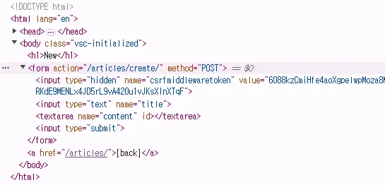
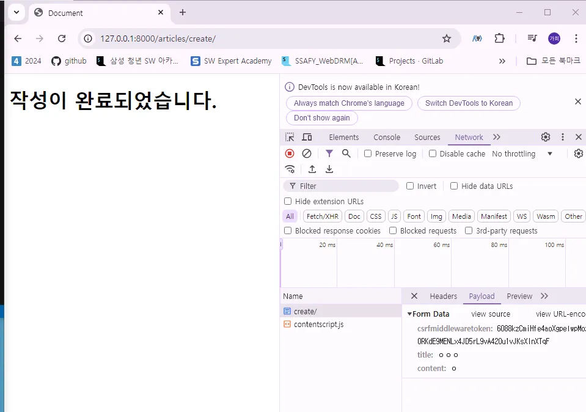
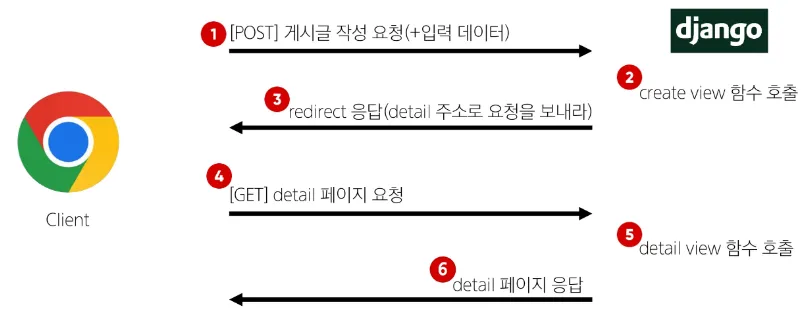
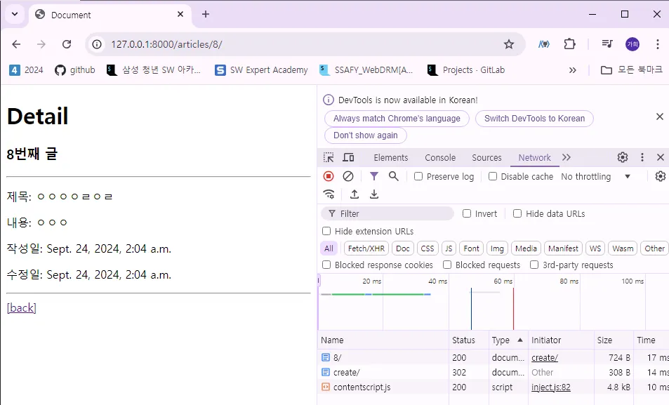

# Django 05. ORM with view

## 1. 단일 게시글 조회 Read

### 1) 단일 게시글 조회

```python
# articles/urls.py

urlpatterns = [
        ...
        path('<int:pk>/', views.detail, name='detail'),
]
```

```python
# articles/views.py

def detail(request, pk):
        article = Article.objects.get(pk=pk)
        context = {
                'article': article,
        }
        return render(request, 'articles/detail.html', context)
```

```html
<!-- templates/articles/detail.html -->

<h1>Detail</h1>
<h3>{{ article.pk }}번째 글</h3>
<hr>
<p>제목: {{ article.title }}</p>
<p>내용: {{ article.content }}</p>
<p>작성일: {{ article.created_at }}</p>
<p>수정일: {{ article.updated_at }}</p>
<hr>
<a href="">[back]</a>
```

### 2) 단일 게시글 페이지 링크 작성

```html
<!-- templates/articles/index.html -->

<h1>Articles</h1>
 <p>{{ articles }}</p> 

  <p>글 번호: {{ article.pk }}</p>
  <a href="">
    <p>글 제목: {{ article.title }}</p>
  </a>
  <p>글 내용: {{ article.content }}</p>
  <hr>

```

## 2. Create

> **Create 로직을 구현하기 위해 필요한 view 함수의 개수는?**
- new : 사용자 입력 데이터를 받을 페이지를 렌더링
- create : 사용자가 입력한 요청 데이터를 받아 DB에 저장
> 

### 1) new 기능 구현

```python
# articles/urls.py

urlpatterns = [
        ...
        path('new/', views.new, name='new'),
]
```

```python
# articles/views.py

def new(request):
    # 게시글 작성 페이지 응답
    return render(request, 'articles/new.html')
```

```html
<!-- templates/articles/new.html -->

<h1>New</h1>
<form action="#" method="GET">
  <input type="text" name="title">
  <textarea name="content" id=""></textarea>
  <input type="submit">
</form>
<a href="">[back]</a>
```

- 메인페이지에 new 페이지로 이동할 수 있는 하이퍼링크 작성

```html
<!-- templates/articles/index.html -->

<h1>Articles</h1>
<a href="">[New]</a>
...
```

### 2) create 기능 구현

```python
# articles/urls.py

urlpatterns = [
        ...
    path('create/', views.create, name='create')
]
```

```python
# articles/views.py

def create(request):
    # 1. 사용자 요청으로부터 입력 데이터를 추출
    title = request.GET.get('title')
    content = request.GET.get('content')

    # 2. 저장
    article = Article(title=title, content=content)
    article.save()

    # 3. 추출한 입력 데이터를 활용해 DB에 저장 요청

    return render(request, 'articles/create.html')
```

```html
<!-- templates/articles/create.html -->

<h1>작성이 완료되었습니다.</h1>
```

```html
<!-- templates/articles/new.html -->
<!-- 데이터 받기 -->

<h1>New</h1>
<form action="" method="GET">
  <input type="text" name="title">
  <textarea name="content" id=""></textarea>
  <input type="submit">
</form>
<a href="">[back]</a>
```

## 3. HTTP request methods

### 1) HTTP

- 네트워크 상에서 데이터(리소스)를 주고 받기 위한 약속

### 2) HTTP request methods

- 데이터에 대해 수행을 원하는 작업(행동)을 나타내는 것
    - 서버에게 원하는 작업의 종류를 알려주는 역할
- 클라이언트가 웹 서버에 특정 동작을 요청하기 위해 사용하는 표준 명령어
- 대표 메서드
    - GET, POST

### 3) Get method

- 서버로부터 데이터를 요청하고 받아오는 데 **(조회)** 사용
- 특징
    - 데이터 전송
        - URL의 쿼리 문자열(Query String)을 통해 데이터를 전송
        - {URL}?title=제목&content=내용
    - 데이터 제한
        - URL 길이에 제한이 있어 대량의 데이터 전송에는 적합하지 않음
    - 브라우저 히스토리
        - 요청 URL이 브라우저 히스토리에 남음
    - 캐싱 (장점)
        - 브라우저는 GET 요청의 응답을 로컬에 저장할 수 있음
        - 동일한 URL로 다시 요청할 때, 서버에 접속하지 않고 저장된 결과를 사용
        - 페이지 로딩 시간을 크게 단축
- 사용 예시
    - 검색 쿼리 전송
    - 웹 페이지 요청
    - API에서 데이터 조회

### 4) Post method

- 서버에 데이터를 제출하여 리소스를 변경(생성, 수정, 삭제)하는 데 사용
- DB에 조작을 가함
- 특징
    - 데이터 전송
        - HTTP Body를 통해 데이터를 전송
    - 데이터 제한
        - GET에 비해 더 많은 양의 데이터를 전송할 수 있음
    - 브라우저 히스토리
        - POST 요청은 브라우저 히스토리에 남지 않음
    - 캐싱
        - POST 요청은 기본적으로 캐시할 수 없다.
        - POST 요청이 일반적으로 서버의 상태를 변경하는 작업을 수행하기 때문
- 사용 예시
    - 로그인 정보 제출
    - 파일 업로드
    - 새 데이터 생성 (ex: 새 게시글 작성)
    - API에서 데이터 변경 요청

### 5) GET, POST Method 정리

- GET 과 POST는 각각의 특성에 맞게 적절히 사용해야 함.
- GET : 데이터 조회
- POST : 데이터 생성이나 수정에 주로 사용

### 6) POST metold 적용

```html
<!-- templates/articles/new.html -->

<h1>New</h1>
<form action="" method="POST">
  <input type="text" name="title">
  <textarea name="content" id=""></textarea>
  <input type="submit">
</form>
<a href="">[back]</a>
```

```python
# articles/views.py

def create(request):
    title = request.POST.get('title')
    content = request.POST.get('content')
    ...
```

## 4. HTTP response status code

### 1) HTTP response status code

- 정의
: 서버가 클라이언트의 요청에 대한 처리 결과를 나타내는 **3자리 숫자**
- 역할
    - 클라이언트에게 요청 처리 결과를 명확히 전달
    - 문제 발생 시 디버깅에 도움
    - 웹 애플리케이션의 동작을 제어하는 데 사용
- 403 Forbidden
: 서버에 요청이 전달되었지만, 권한때문에 거절되었다는 것을 의미

### 2) CSRF (Cross-Site-Request-Forgery)

- 사이트 간 요청 위조
- 사용자가 자신의 의지와 무관하게 공격자가 의도한 행동을 하여 특정 웹 페이지를 보안에 취약하게 하거나 수정, 삭제 등의 작업을 하게 만드는 공격 방법
- **CSRF Token 적용**
    - DTL의 csrf_token 태그를 사용해 손쉽게 사용자에게 토큰 값을 부여
    - 요청 시 토큰 값도 함께 서버로 전송될 수 있도록 하는 것
        
        ```html
        <!-- templates/articles/new.html -->
        
        <form action="" method="POST">
          
          <input type="text" name="title">
          <textarea name="content" id=""></textarea>
          <input type="submit">
        </form>
        ```
        
    - 개발자도구 변화 확인 : type이 hidden인 input 태그가 생성됨
        
        
        
- 요청 시 CSRF Token을 함께 보내야 하는 이유
    - Django 서버는 해당 요청이 DB에 데이터를 하나 생성하는 (DB에 영향을 주는) 요청에 대해 **“Django가 직접 제공한 페이지에서 데이터를 작성하고 있는 것인지”**에 대한 확인 수단이 필요한 것
    - 겉모습이 똑같은 위조 사이트나 정상적이지 않은 요청에 대한 방어 수단
    - 기존 : 요청데이터 → 게시글 작성
    - 변경 : 요청 데이터 + 인증 토큰 → 게시글 작성
- 왜 POST일 때만 Token을 확인할까?
    - POST는 단순 조회를 위한 GET과 달리 특정 리소스에 변경(생성, 수정, 삭제)을 요구하는 의미와 기술적인 부분을 가지고 있기 때문
    - DB에 조작을 가하는 요청은 반드시 인증 수단이 필요
        - 데이터베이스에 대한 변경사항을 만드는 요청이기 때문에 토큰을 사용해 최소한의 신원 확인을 하는 것
- 게시글 작성 결과
    - 게시글 생성 후 개발자도구를 사용해 From Data가 전송되는 것 확인
    - 더 이상 URL에 Query String 형태로 보냈던 데이터가 표기되지 않음
    
    
    

## 5. Redirect

### 1) Redirect가 필요한 이유

> 게시글 작성 후 완료를 알리는 페이지를 응답한다?
- 게시글을 “조회해줘!”라는 요청이 아닌 “작성해줘!”라는 요청이기 때문에 게시글 저장 푸 페이지를 응답하는 것은 POST 요청에 대한 적절한 응답이 아님
> 
- 서버는 데이터 저장 후 페이지를 응답하는 것이 아닌 사용자를 적절한 기존 페이지로 보내야 한다.
- “사용자를 보낸다.” ⇒ 사용자가 GET 요청을 한번 더 보내도록 해야 한다.
- 실제로 서버가 클라이언트를 직접 다른 페이지로 보내는 것이 아닌 클라이언트가 GET 요청을 한번 더 보내도록 응답하는 것

### 2) `redirect()`

- 클라이언트가 인자에 작성된 주소로 다시 요청을 보내도록 하는 함수
- 함수 적용 : create view 함수 변경

```python
from django.shortcuts import render, redirect

def create(request):
    # 1. 사용자 요청으로부터 입력 데이터를 추출
    title = request.POST.get('title')
    content = request.POST.get('content')

    # 2. 저장
    article = Article(title=title, content=content)
    article.save()

    # 3. 추출한 입력 데이터를 활용해 DB에 저장 요청
    return redirect('articles:detail', article.pk)
```

- 동작원리
    
    
    - redirect 응답을 받은 클라이언트는 detail url로 다시 요청을 보내게 됨
    - 결과적으로 detail view 함수가 호출되어 detail view 함수의 반환 결과인 detail 페이지를 응답받게 되는 것
    - 결국 사용자는 게시글 작성 후 작성된 게시글의 detail 페이지로 이동하는 것으로 느끼게 됨.
- 게시글 작성 결과
    
    - 게시글 작성 후 생성된 게시글의 detail 페이지로 redirect 되었는지 확인
    - create 요청 이후에 detail로 다시 요청을 보냈다는 것을 알 수 있음

## 6. Delete

```python
# articles/urls.py

urlpatterns = [
        ...
    path('<int:pk>/delete/', views.delete, name='delete'),
]
```

```python
# articles/views.py

def delete(request, pk):
    # 어떤 게시글 삭제할지 조회
    article = Article.objects.get(pk=pk)

    # 조회한 게시글 삭제
    article.delete()
    return redirect('articles:index')
```

```html
<!-- templates/articles/detail.html -->

<form action="" method="POST">
  
  <input type="submit" value="삭제">
</form>
<a href="">[back]</a>
```

## 7. Update

> **Update 로직을 구현하기 위해 필요한 view 함수의 개수는?**
- edit: 사용자 입력 데이터를 받을 페이지를 렌더링
- update: 사용자가 입력한 요청 데이터를 받아 DB에 저장
> 

### 1) edit 기능 구현

```python
# articles/urls.py

urlpatterns = [
        ...
    path('<int:pk>/edit/', views.edit, name='edit'),
]
```

```python
# articles/views.py

def edit(request, pk):
    # 어떤 게시글 수정할지 조회
    article = Article.objects.get(pk=pk)
    context = {
        'article': article,
    }
    return render(request, 'articles/edit.html', context)
```

```html
<!-- templates/articles/edit.html -->
<!-- 수정 시 이전 데이터가 출력될 수 있도록 작성하기 -->

  <h1>Edit</h1>
  <form action="" method="POST">
    
    <input type="text" name="title" **value="{{ article.title }}"**>
    <textarea name="content" id="">**{{ article.content }}**</textarea>
    <input type="submit" value='수정'>
  </form>
  <a href="">[back]</a>
```

```html
<!-- templates/articles/detail.html -->
<!-- edit 페이지로 이동하기 위한 하이퍼링크 작성 -->

<body>
<a href="">
  <input type="submit" value="수정">
</a>
<form action="" method="POST">
  
  <input type="submit" value="삭제">
</form>
<a href="">[back]</a>
</body>
```

### 2) update 기능 구현

```python
# articles/urls.py

urlpatterns = [
        ...
    path('<int:pk>/update/', views.update, name='update'),
]
```

```python
# articles/views.py

def update(request, pk):
    # 1. 어떤 게시글 수정할지 조회
    article = Article.objects.get(pk=pk)
    # 2. 사용자로부터 받은 새로운 입력 데이터 추출
    title = request.POST.get('title')
    content = request.POST.get('content')
    # 3. 기존 게시글의 데이터를 사용자로 받은 데이터로 새로 할당
    article.title = title
    article.content = content
    # 4. 저장
    article.save()
    return redirect('articles:detail', article.pk)
```

```html
<!-- templates/articles/edit.html -->
<!-- 작성 후 게시글 수정 테스트 -->

<body>
  <h1>Edit</h1>
  <form action="" method="POST">
    
    <input type="text" name="title" value="{{ article.title }}">
    <textarea name="content" id="">{{ article.content }}</textarea>
    <input type="submit" value='수정'>
  </form>
  <a href="">[back]</a>
</body>
```

## 8. 참고

### 1) GET과 POST

|  | GET | POST |
| --- | --- | --- |
| 데이터 전송 방식 | URL의 Query string parameter | HTTP body |
| 데이터 크기 제한 | 브라우저 제공 URL의 최대 길이 | 제한 없음 |
| 사용 목적 | 데이터 검색 및 조회 | 데이터 제출 및 변경 |
|  |  |  |
- GET 요청이 필요한 경우
    - 캐싱 및 성능
        - GET 요청은 캐시(Cache)될 수 있고, 이전에 요청한 정보를 새로 요청하지 않고 사용할 수 있음
        - 특히, 동일한 검색 결과를 여러 번 요청하는 경우 GET 요청은 캐시를 활용하여 더 빠르게 응답할 수 있음
    - 가시성 및 공유
        - GET 요청은 URL에 데이터가 노출되어 있기 때문에 사용자가 해당 URL을 북마크하거나 다른 사람과 공유하기 용이
    - RESTful API 설계
        - HTTP 메서드의 의미에 따라 동작하도록 디자인된 API의 일관성을 유지할 수 있음.
- HTTP request methods를 활용한 효율적인 URL 구성
    - 동일한 URL 한 개로 method에 따라 서버에 요구하는 행동을 다르게 요구
    - Django 후반기 RESTful API 시간에 다룰 예정
    
    
    

### 3) 캐시 (Cache)

- 데이터나 정보를 임시로 저장해두는 메모리나 디스크 공간
- 이전에 접근한 데이터를 빠르게 검색하고 접근할 수 있도록 함