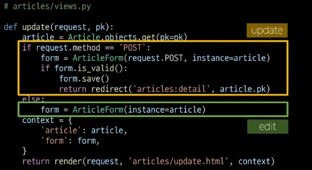

## 1. Django Form

### 1) HTML ‘form’

- 지금까지 사용자로부터 데이터를 제출받기 위해 활용한 방법
- 그러나 비정상적 or 악의적인 요청 필터링 불가
- **유효한 데이터인지**에 대한 확인이 필요
⇒ 유효성 검사

### 2) 유효성 검사

- 수집한 데이터가 정확하고 유효한지 확인하는 과정
- 유효성 검사 구현의 어려움
    - 입력값, 형식, 중복, 범위, 보안 등 많은 것을 고려해야 함
    - 이런 과정과 기능을 직접 개발하지 X
    Django가 제공하는 Form을 사용

### 3) Form Class

- Django Form
    - 사용자 입력 데이터를 수집하고, 처리 및 유효성 검사를 수행하기 위한 도구
    - 유효성 검사를 단순화하고 자동화할 수 있는 기능을 제공
- Form class 정의
    - model 정의 시 content는 TextField 였음
    - Form에는 TextField가 없다.
    - new.html과 edit.html에서 ArticleForm을 활용할 것임.
    → views 함수에 적용 필요
    
    ```python
    # articles/forms.py
    
    from django import forms
    
    class ArticleForm(forms.Form):
            title = forms.CharField(max_length=10)
            content = forms.CharField()
    ```
    
- From class를 적용한 new 로직
    - view함수 new 변경
        
        ```python
        # articles/views.py
        
        from .forms import ArticleForm
        
        def new(request):
            form = ArticleForm()
            context = {
                'form': form,
            }
            return render(request, 'articles/new.html', context)
        ```
        
    - new 페이지에서 form 인스턴스 출력
        
        ```html
        <!-- articles/new.html -->
        
        <h1>New</h1>
        <form action="" method="POST">
          
          {{ form }}
          <input type="submit">
        </form>
        ```
        
        
- From rendering options (줄바꿈 속성 적용 가능!)
    - label, input 쌍을 특정 HTML 태그로 감싸는 옵션
        - `{{  form.as_div }}`
        - `{{  form.as_table }}`
        - `{{  form.as_p }}` : 보통 p태그를 많이 씀
        - `{{  form.as_ul }}`
    
    ```html
    <h1>New</h1>
    <form action="" method="POST">
      
      {{ form.as_p }}
      <input type="submit">
    </form>
    ```
    
    
- Form class가 대체하는 것
    
    - Form에는 TextField가 없다. 그래서 CharField로 쓰고 있는데, TextArea로 바꾸고 싶다.
    ⇒ input의 표현적인 부분을 바꿀 수 있는게 있다!!
    ⇒ Widget

### 4) Widgets

- HTML `input` element의 표현을 담당
(Text input을 TextArea로 바꿔야 함)
- 단순히 input 요소의 속성 및 출력되는 부분을 변경하는 것

## 2. Django ModelForm

### 1) 개요

> 장고는 Form 을 두가지를 제공한다.
> 
- Form
    - 사용자 입력 데이터를 DB에 저장하지 않을 때
    - 검색, 로그인
- ModelForm
    - 사용자 입력 데이터를 DB에 저장해야 할 때
    - Form이 Model에 대한 정보를 알고 있다면 Form에 재작성할 필요가 없다.
    - 게시글 작성, 회원가입

### 2) ModelForm

- Model과 연결된 Form을 자동으로 생성해주는 기능을 제공 (`Form` + `Model`)
- ModelForm class 정의
    - articles/forms.py 파일을 직접 생성해야 함.
    - 기존 ArticleForm 클래스 수정
        - Meta : ModelForm에 대한 정보 작성
        - 모델을 등록을 하면 자동으로 인식해서 형식을 설정
        
        ```python
        # articles/forms.py
        
        from django import forms
        from .models import Article
        
        class ArticleForm(forms.ModelForm):  # ModelForm 상속
            class Meta:  # Meta 클래스에 작성할거야
                model = Article     # [필수] 대상 모델을 등록
                fields = '__all__'  # [필수] 모델의 필드 중 뭘 활용할거냐 # 꼭 fields라고 해야 함.
        ```
        

### 3) Meta Class

- ModelForm 정보를 작성하는 곳
- `fields` 및 `exclude` 속성
    - exclude속성을 사용하여 **모델에서 포함하지 않을 필드**를 지정할 수도 있음
    
    ```python
    # articles/forms.py
    
    class ArticleForm(forms.ModelForm):
        class Meta:
            model = Article
            fields = ('title',)
    ```
    
    ```python
    # articles/forms.py
    
    class ArticleForm(forms.ModelForm):
        class Meta:
            model = Article
            exclude = ('title',)
    ```
    
- 주의사항
: Django에서 ModelForm에 대한 추가 정보나 속성을 작성하는 클래스 구조를 Meta클래스로 작성했을 뿐, 파이썬의 inner class와 같은 문법적 관점으로 접근 ㄴㄴ

### 4) ModelForm 적용

- ModelForm을 적용한 create 로직
    
    ```python
    # articles/views.py
    
    from .forms import ArticleForm
    
    def create(request):
        # 1. 모델을 인스턴스 생성 (+ 사용자 입력 데이터를 통째로 인자로 작성)
        form = ArticleForm(request.POST)
    
        # 2. 유효성 검사
        if form.is_valid():
            article = form.save()
            return redirect('articles:detail', article.pk)
        context = {
            'form': form,
        }
        return render(request, 'articles/new.html', context)
    ```
    
    
    - `is_valid()` : 여러 유효성 검사를 실행하고, 데이터가 유효한지 여부를 Boolean으로 반환
    - 공백데이터가 유효하지 않은 이유와 에러메시지가 출력되는 과정
        - 별도로 명시하진 않았지만 모델 필드에는 기본적으로 빈 값은 허용하지 않는 제약조건이 설정되어 있음
        - 빈 값은 is_vaild()에 의해 False로 평가되고 form객체에는 그에 맞는 에러 메시지가 포함되어 다음 코드로 진행됨.
- ModelForm을 적용한 edit 로직
    
    ```python
    # articles/views.py
    
    def edit(request, pk):
        article = Article.objects.get(pk=pk)
        form = ArticleForm(instance=article)
        context = {
            'article': article,
            'form': form
        }
        return render(request, 'articles/edit.html', context)
    ```
    
    ```html
    <h1>Edit</h1>
    <form action="" method="POST">
      
      {{ form.as_p }}
      <input type="submit" value="수정">
    </form>
    ```
    
- ModelForm을 적용한 update로직
    
    ```python
    # articles/views.py
    
    def update(request, pk):
        article = Article.objects.get(pk=pk)
        form = ArticleForm(request.POST, instance=article)
    
        if form.is_valid():
            form.save()
            return redirect('articles:detail', article.pk)
        context = {
            'article': article,
            'form': form,
        }
        return render(request, 'articles/edit.html', context)
    ```
    
- 정리
    - 사용자로부터 데이터를 수집하고 처리하기 위한 강력하고 유연한 도구
    - HTML form의 생성, 데이터 유효성 검사 및 처리를 쉽게 할 수 있도록 도움

### 5) save 메서드

- `save()` : 데이터베이스 객체를 만들고 저장하는 ModelForm의 인스턴스 메서드
- 생성과 수정을 구분하는 법
    - 키워드 인자 `instance` 여부를 통해 생성할지, 수정할지를 결정
    - `instance` 가 있으면 수정! 없으명 생성!
    
    ```python
    # CREATE
    form = ArticleForm(request.POST)
    form.save()
    
    # UPDATE
    form = ArticleForm(request.POST, instance=article)
    form.save()
    ```
    

## 3. HTTP 요청 다루기

### 1) View 함수 구조 변화

- new & create view 함수 간
    - 공통점
        - 데이터 생성을 구현하기 위함
    - 차이점
        - new : GET method 요청만 처리
        - create : POST method 요청만 처리
- HTTP request method 차이점을 활용해 동일한 목적을 가지는 2개의 view 함수를 하나로 구조화
    - new & create 함수 결합
    
- 새로운 create view 함수
    - new와 create view 함수의 공통점과 차이점을 기반으로 하나의 함수로 결합
    - 두 함수의 유일한 차이점이었던 request method에 따른 분기
        
        ```python
        # articles/views.py
        
        def create(request):
            # 요청 메서드가 POST일 때
            if request.metod == 'POST':
                    # 과거 create 함수 구조였던 객체 생성 및 저장 로직 처리
                form = ArticleForm(request.POST)
                if form.is_valid():
                    article = form.save()
                    return redirect('articles:detail', article.pk)
        
            # 요청 메서드가 POST가 아닐 때
            else:
                    # 과거 new 함수에서 진행했던 form 인스턴스 생성
                form = ArticleForm()
                
            # context에 담기는 form은
            ## is_valid()를 통과하지 못해 에러메시지를 담은 form이거나
            ## else문을 통한 비어있는 form 인스턴스
            context = {
                'form': form,
            }
            return render(request, 'articles/create.html', context)
        ```
        
    - 기존 new 관련 코드 수정
        - 사용하지 않게 된 new url 제거
        - new 관련 키워드를 create로 변경
        - render에서 new 템플릿을 create 템플릿으로 변경
    - request method에 따른 요청의 변화
        - (GET) articles/create : 게시글 생성 페이지를 줘!
        - (POST) articles/create : 게시글을 생성해줘!
- 새로운 update view 함수
    - 기존 edit과 update view 함수 결합
        
        
        
    - 기존 edit 관련 코드 수정
        - 사용하지 않는 edit url 제거
        - edit 관련 키워드를 update로 변경

## 4. 참고

### 1) ModelForm의 키워드 인자 구성

- ModelForm 키워드 인자 data와 instance 살펴보기
    - data는 첫번째에 위치한 키워드 인자이기 때문에 생략 가능
    - instance는 9번째에 위치한 키워드인자이기 때문에 생략할 수 없었음
