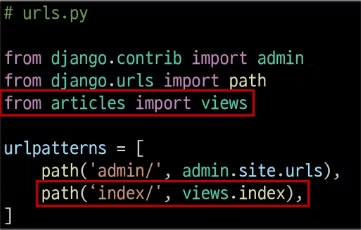

# **Django_Intro_DesignPattern**

## 1. Web Application

### 1) Web application (web service) 개발

- 인터넷을 통해 사용자에게 제공되는 소프트웨어 프로그램을 구축하는 과정
- 다양한 디바이스 (모바일, 태블릿, PC 등)에서 웹 브라우저를 통해 접근하고 사용할 수 있음

### 2) 클라이언트와 서버

- 웹의 동작 방식 : 클라이언트-서버 구조
- Client 클라이언트 : 서비스를 요청하는 주체 (웹 사용자의 인터넷이 연결된 장치, 웹 브라우저)
- Server 서버 : 클라이언틑의 요청에 응답하는 주체 (웹 페이지, 앱을 저장하는 컴퓨터)

### 3) 우리가 웹페이지를 보게 되는 과정

- 웹 브라우저(클라이언트)에서 ‘google.com’을 입력 후 엔터
- 웹 브라우저는 인터넷에 연결된 전세계 어딘가에 있는 구글 컴퓨터(서버)에세 ‘메인 홈페이지.html’ 파일을 달라고 요청
- 요청을 받은 구글 컴퓨터는 데이터베이스에서 ‘메인 홈페이지.html’파일을 찾아 응답
- 웹 브라우저는 전달받은 ‘메인 홈페이지.html’ 파일을 사람이 볼 수 있도록 해석해주고 사용자는 구글의 메인 페이지를 보게 됨.

### 3) Frontend & Backend

- Frontend (프론트엔드)
    - 사용자 인터페이스 (UI)를 구성하고, 사용자가 애플리케이션과 상호작용할 수 있도록 함
    - HTML. CSS, JavaScript, 프론트엔드 프레임워크 등
- Backend (백엔드)
    - 서버측에서 동작하며, 클라이언트의 요청에 대한 처리와 데이터베이스와의 상호작용을 담당
    - 서버 언어 (Python, Java 등) 및 백엔드 프레임워크, 데이터베이스, API, 보안 등

## 2. Framework

### 1) Web Framework

- 웹 애플리케이션을 빠르게 개발할 수 있도록 도와주는 도구
- 개발에 필요한 기본 구조, 규칙, 라이브러리 등을 제공

### 2) Django Framework

- Python 기반의 대표적인 웹 프레임워크
- 왜 Django를 사용할까?
    - 다양성 : Python 기반으로 웹, 모바일 앱 백엔드, API 서버 및 빅데이터 관리 등 광범위한 서비스 개발에 적합
    - 확장성 : 대량의 데이터에 대해 빠르고 유연하게 확장을 할 수 있는 기능을 제공
    - 보안 : 취약점으로부터 보호하는 보안 기능이 기본적으로 내장되어 있음
    - 커뮤니티 지원 : 개발자를 위한 지원, 문서 및 업데이트를 제공하는 활성화된 커뮤니티
- 장고로 서버를 만들자

### 3) 가상 환경

- Python 애플리케이션과 그에 따른 패키지들을 격리하여 관리할 수 있는 독립적인 실행 환경
- Python 환경 구조 예시
    
    
    
- 의존성 패키지
    - 한 SW 패키지가 다른 패키지의 기능이나 코드를 사용하기 때문에 그 패키지가 존재해야만 제대로 작동하는 관계
    - 사용하려는 패키지가 설치되지 않았거나, 호환되는 버전이 아니면 오류가 발생하거나 예상치 못한 동작을 보일 수 있음
- 패키지 목록 파일 특징 및 주의사항
    - 가상환경의 패키지 목록을 쉽게 공유 가능
    - 프로젝트의 의존성을 명확히 문서화
    - 동일한 개발 환경을 다른 시스템에서 재현 가능
    - 활성화된 가상환경에서 실행해야 정확한 패키지 목록 생성
    - 시스템 전역 패키지와 구분 필요
- 가상환경 주의사항 및 권장사항
    - 가상 환경에 ‘들어가고 나오는’ 것이 아니라 사용할 Python 환경을 On/off 로 전환하는 개념
        - 가상환경 활성화는 현재 터미널 환경에만 영향을 끼침
        - 새 터미널 창을 열면 다시 활성화해야 함.
    - 가상환경은 ‘방’이 아니라 ‘도구 세트’
        - 활성화는 특정 도구 세트를 선택하는 것
    - 프로젝트마다 별도의 가상환경 사용
    - 일반적으로 가상환경 폴더 venv는 관련된 프로젝트와 동일한 경로에 위치
    - 가상환경 폴더 venv는 gitignore에 작성되어 원격 저장소에 공유되지 않음
        - 저장소 크기를 줄여 효율적인 협업과 배포를 가능하게 하기 위함 (requirements.txt를 공유)
- 의존성 패키지 관리의 중요성
    - 개발 환경에서는 각각의 프로젝트가 사용하는 패키지와 그 버전을 정확히 관리하는 것이 중요
    - 가상환경 & 의존성 패키지 관리
- 명령어
    - 가상환경 venv 생성 : `python -m venv venv`
    - 가상환경 활성화 : `source venv/Scripts/activate`
    - 환경에 설치된 패키지 목록 확인 : `pip list`
    - 설치된 패키지 목록 생성 : `pip freeze > requirements.txt`
    - 패키지 목록 기반 설치 : `pip install -r requirements.txt`
    - 가상환경 비활성화 : `deactivate`

### 4) Django 프로젝트 명령어

- Django 프로젝트 생성 : `django-admin startproject firstpjt .`
    - 처음 장고 프로젝트를 생성할 때만 django-admin 명령어를 사용
    - 프로젝트 이름 : firstpjt
    - . : 현재 디렉토리에 생성할 것이다.
- 서버 실행 : `python [manage.py](http://manage.py) runserver`
    - 장고 개발 모든 것은 python [manage.py](http://manage.py) 명령어로 하게 될 것
    - [manage.py](http://manage.py) : runserver 등의 명령어를 실행시키게 하는 파일
- 서버 확인 [`http://127.0.0.1:8000/`](http://127.0.0.1:8000/)

## 3. Django Design Pattern

### 1) 디자인패턴

- 소프트웨어 설계에서 발생하는 문제를 해결하기 위한 일반적인 해결책
(공통적인 문제를 해결하는 데 쓰이는 형식화된 관행)
- “애플리케이션의 구조는 이렇게 구성하자” 라는 관행

### 2) MVC 디자인 패턴 (Model, View, Controller)

- 애플리케이션을 구조화하는 대표적인 패턴
- 데이터 & 사용자 인터페이스 & 비즈니스 로직을 분리
- 시각적 요소와 뒤에서 실행되는 로직을 서로 영향 없이 독립적이고 쉽게 유지 보수할 수 있는 애플리케이션을 만들기 위해 차용

### 3) MTV 디자인 패턴 (Model, Template, View)

- Django에서 애플리케이션을 구조화하는 패턴
- 기존 MVC 패턴과 동일하나 단순히 명칭을 다르게 정의한 것

### 4) Project & App

- 한 프로젝트 안에 여러 앱이 있고, 앱들이 각각의 역할(기능 단위)을 한다.

    

- Django project : 애플리케이션의 집합 (DB 설정, URL 연결, 전체 앱 설정 등을 처리)
- Django application : 독립적을 작동하는 기능 단위 모듈 (각자 특정한 기능을 담당하며 다른 앱들과 함께 하나의 프로젝트를 구성)
- 예시) 만약 온라인 커뮤니티 카페를 만든다면?
    - 프로젝트 : 카페 (전체 설정 담당)
    - 앱 : 게시글, 댓글, 회원 관리 등 (DB, 인증, 화면)
- 앱을 사용하기 위한 순서
    - 앱 생성  : `python [manage.py](http://manage.py) startapp articles`
        - 앱의 이름은 ‘복수형’으로 지정하는 것을 권장
        - 앱 이름 : articles
    - 앱 등록 : 반드시 앱을 생성한 후에 등록해야 함. (등록 후 생성은 불가능)
        - 내장함수에 우선해서 등록
        
        
        
- 프로젝트 구조
    - [`settings.py`](http://settings.py) : 프로젝트의 모든 설정을 관리
    - [`urls.py`](http://urls.py) : 요청이 들어오는 URL에 따라 이에 해당하는 적절한 views를 연결 (요청이 들어오는 정문)
    - `__init__.py`  : 해당 폴더를 패키지로 인식하도록 설정하는 파일. firstpjt를 패키지로서 import 할 수 있게 만들어주는 파일
    - `asgi.py`  : 비동기식 웹 서버와의 연결 관련 설정
    - [`wsgi.py`](http://wsgi.py) : 웹 서버와의 연결 관련 설정
    - `manage.y` : Django 프로젝트와 다양한 방법으로 상호작용하는 커맨드라인 유틸리티
- 앱 구조
    - [`admin.py`](http://admin.py) : 과닐자용 페이지 설정
    - [`models.py`](http://models.py) : DB와 관련된 Model을 정의, MTV 패턴의 M
    - [`vies.py`](http://vies.py) : 로직 담당, HTTP 요청을 처리하고 해당 요청에 대한 응답을 반환 (url, model, template과 연계, MTV 패턴의 V
    - [`apps.py`](http://apps.py) : 앱의 정보가 작성된 곳
    - [`tests.py`](http://tests.py) : 프로젝트 테스트 코드를 작성하는 곳

## 4. 요청과 응답

### 1) Django와 요청 & 응답

- index는 보통 메인 페이지를 뜻함
- 데이터가 흐르는 순서 : [urls.py](http://urls.py) → [views.py](http://views.py) → [templates.py](http://templates.py) 이 순서로 코드를 작성함

### 2) main 페이지를 만들어서 응답하게 하는 실습

- URLS
    
    
    
    - [http://127.0.0.1:8000/index/](http://127.0.0.1:8000/index/) 로 요청이 왔을 때, request 객체를 views 모듈의 index view 함수에게 전달하며 호출
    - articles 패키지에서 views 모듈을 가져 오는 것
    - url 경로는 반드시 `/` (slash)로 끝나야 함
- View
    
    
    
    - view 함수가 정의되는 곳
    - 특정 경로에 있는 template과 request 객체를 결합해 응답 객체를 반환
    - 모든 view 함수는 첫번째 인자로 요청 객체를 필수적으로 받음
    - 매개변수 이름이 request가 아니어도 되지만 그렇게 작성하지 않음
- Template
    
    
    
    - articles 앱 폴더 안에 templates 폴더 생성 (폴더명은 반드시 templates여야 하며 개발자가 직접 생성해야 함.)
    - templates 폴더 안에 articles 폴더 생성
    - articles 폴더 안에 템플릿 파일 생성

### 3) Django에서 template을 인식하는 경로 규칙

- app 폴더 / templates / articles / index.html
- app 폴더 / templates / example.html
- Django는 빨간 부분을 기본 경로로 인식하기 때문에 view 함수에서 template 경로 작성 시 이 지점 이후의 경로를 작성해야 함.
    
    
    

### 4) 요청과 응답 과정 정리

### 5) 데이터 흐름에 따른 코드 작성하기

URLs → View → Template

## 5. 참고

### 1) 가상환경 생성 루틴

- 가상환경 생성
- 가상환경 활성화
- Django 설치
- 패키지 목록 파일 생성 (패키지 설치시마다 진행)

### 2) Django 프로젝트 생성 루틴 정리 + git

- 가상 환경 생성
- 가상 환경 활성화
- Django 설치
- 패키지 목록 파일 생성 (패키지 설치시마다 진행)
- .gitignore 파일 생성 (첫 add 전)
- git 저장소 생성 (git init)
- Django (프로젝트 생성)’

### 3) LTS (Long-Term Support)

- 프레임워크나 라이브러리 등의 소프트웨어에서 장기간 지원되는 안정적인 버전을 의미할 때 사용
- 기업이나 대규모 프로젝트에서는 소프트웨어 업그레이드에 많은 비용과 시간이 필요하기 때문에 안정적으로 장기간 지원되는 버전이 필요
- https://www.djangoproject.com/download/

### 4) render 함수

- 주어진 템플릿을 주어진 컨텍스트 데이터와 결합하고 렌더링된 텍스트와 함께 HttpResponse 응답 객체를 반환하는 함수
- `render(request, template_name, context)`
    - request : 응답을 생성하는 데 사용되는 요청 객체
    - template_name : 템플릿 이름의 경로
    - context : 템플릿에서 사용할 데이터 (딕셔너리 타입으로 작성)

### 5) MTV 디자인 패턴 정리

- Model
    - 데이터와 관련된 로직을 관리
    - 응용프로그램의 데이터 구조를 정의하고 데이터베이스의 기록을 관리
- Template
    - 레이아웃과 화면을 처리
    - 화면상의 사용자 인터페이스 구조와 레이아웃을 정의
- View
    - Model& Templaet과 관련한 로직을 처리해서 응답을 반환
    - 클라이언트의 요청에 대해 처리를 분기하는 역할
    - 예시 : 데이터가 필요하다면 model에 접근해서 데이터를 가져오고, 가져온 데이터를 template로 보내 화면을 구성하고 구성된 화면을 응답으로 만들어 클라이언트에게 반환

### 6) Trailing Commna

- 후행 쉼표
- 리스트, 딕셔너리, 튜플 등의 자료구조에서 마지막 요소 뒤에 쉼표를 추가하는 것
- 문법적으로 아무런 영향을 주지 않음
- 일반적으로 선택 사항 (단일 요소 튜플을 만들 때는 예외)
- 새로운 요소를 추가하거나 순서를 변경할 때 편리
- 값의 목록, 인자 또는 import 항목들이 시간이 지남에 따라 확장될 것으로 예상되는 경우에 주로 사용
- 여러 줄에 걸쳐 작성된 데이터 구조에서 유용하며, 코드의 가독성과 유지보수성을 향상시키는 데 도움
- 일반적인 패텅능 각 값(등)을 별도의 줄에 배치하고, 항상 후행 쉼표를 추가한 뒤, 닫는 괄호/대괄호/중괄호를 다음 줄에 배치하는 것
- 닫는 구분 기호와 같은 줄에 후행 쉼표를 두는 것은 권장하지 않음.

### 7) 지금까지 등장한 Django의 규칙

- [urls.py](http://urls.py) 에서 각 url 문자열 경로는 반드시 `/` 로 끝남
- views.py에서 모든 view 함수는 첫번째 인자로 요청 객체를 받음
    - 매개변수 이름은 반드시 request로 지정하기
- Django는 특정 경로에 있는 template 파일만 읽어올 수 있음
    - 특정 경로 : app 폴더/templates/