# Django02. Templates & URLS

## 1. Template System

### 1) Django Template system

- 데이터 표현을 제어하면서, 표현과 관련된 부분을 담당

### 2) HTML의 콘텐츠를 변수 값에 따라 변경하기

```html
<!-- articles/index.html -->
<body>
	<h1>Hello, django!</h1>
</body>
```

```python
# articles/views/py

def index(request):
	context =  {
			'name': 'Jane',
	}
	return render(request, 'articles/index.html', context)
```

```html
<!-- articles/index.html -->
<body>
	<h1>Hello, {{name}}</h1>
</body>
```

### 3) DTL (Django Template Language)

- Template에서 조건, 반복, 변수 등의 프로그래밍적 기능을 제공하는 시스템
- DTL Syntax
  - Variable
    - **render 함수의 세번째 인자**로 **딕셔너리** 데이터를 사용
    - 딕셔너리 key에 해당하는 문자열이 template에서 사용 가능한 변수명이 됨.
    - dot (`.`)을 사용해서 변수 속성에 접근할 수 있음
    
    ```html
    {{variable}}
    {{variable.attribute}}
    ```
      
  - Filters
      - 표시할 변수를 수정할 때 사용 (변수 + | + 필터)
      - 연결(chained)이 가능하며 일부 필터는 인자를 받기도 함.
      - 약 60개의 built-in template filters를 제공
      
      ```html
      {{variable|filter}}
      
      <!-- 30글자만 출력 -->
      {{name|truncatewords:30}}
      ```
      
  - Tags
    - 반복 또는 논리를 수행하여 제어 흐름을 만듦
    - 일부 태그는 시작과 종료 태그가 필요
    - 약 24개의 built-in template tags를 제공
    
    ```html
    
     
    ```
      
  - Comments
    - DTL에서의 주석
    
    ```html
    <h1>Hello, {# name #}</h1>
    
    
      ...
    
    ```
        

## 2. 템플릿 상속

### 1) 기본 템플릿 구조의 한계

> 만약 모든 템플릿에 bootstrap을 적용하려면?
  - CDN을 head와 body쪽에 다~~ 적어줘야 함.
  - 모든 템플릿에 bootstrap CDN을 작성하기 귀찮음

### 2) 템플릿 상속 (Template inheritance)

- 페이지의 공통 요소를 포함하고, 하위 템플릿이 재정의할 수 있는 공간을 정의하는 기본 ‘skeleton’ 템플릿을 작성하여 상속 구조를 구축
- `dinner.html` 과 `index.html` 모두에 Bootstrap CDN을 적용하려면, base에만 하면 된다.
   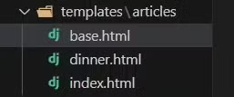
    
    
- 상속 구조 만들기
    - skeleton 역할을 하게 되는 상위 템플릿 `base.html` 작성
    
    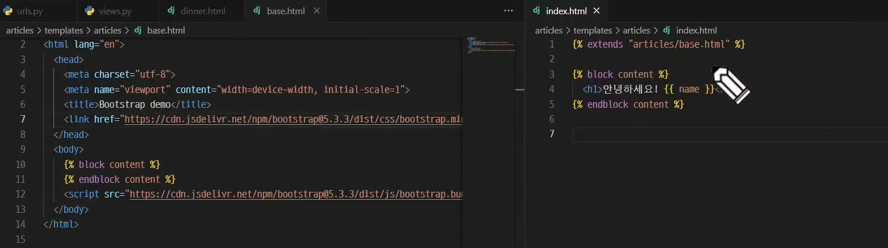
    

### 3) 상속 관련 DTL 태그

- `extends` tag
    - 자식 (하위) 템플릿이 부모 템플릿을 확장한다는 것을 알림
    - 반드시 자식 템플릿 최상단에 작성되어야 함. (2개 이상의 부모를 상속받을 수는 없다는 의미)
    - ``
- `block` tag
    - 하위 템플릿에서 재정의할 수 있는 블록을 정의
    - 상위 템플릿에 작성하며 하위 템플릿이 작성할 수 있는 공간을 지정하는 것 (군데 군데 만들어준다)
    - block 태그 + 스페이스 뒤에 이름을 꼭 적어줘야 함.
    - ` `

## 3. HTML form

### 1) 요청과 응답

- 데이터를 보내고 가져오기
    - HTML ‘form’ element를 통해 사용자와 애플리케이션 간의 상호작용 이해하기
    - HTML ‘form’은 HTTP 요청을 서버에 보내는 가장 편리한 방법
- `form` element
    - 사용자로부터 할당된 데이터를 서버로 전송
    - 웹에서 사용자 정보를 입력하는 여러 방식 (text, password, checkbox 등)을 제공
- `action` & `method` : form의 핵심 속성 2가지
- 데이터를 어디(action)로 어떤 방식(method)으로 요청할지
    - action
        - 입력 데이터가 전송될 URL을 지정 (목적지)
        - 만약 이 속성을 지정하지 않으면 데이터는 현재 form이 있는 페이지의 URL로 보내짐
    - method
        - 데이터를 어떤 방식으로 보낼 것인지 정의
        - 데이터의 HTTP request methods (GET, POST)를 지정
- `input` element : 사용자의 데이터를 입력받을 수 있는 요소
 - type 속성 값(text, password, checkbox 등)에 따라 다양한 유형의 입력 데이터를 받음
    - 핵심 속성 : `name`
        - input의 핵심 속성
        - 사용자가 입력한 데이터에 붙이는 이름 (key)
        - 데이터를 제출했을 때 서버는 name 속성에 설정된 값을 통해서만 사용자가 입력한 데이터에 접근할 수 있음
- Query String Parameters
    - 사용자의 입력 데이터를 URL 주소에 파라미터를 통해 서버로 보내는 방법
    - 문자열은 앰퍼샌드 (`&`)로 연결된 key=value 쌍으로 구성되며, 기본 URL과는 물음표(`?`)로 구분됨
    - 예시
    : `http://host:port/path?key=value&key=value`

### 2) Fake Naver 실습

- input에 hello를 입력하고 제출 버튼을 누른 후 브라우저의 URL 변화 확인
    
    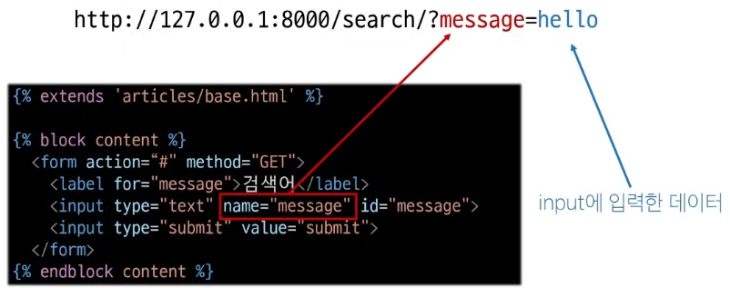
    
- 실제 Naver에서 검색 후 URL 확인
[`https://search.naver.com/search.naver?query=싸피`](https://search.naver.com/search.naver?query=%EC%8B%B8%ED%94%BC)
    - query : input의 name 속성
    - 싸피 : input에 입력한 데이터

### 3) form 활용

- 사용자 입력 데이터를 받아 그대로 출력하는 서버 만들기
    - view 함수는 몇 개가 필요할까?
    → 2개 아닌가
- HTTP request 객체
    - form으로 전송한 데이터 뿐만 아니라 Django로 들어오는 모든 요청 관련 데이터가 담겨 있음
    - view 함수의 첫번째 인자로 전달됨.
- request 객체 살펴보기
    
    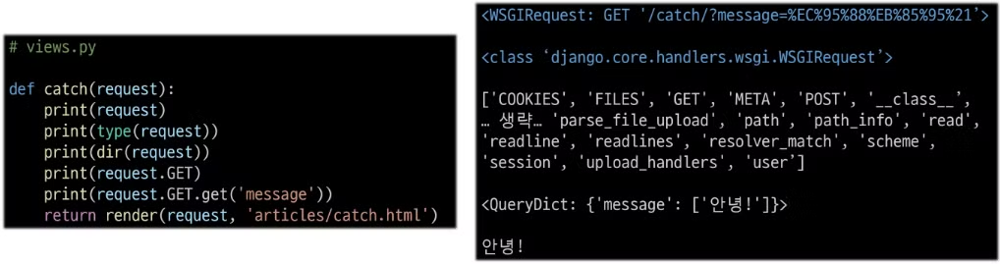
    
- request 객체에서 form 데이터 추출
    - `request.GET.get('message')`
    - `reauest.GET` : <QueryDict: {’message’: [’안녕’]}>
    - `get(’message’)` : 딕셔너리의 get 메서드를 사용해 키의 값을 조회
- throw-catch 간 요청과 응답 정리
    
    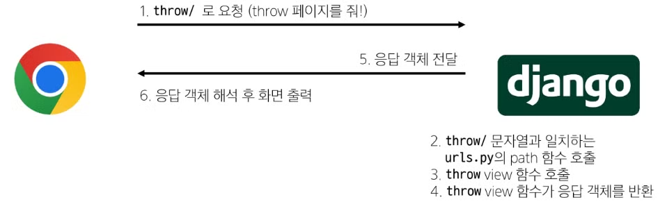
    
    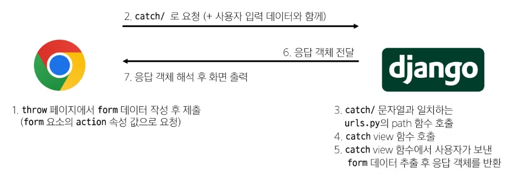
    

## 4. Django URLs

### 1) 요청과 응답에서 Django URLS의 역할

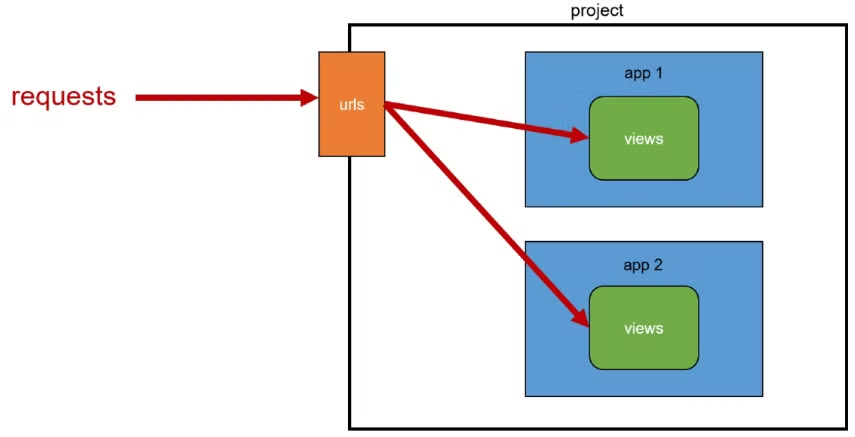

### 2) URL dispathcer

- 운항 관리자, 분배기
- URL 패턴을 정의하고 해당 패턴이 일치하는 요청을 처리할 view 함수를 연결 (매핑)

### 3) Variable Routing (변수와 URL)

- 현재 URL 관리의 문제점
    - 템플릿의 많은 부분이 중복되고, URL의 일부만 변경되는 상황이라면 계속해서 비슷한 URL과 템플릿을 작성해 나가야 할까?
- Variable Routing
    - URL 일부에 변수를 포함시키는 것
    - 변수는 view 함수의 인자로 전달할 수 있음
- 작성법
    - `<path_converter:variable_name>`
    
    ```python
    path('articles/<int:num>/', views.detail)
    path('hello/<str:name>/', views.greeting)
    ```
    
- Path converters
    - URL 변수의 타입을 지정
    - str, int 등 5가지 타입 지원

### 4) App과 URL

- App URL mapping
    - 각 앱에 URL을 정의하는 것
    - 프로젝트와 각 앱이 URL을 나누어 관리를 편하게 하기 위함
- 2번째 앱 pages 생성 후 발생할 수 있는 문제
    - view 함수 이름이 같거나 같은 패턴의 URL 주소를 사용하게 하는 경우
    - 아래 코드와 같이 해결해볼 수 있으나 더 좋은 방법이 필요
        
        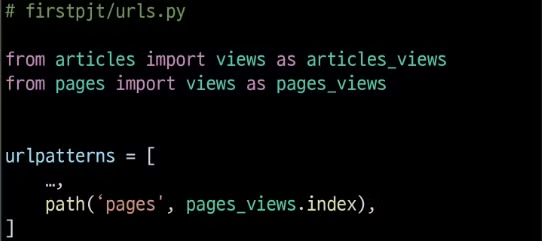
        
    - **URL을 각자 app에서 관리하자**
- URL 구조
    - 기존
        
        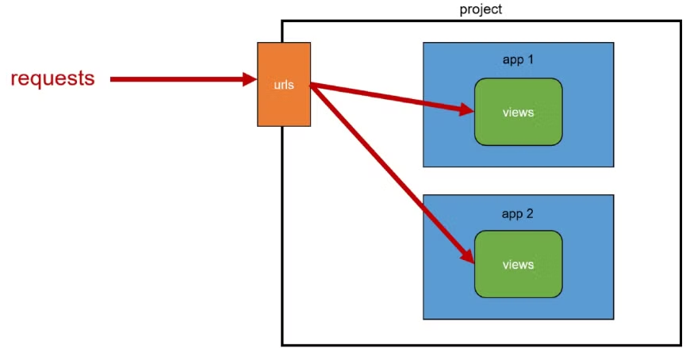
        
    - 변경된
        
        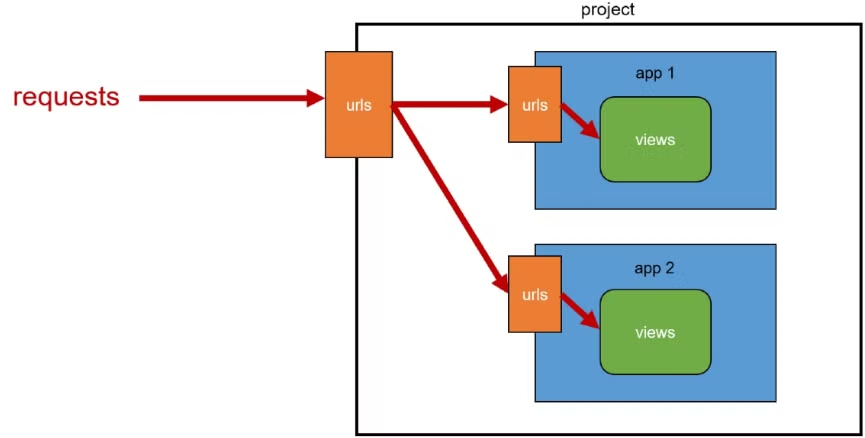
        
- URL 구조 변화
    
    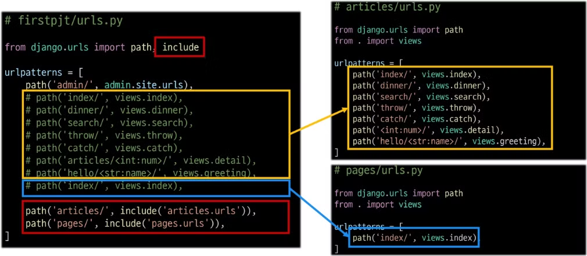
    
- `include( )`
    - 프로젝트 내부 앱들의 URL으르 참조할 수 있도록 매핑하는 함수
    - URL의 일치하는 부분까지 잘라내고, 남은 문자열 부분은 후속 처리를 위해 include된 URL로 전달
    - 적용
        
        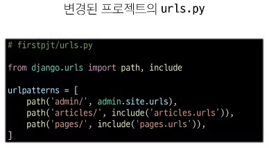
        

## 5. URL 이름 지정

### 1) URL 구조 변경에 따른 문제점

- 기존 ‘articles/’ 주소가 ‘articles/index/’로 변경됨에 따라 해당 url을 사용하는 모든 위치를 찾아가 변경해야 함.
- URL에 이름을 지어주면, 이름만 기억하면 될듯 !!!

```python
# first/urls.py
path('articles/', include('articles.urls'))

# articles/urls.py
path('index/', views.index, name='index')
```

### 2) Naming URL patterns

- URL에 이름을 지정하는 것
- path함수의 name 인자를 정의해서 사용
- URL 표기 변화
    
    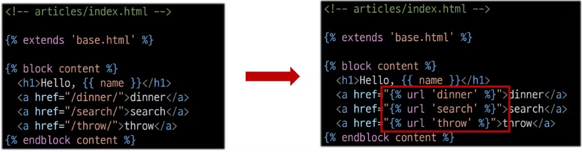
    
    - URL을 작성하는 모든 곳에서 변경
    - a 태그의 href 속성 값 뿐만 아니라 form의 action 속성 등도 포함

### 3) DTL URL tag

- `url` tag
    - ``
    - 주어진 URL 패턴의 이름과 일치하는 절대 경로 주소를 반환

## 6. URL 이름 공간

### 1) app_name 속성

- URL 이름 지정 후 남은 문제
    - articles 앱의 url 이름과 pages 앱의 url 이름이 같은 상황
    - 단순히 이름만으로는 완벽하게 분리할 수 없음
    - **이름에 성(key)을 붙이자 !!**
- **URL tag의 최종 변화** : 마지막으로 url 태그가 사용하는 모든 곳의 표기 변경하기
    - ``
    - `` → ``

