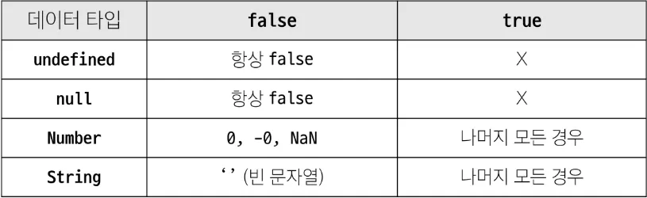

## 1. 데이터 타입

### 1) 원시 자료형

- 변수에 값이 직접 저장되는 자료형
- Number, String, Boolean, null, undefined
- 예시 : 변수에 할당될 때 값이 복사됨. 변수 간 서로 영향을 미치지 않음
    
    ```jsx
    const a = 'bar'
    console.log(a)  //bar
    
    a.toUpperCase()
    console.log(a)  // bar
    ```
    
    ```jsx
    let a = 10
    let b = a
    b = 20
    console.log(a)  // 10
    console.log(b)  // 20
    ```
    
- 종류
    - `Number` : 정수 또는 실수형 숫자를 표현하는 자료형
        
        ```jsx
        const a = 13
        const b = -5
        const c = 3.14
        const d = 2.998e8  // 2.998*10^8 = 299,800,000
        const e = Infinity
        const f = -Infinity
        const g = Nan // Not a Number를 나타내는 값
        ```
        
    - `String` : 텍스트 데이터를 표현하는 자료형
        - ‘+’ 연산자를 사용해 문자열끼리 결합
        - 뺄셈, 곱셈, 나눗셈 불가능
        
        ```jsx
        const firstName = 'Tony'
        const lastName = 'Stark'
        const fullName = firstName + lastName
        
        console.log(fullName) // TonyStark
        ```
        
        - Template literals (템플릿 리터럴)
            - 내장된 표현식을 허용하는 문자열 작성 방식
            - Backtick(``)을 이용하며, 여러 줄에 걸쳐 문자열을 정의할 수도 있고 JavaScript의 변수를 문자열 안에 바로 연결할 수 있음
            - 표현식은 `$` 와 중괄호 `{expression}` 으로 표기
            - ES6+부터 지원
            
            ```jsx
            const age = 100
            const message = `홍길동은 ${age}세입니다.`
            console.log(messgae)  // 홍길동은 100세입니다.
            ```
            
    - `null` : 프로그래머가 의도적으로 ‘값이 없음’을 나타낼 때 사용
        
        ```jsx
        let a = null
        console.log(a) // null
        ```
        
    - `undefined` : 시스템이나 JavaScript 엔진이 ‘값이 할당되지 않음’을 나타낼 때 사용
        
        ```jsx
        let b
        console.log(b)  // undifined
        ```
        
    - `Boolean` : 조건문 또는 반복문에서 Boolean이 아닌 데이터타입은 ‘자동 형변환 규칙’에 따라 true 또는 false로 변환됨
- 자동 형변환



### 2) 참조 자료형

- 객체의 주소가 저장되는 자료형 (가변, 주소가 복사)
- Objects (Object, Array, Function)
- 예시 : 객체를 생성하면 객체의 메모리 주소를 변수에 할당. 변수 간에 서로 영향을 미침
    
    ```jsx
    const obj1 = {name: 'Alice', age?: 30}
    const obj = obj1
    obj2.age = 40
    
    console.log(obj1.age)  // 40
    console.log(objs.age)  // 40
    
    ////////////////////////////////////////
    
    const arr1 = [1, 2, 3]
    const arr2 = arr1
    arr2.push(4)
    
    console.log(arr1) // [1, 2, 3, 4]
    console.log(arr2) // [1, 2, 3, 4]
    ```
    

## 2. 연산자

### 1) 할당 연산자

- 오른쪽에 있는 피연산자의 평가 결과를 왼쪽 피연산자에 할당하는 연산자
- 단축 연산자 지원

```jsx
let a = 0

a += 10
console.log(a)  // 10

a -= 3
console.log(a)  // 7

a *= 10
console.log(a)  // 70

a %= 7
console.log(a)  // 0

```

### 2) 증가 & 감소 연산자

- 증가 연산자 (`++`)
    - 피연산자를 증가(1을 더함)시키고 연산자의 위치에 따라 증가하기 전이나 후의 값을 반환
- 감소 연산자 (`--`)
    - 피연산자를 감소 (1을 뺌) 시키고 연산자의 위치에 따라 감소하기 전이나 후의 값을 반환
- `+=` 또는 `-=` 와 같이 더 명시적인 표현으로 작성하는 것을 권장

```jsx
let x = 3
const y = x++
console.log(x, y)  // 4 3

let a = 3
const b == ++a
console.log(a, b)  // 4 4
```

### 3) 비교 연산자

- 피연산자들(숫자, 문자, Boolean 등)을 비교하고 결과 값을 boolean으로 반환하는 연산자)
```jsx
3 > 2  // true
3 < 2  // false

'A' <'B'  // true
'Z' <'a'  // true
'가' <'나'  // true
```

### 4) 동등 연산자 (`==`)

- 두 피연산자가 같은 값으로 평가되는지 비교 후 boolean 값을 반환
- ‘암묵적 타입 변환’을 통해 타입을 일치시킨 후 같은 값인지 비교
⇒ 권장하지 않음
- 두 피연산자가 모두 객체일 경우 메모리의 같은 객체를 바라보는지 판별

```jsx
console.log(1==1)  // true
console.log('hello' == 'hello')  // true
console.log('1' == 1) // true
console.log(0 == fasle) // true
```

### 5) 일치 연산자 (`===`)

- 두 피연산자의 값과 타입이 모두 같은 경우 true를 반환
- 같은 객체를 가리키거나, 같은 타입이면서 같은 값인지를 비교
- 엄격한 비교가 이뤄지며 암묵적 타입 변환이 발생하지 않음
- 특수한 경우를 제외하고는 동등 연산자가 아닌 일치 연산자 사용 권장

```jsx
console.log(1 === 1)  // true
console.log('hello' === 'hello')  // true
console.log('1' === 1)  // false 문자열vs 숫자일 때는 숫자로 바꿈
console.log(0 === false) // false
console.log([1] == 1) // true
```

### 6) 논리 연산자

- and 연산 `&&`
- or 연산 `||`
- not 연산 `!`
- 단축 평가 지원

```jsx
true && false  // false
true && true // true

false || true  // true
false || false // false

!true  // false

1 && 0  // 0
1 && 1  // 0
4 && 7  // 7
1 || 0  // 1
0 || 1  // 1
4 || 7  // 4

```

## 3. 조건문

### 1) `if` : 조건 표현식의 결과값을 boolean 타입으로 변환 후 참/거짓을 판단

- 예시
    
    ```jsx
    const name = 'customer'
    
    if (name ==='admin') {
        console.log('관리자님 환영해요')
    } else if (name === 'customer') {
        console.log('고객님 환영해요')
    } else {
        console.log(`반갑습니다. ${name}님`)
    }
    ```
    

### 2) 삼항 연산자

- 구성요소
`condition ? expression1 : expression2`
    - condition : 평가할 조건 (true 또는 false)로 평가
    - expression1 : 조건이 true일 경우 반환할 값 또는 표현식
    - expression2 : 조건이 false일 경우 반환할 값 또는 표현식
- 예시
    - 간단한 조건부 로직을 간결하게 표현할 때 유용
    - 복잡한 로직이나 대다수의 경우에는 가독성이 떨어질 수 있으므로 적절한 상황에서만 사용할 것
    
    ```jsx
    const age = 20
    const message(age >= 18) ? '성인' : '미성년자'
    consolel.log(message)  // '성인'
    ```
    

## 4. 반복문

### 1) `while`

- 조건문이 참이면 문장을 계속해서 수행
    
    ```jsx
    while (조건문) {
            // do something
    }
    ```
    
- 예시
    
    ```jsx
    let i = 0
    
    while (i< 6) {
        console.log(i)
        i += 1
    }
    ```
    

### 2) `for`

- 특정한 조건이 거짓으로 판별될 때까지 반복
    
    ```jsx
    for ([초기문]; [조건문;] [증감문]) {
      // do something
    }
    ```
    
- 예시
    
    ```jsx
    for (let i = 0; i < 6; i++) {
        console.log(i)
    }
    ```
    
    

### 3) `for ...in`

- 객체의 열거 가능한 속성 (property)에 대해 반복
    
    ```jsx
    for (variable in objec) {
        statement
    }
    ```
    
- 예시
    
    ```jsx
    const fruits = {a: 'apple', b: 'banana'}
    
    for (const property in objec) {
        console.log(property) // a, b
        console.log(object[property])  // apple, banana
    ```
    

### 4) `for ... of`

- 반복 가능한 객체 (배열, 문자열 등)에 대해 반복
    
    ```jsx
    for (variable of iterable) {
        statement
    }
    ```
    
- 예시
    
    ```jsx
    const numbers = [0, 1, 2, 3]
    
    for (const number of numbers) {
        console.log(number)  // 0, 1, 2, 3
    }
    
    const myStr = 'apple'
    
    for (const char of myStr) {
      console.log(char)
    }
    
    ```
    

### 5) for…in과 for …of  비교 (배열과 객체)

```jsx
// for...in 과 for...of 의 차이
const arr = ['a', 'b', 'c']

for (const i in arr) {
  console.log(i) // 0, 1, 2
}

for (const i of arr) {
  console.log(i) // a, b, c
}
```

```jsx
// Object
const capitals = {
  korea: '서울',
  japan: '도쿄',
  china: '베이징',
}
for (const capital in capitals) {  // 반복자가 도는 형태가 아님
  console.log(capital)
}

for (const capital of capitals) {
  console.log(capital)
  // Uncaught TypeError: capitals is not iterable
}

```

### 6) 배열 반복과 for…in

- 객체 관점에서 배열의 인덱스는 ‘정수 이름을 가진 열거 가능한 속성’
- for…in 은 정수가 아닌 이름과 속성을 포함하여 열거 가능한 모든 속성을 반환
- 내부적으로 for …in 은 배열의 반복자가 아닌 속성 열거를 사용하기 때문에 특정 순서에 따라 인덱스를 반환하는 것을 보장할 수 없음
- for …in 은 인덱스의 순서가 중요한 배열에서는 사용하지 않음
- 배열에서는 for문, for…of를 사용
- 객체 관점에서 배열의 인덱스는 정수 이름을 가진 속성이기 때문에 인덱스가 출력됨 (순서 보장X)

```jsx
const arr = ['a', 'b', 'c']

for (const i in arr) {
    console.log(i)  // 0, 1, 2
}

for (const i of arr) {
console.log(i)  // a, b, c
}
```

### 7) 반복문 사용시 const 사용 여부

- for 문
    - `for (let i = 0; i < arr.length; i++) {....}` 의 경우에는
    최초 정의한 i를 ‘**재할당**’하면서 사용하기 때문에 const를 사용하면 에러 발생
- for …in, for …of
    - 재할당이 아니라, 매 반복마다 다른 속성 이름이 변수에 **지정**되는 것이므로 const를 사용해도 에러가 발생하지 않음
    - 단, const 특징에 따라 블록 내부에서 변수를 수정할 수 없음

### 8) 반복문 종합

| 키워드 | 특징 | 스코프 |
| --- | --- | --- |
| while | . | 블록 스코프 |
| for | . | 블록 스코프 |
| for …in | object 순회 | 블록 스코프 |
| for … of  | iterable 순회 | 블록 스코프 |