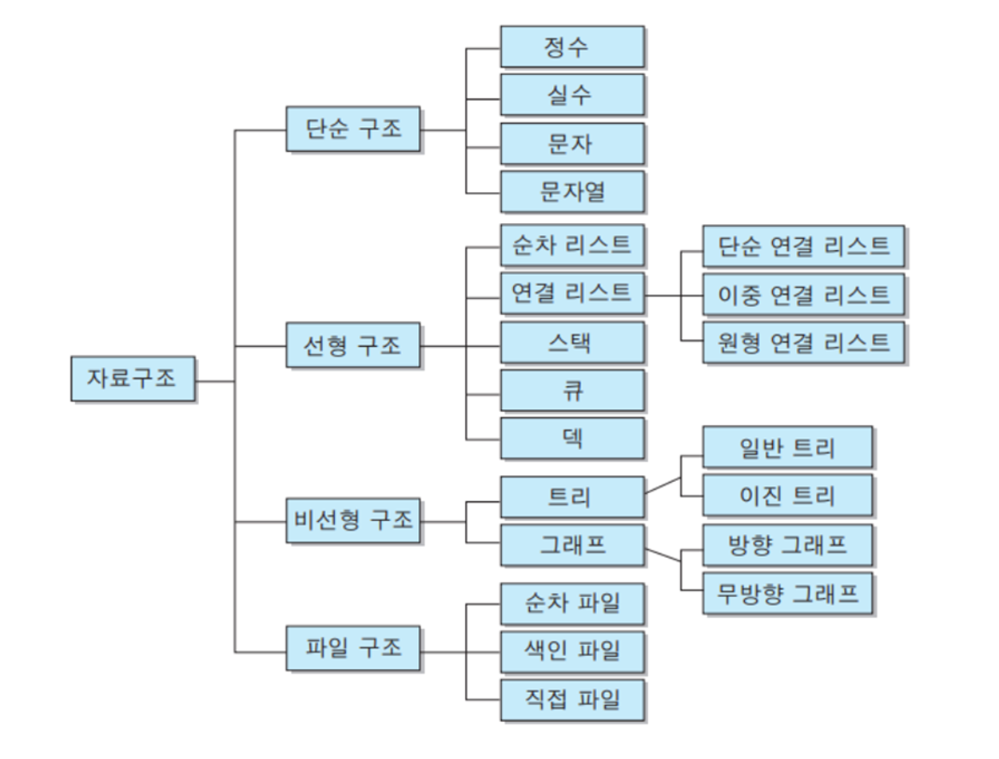

# Python05. DataStructure

## 1. 개요

### 1) 데이터 구조 Data Structure

- 여러 데이터를 효과적으로 사용, 관리하기 위한 구조 (str, list, dict 등)

### 2) 자료 구조

- 컴퓨터 공학에서는 ‘자료 구조’ 라고 함
- 각 데이터의 효율적인 저장, 관리를 위한 구조를 나눠 놓은 것



<br>

### 3) 데이터 구조 활용

- 문자열, 리스트, 딕셔너리 등 각 데이터 구조의 메서드를 호출하여 다양한 기능을 활용하기

### 4) 메서드 `method`

💡 객체에 속한 함수 <br> 💡 객체의 상태를 조작하거나 동작을 수행


- 메서드 특징
    - 메서드는 클래스(class) 내부에 정의되는 함수
    (str, list, dict 모두 클래스임)
    - 클래스는 파이썬에서 ‘타입을 표현하는 방법’이며 이미 은연중에 사용해왔음
    - 예를 들어 help 함수를 통해 str을 호출해보면 class였다는 것을 확인 가능
- 메서드는 **클래스에 속해있는 함수**이며, **각 데이터 타입별로 다양한 기능을 가진 메서드**가 존재
- 메서드 호출 예시
    
    ```python
    # 문자열 메서드 예시 - 객체.메서드()
    print('hello'.capitalize())  # Hello
    
    # 리스트 메서드 예시
    numbers = [1, 2, 3]
    numbers.append(4)
    
    print(numbers)  # [1, 2, 3, 4]
    
    ```    
<br>

## 2. 시퀀스 데이터 구조

### 1) 문자열 `String`

- 문자열 조회/탐색 및 검증 메서드
    
    
    | 메서드 | 설명 |
    | --- | --- |
    | s.find(x) | x의   첫 번째 위치를 반환. 없으면,  -1을 반환 |
    | s.index(x) | x의   첫 번째 위치를 반환. 없으면,  오류 발생 |
    | s.isupper() | 대문자 여부 |
    | s.islower() | 소문자 여부 |
    | s.isalpha() | 알파벳 문자 여부      *단순 알파벳이 아닌 유니코드 상 Letter (한국어도 포함) |

    <br>

- 문자열 조작 메서드 (새 문자열 반환)
    
    
    | 메서드 | 설명 |
    | --- | --- |
    | s.replace(old, new[,count]) | 바꿀 대상 글자를 새로운 글자로 바꿔서 반환
    count 는 몇번 바꿀지를 의미하는 선택 인자 |
    | s.strip([chars]) | **양 끝의** 공백이나 특정 문자를 제거 |
    | s.split(sep=None, maxsplit=-1) | 공백이나 특정 문자를 기준으로 분리 |
    | 'separator'.join(iterable) | 구분자로 iterable의 문자열을 연결한 문자열을 반환 |
    | s.capitalize() | 가장 첫 번째 글자를 대문자로 변경 |
    | s.title() | 문자열 내 공백을 기준으로 각 단어의 첫 글자는 대문자로, 나머지는 소문자로 변환 |
    | s.upper() | 모두 대문자로 변경 |
    | s.lower() | 모두 소문자로 변경 |
    | s.swapcase() | 대↔소문자 서로 변경 |
<br>

### 2) 리스트 `list`

- 리스트 값 추가 및 삭제 메서드
    
    
    | 메서드 | 설명 |
    | --- | --- |
    | L.append(x) | 리스트 마지막에 항목 x를 추가 |
    | L.extend(m) | Iterable m의 모든 항목들을 리스트 끝에 추가 (+=과 같은 기능) |
    | L.insert(i, x) | 리스트 인덱스 i에 항목 x를 삽입 |
    | L.remove(x) | 리스트 가장 왼쪽에 있는 항목(첫 번째) x를 제거
    항목이 존재하지 않을 경우, ValueError |
    | L.pop() | 리스트 가장 오른쪽에 있는 항목(마지막)을 반환 후 제거 |
    | L.pop(i) | 리스트의 인덱스 i에 있는 항목을 반환 후 제거 |
    | L.clear() | 리스트의 모든 항목 삭제 |
- 리스트 탐색 및 정렬 메서드
    
    
    | 문법 | 설명 |
    | --- | --- |
    | L.index(x) | 리스트에 있는 항목 중 가장 왼쪽에 있는 항목 x의 인덱스를 반환 |
    | L.count(x) | 리스트에서 항목 x의 개수를 반환 |
    | L.reverse() | 리스트의 순서를 역순으로 변경 (정렬 X) |
    | L.sort() | 리스트를 정렬 (매개변수 이용가능) |

<br>

## 3. 비시퀀스 데이터 구조

### 1) 딕셔너리 `dictionary`

- 고유한 항목들의 정렬되지 않은 컬렉션
- 딕셔너리 메서드

    | 메서드 | 설명 |
    | --- | --- |
    | D.clear() | 딕셔너리 D의 모든 키/값 쌍을 제거 |
    | D.get(k) | 키 k에 연결된 값을 반환 (키가 없으면 None을 반환) ↔ dict[keys]로 접근하면 에러가 남 |
    | D.get(k, v) | 키 k에 연결된 값을 반환하거나 키가 없으면 기본 값으로 v를 반환 |
    | D.keys() | 딕셔너리 D의 키를 모은 객체를 반환 (반복문으로 출력 가능, 혹은 리스트로 전환) |
    | D.values() | 딕셔너리 D의 값을 모은 객체를 반환 |
    | D.items() | 딕셔너리 D의 키/값 쌍을 모은 객체를 반환 |
    | D.pop(k) | 딕셔너리 D에서 키 k를 제거하고 연결됐던 값을 반환 (없으면 오류) |
    | D.pop(k,   v) | 딕셔너리 D에서 키 k를 제거하고 연결됐던 값을 반환 (없으면 v를 반환. 디폴트값 지정) |
    | D.setdefault(k) | 딕셔너리 D에서 키 k와 연결된 값을 반환 |
    | D.setdefault(k, v) | 딕셔너리 D에서 키 k와 연결된 값을 반환  k가 D의 키가 아니면 값 v와 연결한 키 k를 D에 추가하고 v를 반환 |
    | D.update(other) | other 내 각 키에 대해 D에 있는 키면 D에 있는 그 키의 값을 other에 있는 값으로 대체. other에 있는 각 키에 대해 D에   없는 키면 키/값 쌍을 D에 추가 |

### 2) 세트 `set`

- 고유한 항목들의 정렬되지 않은 컬렉션
- 세트 메서드
    
    | 메서드 | 설명 |
    | --- | --- |
    | s.add(x) | 세트 s에 항목 x를 추가. 이미 x가 있다면 변화 없음 |
    | s.clear() | 세트 s의 모든 항목을   제거 |
    | s.remove(x) | 세트 s에서 항목 x를 제거. 항목   x가 없을 경우 Key error |
    | s.pop() | 세트 s에서 랜덤하게 항목을 반환하고, 해당 항목을 제거 |
    | s.discard(x) | 세트 s에서 항목 x를 제거 |
    | s.update(iterable) | 세트 s에 다른 iterable 요소를   추가 |


- 세트의 집합 메서드
    
    | 메서드 | 설명 | 연산자 |
    | --- | --- | --- |
    | set1.difference(set2) | set1에는 들어있지만 set2에는      없는   항목으로 세트를 생성 후 반환 | set1   – set2 |
    | set1.intersection(set2) | set1과 set2 모두   들어있는 항목으로      세트를   생성 후 반환 | set1   & set 2 |
    | set1.issubset(set2) | set1의 항목이 모두 set2에 들어있으면      True를   반환 | set1   <= set2 |
    | set1.issuperset(set2) | set1가 set2의   항목을 모두 포함하면      True를   반환 | set1   >= set2 |
    | set1.union(set2) | set1 또는 set2에(혹은   둘 다) 들어있는      항목으로   세트를 생성 후 반환 | set1   | set2 |


<br>

## 4. 참고 : 문자 유형 판별 메서드
| 문자열에 포함된 문자들의 유형을 판별하는 메서드
- `isdecimal()`
    - 문자열이 모두 숫자 문자(0~9)로만 이루어져 있어야 True
- `isdigit()`
    - isdecimal()과 비슷하지만, 유니코드 숫자도 인식 ('①’ 도 숫자로 인식)
- `isnumeric()`
    - isdigit()과 유사하지만, 몇 가지 추가적인 유니코드 문자들을 인식 <br>(분수, 지수, 루트 기호도 숫자로 인식)


| `isdecimal()` | `isdigit()` | `isnumeric()` | 예시 |
|:-------------:|:-----------:|:-------------:|:----:|
| True | True | True | "038",   "੦੩੮",   "０３８" |
| False | True | True | "⁰³⁸", "🄀⒊⒏", "⓪③⑧" |
| False | False | True | "⅛⅘", "ⅠⅢⅧ", "⑩⑬㊿", "壹貳參" |
| False | False | False | "abc", "38.0", "-38" |