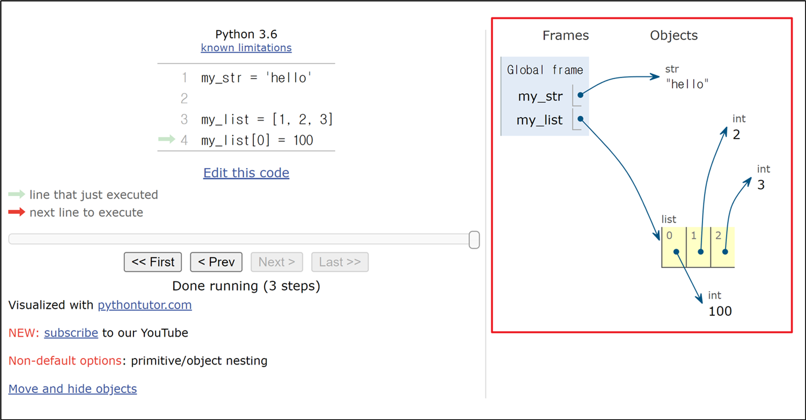

# Data Types

## < 데이터 타입 >
| 분류
- Numeric Types : int (정수), float (실수), complex (복소수)
- Text Sequence Type : str (문자열)
- Sequence Types : list, tuple, range
- Non-sequence Types : set, dict
- 기타 : Boolean, None, Functions

| 데이터 타입이 필요한 이유
- 값들을 구분하고, 어떻게 다뤄야 하는지를 알 수 있음
- 요리 재료마다 특정한 도구가 필요하듯이 각 데이터 타입 값들도 각자에게 적합한 도구를 가짐
- 타입을 명시적으로 지정하면 코드를 읽는 사람이 변수의 의도를 더 쉽게 이해할 수 있고, 잘못된 데이터 타입으로 인한 오류를 미리 예방

<br>

## 1. Numeric Types
### 1) int 정수 자료형
- 정수를 표현하는 자료형
- 진수 표현
  - 2진수(binary) : `0b`
  - 8진수(octal) : `0o`
  - 16진수(hexadecimal) : `0x`

### 2) float 실수 자료형
- 실수를 표현하는 자료형
- 프로그래밍 언어에서 float는 실수에 대한 근삿값
- 유한정밀도
    - 컴퓨터 메모리 용량이 한정돼있고 한 숫자에 대해 저장하는 용량이 제한됨
    - 0.6666666과 1.6666667은 제한된 양의 메모리에 저장할 수 있는 2/3과 5/3에 가장 가까운 값
- 실수 연산 시 주의사항
    - 컴퓨터는 2진수를 사용, 사람은 10진법을 사용
    - 이때 10진수 0.1은 2진수로 표현하면 0.0001100110011001100110... - 같이 무한대로 반복
    - 무한대 숫자를 그대로 저장할 수 없어서 사람이 사용하는 10진법의 근사값만 표시
    - 0.1의 경우 3602879701896397 / 2 ** 55 이며 0.1에 가깝지만 정확히 동일하지는 않음
    - 이런 과정에서 예상치 못한 결과가 나타남
    - 이런 증상을 Floating point rounding error 부동소수점 에러라고 함
- 부동소수점 에러
    - 컴퓨터가 실수를 표현하는 방식으로 인해 발생하는 작은 오차
    - 원인 : 실수를 2진수로 변환하는 과정에서 발생하는 근사치 표현
    - 부동소수점 에러 해결책 : 대표적으로 decimal 모듈을 사용해 부동소수점 연산의 정확성을 보장하는 방법
        ```
        # 해결 전
        a = 3.2 - 3.1
        b = 1.2 - 1.1
        print(a)  # 0.10000000000000009
        print(b)  # 0.09999999999999987
        print(a == b)  # False

        # 해결 후
        from decimal import Decimal

        a = Decimal('3.2') - Decimal('3.1')
        b = Decimal('1.2') - Decimal('1.1')

        print(a)  # 0.1
        print(b)  # 0.1
        print(a == b)  # True
        ```
- 지수표현방식 : `e` 또는 `E`를 사용한 지수 표현
    ```
    # 314 ∗ 0.01
    number = 314e-2

    # 3.14
    print(number)
    ```

<br>

## 2. Sequence Types
- 여러 개의 값들을 순서대로 나열하여 저장하는 자료형 (str, list, tuple, range)
- 특징
  - 순서 : 값들이 순서대로 저장 (정렬 X)
  - 인덱싱 : 각 값에 고유한 인덱스(번호)를 가지고 있으며, 인덱스를 사용하여 특정 위치의 값을 선택하거나 수정 가능
  - 슬라이싱 : 인덱스 범위를 조절해 부분적인 값을 추출할 수 있음
  - 길이 : len() 함수를 사용하여 저장된 값의 개수(길이)를 구할 수 있음
  - 반복 : 반복문을 사용하여 저장된 값들을 반복적으로 처리 가능

### 1) str 문자형
- 문자들의 순서가 있는 변경 불가능한 시퀀스 자료형
- 문자열 표현
    - 문자열은 단일 문자나 여러 문자의 조합으로 이루어짐
    - 작은따옴표(`'`) 또는 큰따옴표(`"`) 감싸서 표현
- 따옴표 안에 따옴표를 표현할 경우
    - 작은따옴표가 들어있는 경우는 큰따옴표로 문자열 생성
    - 큰따옴표가 들어있는 경우는 작은따옴표로 문자열 생성
- Escape sequence
    - 역슬래시 뒤에 특정 문자가 와서 특수한 기능을 하는 문자 조합
    - 파이썬의 일반적 문법 규칙을 잠시 탈출한다는 의미
    - |예약문자|내용(의미)|
      |:------:|:-----------:|
      |\n|줄바꿈|
      |\t|탭|
      |\\ |백슬래시|
      |\'|작은 따옴표|
      |\"|큰 따옴표|
    
        ```
        # 철수야 '안녕'
        print('철수야 \'안녕\'')

        '''
        이 다음은 엔터
        입니다.
        '''
        print('이 다음은 엔터\n입니다.)
        ```
- String Interpolation (삽입) : 문자열 내에 변수나 표현식을 삽입하는 방법
  - f-string
    - 문자열에 f 또는 F 접두어를 붙이고 표현식을 {expression}로 작성하는 문법
    - 문자열에 파이썬 표현식의 값을 삽입할 수 있음
- 문자열 시퀀스의 특징
  - 인덱스 : 시퀀스 내 값들에 대한 고유 번호로, 각 값의 위치를 식별하는 데 사용되는 숫자
  - 슬라이싱 : 시퀀스의 일부분을 선택하여 추출하는 작업. 시작 인덱스와 끝 인덱스를 지정하여 해당 범위의 값을 포함하는 새로운 시퀀스를 생성
  - 문자열은 불변 (변경 불가)
  변수가 메모리 주소를 참조하는걸 보면, 구조 상 불가능하다.

### 2) list 리스트
- 여러 개의 값을 순서대로 저장하는 변경 가능한 시퀀스 자료형
- 리스트 표현
  - 0개 이상의 객체를 포함하며 데이터 목록을 저장
  - 대괄호 `[]`로 표기
  - 어떤 자료형도 저장 가능
  ```
  my_list_1 = []

  my_list_2 = [1, 'a', 3, 'b', 5]

  my_list_3 = [1, 2, 3, 'Python', ['hello', 'world', '!!!']]
  ```
- 리스트의 시퀀스 특징 <br> `my_list = [1, 'a', 3, 'b', 5]`
  - 인덱싱 : `print(my_lust[1]) # a`
  - 슬라이싱
    ```
    print(my_list[2:4])  # [3, 'b']
    print(my_list[:3])  # [1, 'a', 3]
    print(my_list[3:])  # ['b', 5]
    print(my_list[0:5:2])  # [1, 3, 5]
    print(my_list[::-1])  # [5, 'b', 3, 'a', 1]
    ```
  - 길이 : `print(len(my_list)) # 5`
- 중첩된 리스트 접근
  ```
  my_list = [1, 2, 3, 'Python', ['hello', 'world', '!!!']]
  print(len(my_list))  # 5
  print(my_list[4][-1])  # !!!
  print(my_list[-1][1][0])  # w
  ```
- 리스트는 가변 (변경 가능)
  ```
  my_list = [1, 2, 3]
  my_list[0] = 100

  print(my_list)  # [100, 2, 3]
  ```

### 3) tuple
- 여러 개의 값을 순서대로 저장하는 변경 불가능한 시퀀스 자료형
- 튜플 표현
  - 0개 이상의 객체를 포함하며 데이터 목록을 저장
  - 소괄호 `()`로 표기
  - 데이터는 어떤 자료형도 저장 가능
  ```
  my_tuple_1 = ()

  my_tuple_2 = (1,) # my_tuple_2에서 뒤에 ,를 꼭 넣어줘야 함. 그냥 (1)로 표현하면 in

  my_tuple_3 = (1, 'a', 3, 'b', 5)
  ```
- 튜플의 시퀀스 특징 <br> `my_tuple = (1, 'a', 3, 'b', 5)`
  - 인덱싱 : `print(my_tuple[1])  # a`
  - 슬라이싱
    ```
    print(my_tuple[2:4])  # (3, 'b')
    print(my_tuple[:3])  # (1, 'a', 3)
    print(my_tuple[3:])  # ('b', 5)
    print(my_tuple[0:5:2])  # (1, 3, 5)
    print(my_tuple[::-1])  # (5, 'b', 3, 'a', 1)
    ```
  - 길이 : `print(len(my_tuple))  # 5`
- 튜플은 불변 (변경 불가)
  ```
  my_tuple = (1, 'a', 3, 'b', 5)

  # TypeError: 'tuple' object does not support item assignment
  my_tuple[1] = 'z'
  ```
- 튜플은 어디 쓰일까?
  - 튜플의 불변 특성을 사용해서 안전하게 여러 개의 값을 전달, 그룹화, 다중 할당 등
  - 개발자가 직접 사용하기 보다 '파이썬 내부 동작'에서 주로 사용됨. <br> 👉🏻값이 안정적이고 고정적이여야 함.
  <br>

  ```
  x, y = (10, 20)

  print(x)  # 10
  print(y)  # 20

  # 파이썬은 쉼표를 튜플 생성자로 사용하니 괄호는 생략 가능
  x, y = 10, 20
  ```


### 4) range
- 연속된 정수 시퀀스를 생성하는 변경 불가능한 자료형
- range 표현 (1)
  - `range(시작 값, 끝 값, 증가 값)`
  - `range(n)` : 0부터 n-1까지 숫자의 시퀀스
  - `range(n, m)` : n부터 m-1까지 숫자의 시퀀스
  ```
  my_range_1 = range(5)
  my_range_2 = range(1, 10)

  print(my_range_1)  # range(0, 5)
  print(my_range_2)  # range(1, 10)
  ```
- range 특징
  - 증가 값이 없으면 1씩 증가
  - 증가 값이 음수면 감소 / 증가 값이 양수면 증가
  - 증가 값이 0이면 에러
  - 증가 값이 음수면 시작 값이 끝 값보다 커야 함.
  - 증가 값이 음수면 시작 값이 끝 값보다 작아야 함.
  - range는 불변 (변경 불가)
- range 표현 (2)
  - 주로 반복문과 함께 사용 예정
  - 형 변환이 가능
  <br>

  ```
  # 리스트로 형 변환 시 데이터 확인 가능
  print(list(range(5)))   # [0, 1, 2, 3, 4]
  print(list(range(1, 10)))  # [1, 2, 3, 4, 5, 6, 7, 8, 9]

  # 반복문과 함께 활용
  for i in range(1, 10):
      print(i)  # 1 2 3 4 5 6 7 8 9
  for i in range(1, 10, 2):
      print(i)  # 1 3 5 7 9
  ```

<br>

## 3. Non-Sequence Types
### 1) dict 딕셔너리
- key-value 쌍으로 이루어진 순서와 중복이 없는 변경 가능한 자료형
- 딕셔너리 표현
  - key : 변경 불가능한 자료형만 사용 가능 (str, int, float, tuple, range ...)
  - 딕셔너리 : key에 접근해 값을 얻어냄
  - 중괄호 `{ }`로 표기
  <br>

  ```
  my_dict_1 = {}
  my_dict_2 = {'key': 'value'}
  my_dict_3 = {'apple': 12, 'list': [1, 2, 3]}

  print(my_dict_1)  # {}
  print(my_dict_2)  # {'key': 'value'}
  print(my_dict_3)  # {'apple': 12, 'list': [1, 2, 3]}
  ```
- 딕셔너리 사용 : key를 통해 value에 접근
  ```
  my_dict = {'apple': 12, 'list': [1, 2, 3]}
  print(my_dict['apple'])  # 12
  print(my_dict['list'])  # [1, 2, 3]

  # 추가
  my_dict['banana'] = 50
  print(my_dict) # {'apple': 12, 'list': [1, 2, 3], 'banana': 50}

  # 변경
  my_dict['apple'] = 100
  print(my_dict) # {'apple': 100, 'list': [1, 2, 3], 'banana': 50}
  ```


### 2) set
- 순서와 중복이 없는 변경 가능한 자료형
- 세트 표현
  - 수학에서의 집합과 동일한 연산 처리 가능
  - 중괄호 `{ }'로 표기

  ```
  my_set_1 = set()
  my_set_2 = {1, 2, 3}
  my_set_3 = {1, 1, 1}

  print(my_set_1)  # set()
  print(my_set_2)  # {1, 2, 3}
  print(my_set_3)  # {1}
  ```
- 세트의 집합 연산
  ```
  my_set_1 = {1, 2, 3}
  my_set_2 = {3, 6, 9}

  # 합집합
  print(my_set_1 | my_set_2)  # {1, 2, 3, 6, 9}

  # 차집합
  print(my_set_1 - my_set_2)  # {1, 2}

  # 교집합
  print(my_set_1 & my_set_2)  # {3}
  ```

<br>

## 4. Other Types
### 1) None
- 파이썬에서 '값이 없음'을 표현하는 자료형
- None 표현
  ```
  variable = None

  print(variable)  # None
  ```

### 2) Boolean
- 참(True)와 거짓(False)을 표현하는 자료형
- 불리언 표현
  - 비교/논리 연산의 평가 결과로 사용됨
  - 주로 조건/반복문과 함께 사용
  <br>

  ```
  bool_1 = True
  bool_2 = False

  print(bool_1)  # True
  print(bool_2)  # False
  print(3 > 1)  # True
  print('3' != 3)  # True
  ```

<br>

## 5. Collection
- 여러 개의 항목 또는 요소를 담는 자료 구조
- str, list, tuple, set, dict
- 컬렉션 정리

  |     컬렉션    	|     변경 가능 여부    	|     순서 여부    	|  시퀀스 여부 	|
  |:-------------:|:---------------------:|:----------------:|:--------:|
  |       str     	|            X          	|         O        	|  시퀀스  	|
  |      list     	|            O          	|         O        	|  시퀀스  	|
  |      tuple    	|            X          	|         O        	|  시퀀스  	|
  |       dict     	|            O          	|         X        	| 비시퀀스 	|
  |      set     	  |            O          	|         X        	| 비시퀀스 	|
<br>

- 불변과 가변의 차이
  <br>

  ```
  my_str = 'hello'
  # TypeError: 'str' object does not support item assignment
  my_str[0] = 'z'

  my_list = [1, 2, 3]
  my_list[0] = 100
  # [100, 2, 3]
  print(my_list)
  ```

  

<br>

## < Type Conversion 형 변환 >
| 한 데이터 타입을 다른 데이터 타입으로 변환하는 과정

### 1. 암시적 형변환 (Implicit Type Conversion)
- 파이썬이 자동으로 수행하는 형 변환
- 예시
  - 정수와 실수의 연산에서 정수가 실수로 변환됨.
  - Boolean과 Numeric Type에서만 가능
  ```
  print(3 + 5.0)  # 8.0

  print(True + 3)  # 4

  print(True + False)  # 1
  ```

### 2. 명시적 형변환 (Explicit Type conversion)
- 프로그래머가 직접 지정하는 형변환
- 암시적 형변환이 아닌 경우를 모두 포함
- 예시
  - str -> integer : 형식에 맞는 숫자만 가능
    ```
    print(int('1'))  # 1

    # ValueError: invalid literal for int() with base 10: '3.5'
    print(int('3.5'))

    print(int(3.5))  # 3
    print(float('3.5'))  # 3.5
    ```
  - integer -> str : 모두 가능
    ```
    print(str(1) + '등')  # 1등
    ```