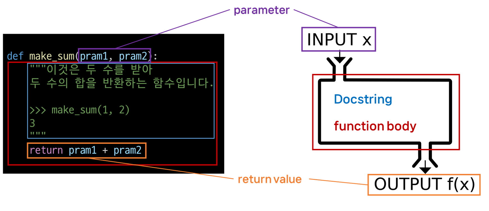
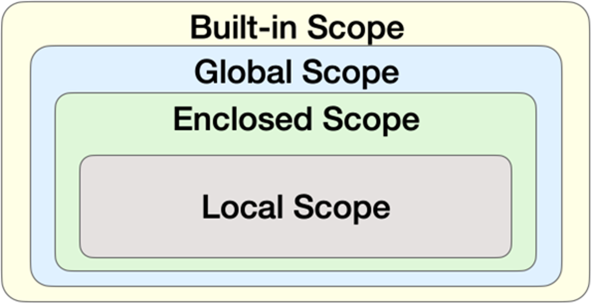

# Functions

## 1. 함수 Functions
- 특정 작업을 수행하기 위한 재사용 가능한 코드 묶음

### 1) 함수를 사용하는 이유
- 코드의 중복을 방지
- 재사용이 높아지고, 코드의 가독성과 유지보수성 향상

### 2) 함수의 구조


### 3) 함수의 정의와 호출
- 함수 정의
  - `def` 키워드로 시작
  - `def` 키워드 이후 함수 이름 작성
  - 괄호 안에 매개변수 정의
  - 매개변수(parameter)는 함수에 전달되는 값을 나타냄.
- 함수 body
  - 콜론 (`:`) 다음에 들여쓰기 된 코드 블록
  - 함수가 실행될 때 수행되는 코드를 정의
  - Docstring은 함수 body 앞에 선택적으로 작성 하능한 함수 설명서
- 함수 반환 값
  - 필요한 경우, 함수는 결과 반환 가능
  - `return` 키워드 이후 반환할 값을 명시
  - `return`문은 함수의 실행을 종료하고, 결과를 호출 부분으로 반환
- 함수 호출 <br> : 함수를 실행하기 위해 함수의 이름을 사용하여 해당 함수의 코드 블록을 실행하는 것

## 2. 매개변수와 인자
### 1) 매개변수와 인자
- 매개변수 (parameter) <br> : 함수를 정의할 때, 함수가 받을 값을 나타내는 변수
- 인자 (argument) <br> : 함수를 호출할 때, 실제로 전달되는 값
- 매개변수와 인자 예시
    ```python
    def add_numbers(x, y): # x와 y는 매개변수(parameter)
    result = x + y
    return result


    a = 2
    b = 3
    sum_result = add_numbers(a, b) # a와 b는 인자(argument)
    print(sum_result)
    ```
### 2) 다양한 인자 종류
- **위치 인자** (Positional Arguments)
  - 함수 호출 시 인자의 위치에 따라 전달되는 인자
  - 위치 인자는 함수 호출 시 반드시 값을 전달해야 함. (누락될 수 없음)
  ```python
  def greet(name, age):
      print(f'안녕하세요, {name}님! {age}살이시군요.')

  greet('Alice', 25) # 안녕하세요, Alice님! 25살이시군요
  ```

- **기본 인자 값** (Default Argument Values)
  - 함수 정의에서 매개변수에 기본 값을 할당하는 것
  - 함수 호출 시 인자를 전달하지 않으면, 기본 값이 매개변수에 할당됨. (유연함)
  ```python
  def greet(name, age=30):
      print(f'안녕하세요, {name}님! {age}살이시군요.')

  greet('Bob') # 안녕하세요, Bob님! 30살이시군요.
  greet('Charlie', 40) # 안녕하세요, Charlie님! 40살이시군요.
  ```

- **키워드 인자** (Keyword Arguments)
  - 함수를 호출할 때 사용법.
  - 함수 호출 시 인자의 이름과 함께 값을 전달하는 인자
  - 매개변수와 인자를 일치시키지 않고, 특정 매개변수에 값을 할당할 수 있음
  - 인자의 순서는 중요하지 않으며, 인자의 이름을 명시하여 전달
  - 단, 호출 시 키워드 인자는 위치 인자 뒤에 둬야 함.
  ```python
  def greet(name, age):
      print(f'안녕하세요, {name}님! {age}살이시군요.')

  greet(name='Dave', age=35)  # 안녕하세요, Dave님! 35살이시군요.
  greet(age=35, 'Dave')  #  positional argument follows keyword argument
  ```

- **임의의 인자 목록** (Arbitrary Argument Lists)
  - (0개 이상의) 정해지지 않은 개수의 인자를 처리하는 인자
  - 함수 정의 시 매개변수 앞에 `*` 를 붙여 사용하며, **여러 개**의 인자를 **tuple**로 처리

  ```python
  def calculate_sum(*args):
      print(args)
      total = sum(args)
      print(f'합계: {total}')
      
      calculate_sum(1, 2, 3)
  ```

- **임의의 키워드 인자 목록**
  - 정해지지 않은 개수의 키워드 인자를 처리하는 인자
  - 함수 정의 시 매개변수 앞에 `**` 를 붙여 사용하며, 여러 개의 인자를 dictionary로 묶어 처리
  ```python
  def print_info(**kwargs):
      print(kwargs)

  print_info(name='Eve', age=30) # {'name': 'Eve', 'age': 30}
  ```

### 3) 함수 인자 권장 작성 순서
- 위치 → 기본 → 가변 → 가변 키워드
- 호출 시 인자 전달 과정에서 혼란을 줄일 수 있도록 함.
- 단, 모든 상황에 적용되는 절대적 규칙은 아니며, 상황에 따라 유연하게 조정 가능

### 4) 인자의 모든 종류를 적용한 예시
```python
def func(pos1, pos2, default_arg='default', *args, **kwargs):
    print('pos1:', pos1)
    print('pos2:', pos2)
    print('default_arg:', default_arg)
    print('args:', args)
    print('kwargs:', kwargs)

func(1, 2, 3, 4, 5, 6, key1='value1', key2='value2')

"""
pos1: 1
pos2: 2
default_arg: 3
args: (4, 5, 6)
kwargs: {'key1': 'value1', 'key2': 'value2'}
"""
```


## 3. 재귀함수
- 정의된 함수 내부에서 자기 자신을 호출하는 함수

### 1) 재귀 함수 예시 (팩토리얼)
-  factorial 함수는 자기 자신을 **재귀적으로 호출**하여 입력된 숫자 n의 팩토리얼을 계산
- 재귀 호출은 n이 0이 될 때까지 반복되며, 종료 조건을 설정하여 재귀 호출이 멈추도록 함
(아니면 무한정 돌아버림)
- 재귀 호출의 결과를 이용하여 문제를 작은 단위의 문제로 분할하고, 분할된 문제들의 결과를 조합하여 최종 결과를 도출
  ```python
  𝑛!
  𝑛 ∗ (𝑛−1)!
  𝑛 ∗ (𝑛−1) ∗ (𝑛−2)!
  …

  def factorial(n):
  # 종료 조건: n이 0이면 1을 반환
    if n == 0:
        return 1
    else:
    # 재귀 호출: n과 n-1의 팩토리얼을 곱한 결과를 반환
        return n * factorial(n - 1)

  # 팩토리얼 계산 예시
  print(factorial(5))  # 120
<br>

### 2)  재귀 함수 특징

- 특정 알고리즘 식을 표현할 때, 변수의 사용이 줄어들며 코드의 가독성이 좋아짐
- 1개 이상의 base case(종료되는 상황)가 존재하고 수렴하도록 작성

### 3) 재귀 함수를 사용하는 이유

- 문제의 자연스러운 표현
: 복잡한 문제를 간결하고 직관적으로 표현 가능
- 코드 간결성
: 상황에 따라 반복문보다 알고리즘 코드가 더 간결하고 명확해질 수 있음
- 수학적 문제 해결
: 수학적 정의가 재귀적으로 표현되는 경우, 직접적인 구현 가능

### 4) 재귀 함수 활용시 기억해야 할 것

- 종료조건을 명확히
- 반복되는 호출이 종료 조건을 향하도록

## 4. 내장 함수

### 1) 내장함수
- 파이썬이 기본적으로 제공하는 함수 (별도의 import 없이 바로 사용 가능)

### 2) 유용한 내장 함수 map&zip

- `map(function, iterable`
    - 순회 가능한 데이터 구조 (iterable)의 모든 요소에 함수를 적용하고, 그 결과를 map object로 반환
    - iterable : 반복 가능한 객체(요소) 컬렉션
        ```python
        numbers = [1, 2, 3]
        result = map(str, numbers)

        print(result)  # <map object at 0x00000239C915D760>
        print(list(result))  # ['1', '2', '3']
        ```
    -  `map( )` 활용 <br> : SWEA 문제의 input 처럼 문자열 `'1 2 3'`이 입력 되었을 때 활용 예시
        ```python
        numbers1 = input().split()
        print(numbers1)  # ['1,', '2,', '3']

        numbers2 = list(map(int, input().split()))
        print(numbers2)  # [1, 2, 3]
        ```
- `zip(*iterable)`
  - 임의의 iterable을 모아 튜플을 원소로 하는 zip object를 반환
    ```python
    girls = ['jane', 'ashley']
    boys = ['peter', 'jay']
    pair = zip(girls, boys)

    print(pair)  # <zip object at 0x000001C76DE58700>
    print(list(pair))  # [('jane', 'peter'), ('ashley', 'jay')]
    ```
  - `zip()` 활용
    - 여러 개의 리스트를 동시에 조회할 때
        ```python
        kr_scores = [10, 20, 30, 50]
        math_scores = [20, 40, 50, 70]
        en_scores = [40, 20, 30, 50]

        for student_scores in zip(kr_scores, math_scores, en_scores):
            print(student_scores)

        """
        (10, 20, 40)
        (20, 40, 20)
        (30, 50, 30)
        (50, 70, 50)
        """
        ```
    - 2차원 리스트의 같은 컬럼(열) 요소를 동시에 조회할 때
        ```python
        kr_scores = [10, 20, 30, 50]
            math_scores = [20, 40, 50, 70]
            en_scores = [40, 20, 30, 50]

            for student_scores in zip(kr_scores, math_scores, en_scores):
                print(student_scores)

            """
            (10, 20, 40)
            (20, 40, 20)
            (30, 50, 30)
            (50, 70, 50)
            """
        ```
    - 2차원 리스트의 같은 컬럼(열) 요소를 동시에 조회할 때
        ```python
            scores = [
                [10, 20, 30],
                [40, 50, 39],
                [20, 40, 50],
            ]

            for score in zip(*scores):
                print(score)

            """
            (10, 40, 20)
            (20, 50, 40)
            (30, 39, 50)
            """
        ```

## 5. 함수와 Scope
- Python의 범위 (Scope) : 함수는 코드 내부에 `local scope`를 생성하며, 그 외의 공간인 `global scope`로 구분

### 1) 범위와 변수 관계
- scope
    - global scope : 코드 어디에서든 참조할 수 있는 공간
    - local scope : 함수가 만든 scope (함수 내부에서만 참조 가능)
- variable
    - global variable : global scope에 정의된 변수
    - local variable : local scope에 정의된 변수
    - 
### 2) Scope 예시
    def func():
        num = 20
        print('local', num)  # local 20


    func()

    print('global', num)  # Nam
    
- `num`은 locasl scope에 존재하기 때문에 global에서 사용할 수 없음
- 이는 변수의 `수명주기`와 연관이 있음

### 3) 변수 수명주기 (lifecycle)

: 변수의 수명 주기는 변수가 선언되는 위치와 스코프에 따라 결정됨

- built-in scope
: 파이썬이 실행된 이후부터 영원히 유지
- global scope
: 모듈이 호출된 시점 이후 혹은 인터프리터가 끝날 때까지 유지
- local scope
: 함수가 호출될 때 생성되고, 함수가 종료될 때까지 유지

### 4) 이름 검색 규칙 (Name Resolution) LEGB Rule

- 파이썬에서 사용되는 이름(식별자)들은 특정한 이름공간(namespace)에 저장되어 있음
- 아래와 같은 순서로 이름을 찾아 나가며, LEGB Rule이라고 부름
    - Local scope : 지역 범위(현재 작업 중인 범위)
    - Enclosed scope : 지역 범위 한 단계 위 범위
    - Global scope : 최상단에 위치한 범위
    - Built-in scope : 모든 것을 담고 있는 범위(정의하지 않고 사용할 수 있는 모든 것)
- 함수 내에서는 바깥 Scope의 변수에 **접근 가능하나 수정은 할 수 없음**


### 5) LEGB Rule 예시 1
- sum이**라는 이름을 global scope에서 사용하게 되면서 기존에 built-in scope에 있던 내장함수 sum을 사용하지 못하게 됨
- sum을 참조 시 LEGB Rule에 따라 global에서 먼저 찾기 때문
  
```python
print(sum) # <built-in function sum>
print(sum(range(3))) # 3

sum = 5

print(sum) # 5
print(sum(range(3))) # TypeError: 'int' object is not callable
```

### 6) LEGB Rule 퀴즈
```python
a = 1
b = 2

def enclosed():
    a = 10
    c = 3

    def local(c):
        print(a, b, c) # 10 2 500

    local(500)
    print(a, b, c) # 10 2 3


enclosed()
print(a, b) # 1 2
```
- def local(c)
매개변수는 함수가 호출될 때 전달됨

### 7) `global`키워드

- 변수의 스코프를 전역 범위로 지정하기 위해 사용
- 일반적으로 함수 내에서 전역 변수를 수정하려는 경우에 사용
- 주의사항
    - global 키워드 선언 전에 참조 불가
        ```python
        num = 0


        def increment():
            # SyntaxError: name 'num' is used prior to global declaration
            print(num)
            global num
            num += 1
        ```
    - global 키워드 주의사항
        ```python
        num = 0


        def increment():
            # SyntaxError: name 'num' is used prior to global declaration
            print(num)
            global num
            num += 1
        ```