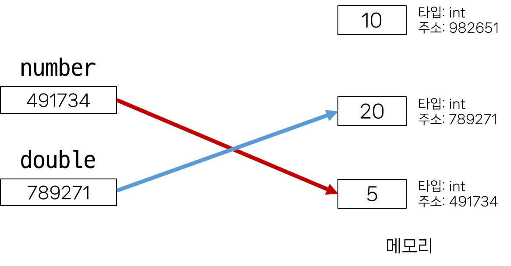

# Fundementals of Python

## 1. Python
> Why Python?
- 쉽고 간결한 문법
- 파이썬 커뮤니티의 지원
- 광범위한 응용 분야
- 알고리즘 구현에 유리함
  - 직관적인 문법
  - 강력한 표준 라이브러리
  - 빠른 프로토타이핑

> Python 실행
- 파이썬 프로그램이 실행되는 법
  - 컴퓨터는 기계어로 소통 -> 사람이 기계어를 직접 작성하기 여려움
  - 인터프리터가 사용자의 명령어를 운영체제가 이해하는 언어로 바꿈
  - 파이썬 인터프리터 사용법 : shell로 한번에 한 명령어식 입력해서 실행
  
<br>

## 2. 표현식과 값
- 표현식 (Expression) : 값으로 평가될 수 있는 코드 조각
- 값 (Value) : 표현식으로 평가된 결과
- 평가 (evaluate) : 표현식을 실행하여 값을 얻는 과정. 표현식을 순차적으로 평가하여 프로그램의 동작을 결정
- 문장 (Statement) : 실행 가능한 동작을 기술하는 코드 (조건문, 반복문, 함수 정의 등)
- 표현식과 문장 : 문장은 보통 여러 개의 표현식을 포함
  
<br>

## 3. 타입
- 변수나 값이 가질 수 있는 데이터의 종류
- 어떤 종류의 데이터인지, 어떻게 해석되고 처리되어야 하는 지를 정의
- 타입은 2가지 요소로 이루어짐
  - "값"과 "값에 적용할 수 있는 연산"
  
<br>

## 4. 산술 연산자
- 연산자 종류

|기호|연산자|
|:------:|:-----------:|
|-|음수부호|
|+|덧셈|
|-|뺄셈|
|*|곱셉|
|/|나눗셈|
|//|정수나눗셈 (몫)|
|%|나머지|
|**|지수 (거듭제곱)|

- 연산자 우선순위 : 괄호 잘 이용하기


|우선순위|연산자|연산|
|:-------:|:---:|:---:|
|높음|**|지수|
||-|음수 부호|
||*, /, //, %|곱셈, 나눗셈, 정수나눗셈, 나머지|
|낮음|+, -|덧셈, 뺄셈|
  
<br>

## 5. 변수와 메모리
| 값이 저장되는 법
- 변수 (Variable) : 값을 저장하기 위한 이름
- 변수 할당 : 표현식을 통해 변수에 값을 저장
- 할당문
  - `degrees = 36.5` : 변수 degrees에 값 3.65를 할당했다.
  - degrees' = 'abc' : 변수 degrees에 값 ‘abc’를 재할당했다.

| 변수명 규칙
- 영문 알파벳, 언더스코어(_), 숫자로 구성
- 숫자로 시작할 수 없음
- 대소문자를 구분
- 아래 키워드는 파이썬의 내부 예약어로 사용 불가능
    ```['False', 'None', 'True', '__peg_parser__', 'and', 'as', 'assert', 
    'async', 'await', 'break', 'class', 'continue', 'def', 'del', 
    'elif', 'else', 'except', 'finally', 'for', 'from', 'global', 
    'if', 'import', 'in', 'is', 'lambda', 'nonlocal', 'not', 
    'or', 'pass', 'raise', 'return', 'try', 'while', 'with', 'yield']
    ```

| 변수, 값 그리고 메모리
- 거리에 집주소가 있듯이 메모리의 모든 위치에는 그 위치를 고유하게 식별하는 메모리 주소가 존재
- 객체 : 타입을 갖는 메모리 주소 내 값. "값이 들어있는 상자"
- 변수는 그 변수가 참조하는 객체의 메모리 주소를 가짐.

| 할당문
- 할당 연산자 (=) 오른쪽에 있는 표현식을 평가해서 값(메모리 주소)을 생성
- 값의 메모리 주소를 ‘=’ 왼쪽에 있는 변수에 저장
- 존재하지 않는 변수라면 새 변수를 생성
- 기존에 존재했던 변수라면 기존 변수를 재사용해서 변수에 들어있는 메모리 주소 변경

| 변수에 재할당

- 변수 double의 값은 무엇일까?
    ```
    number = 10
    double = 2 * number
    print(double)  # 20
    number = 5
    print(double)  # ??
    ```
- 변수 double에는 값 20의 주소가 들어있으니 여전히 20을 참조
    ```
    number = 10
    double = 2 * number
    print(double)  # 20
    number = 5
    print(double)  # 20
    ```