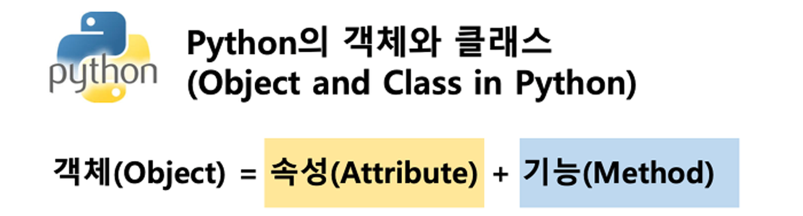
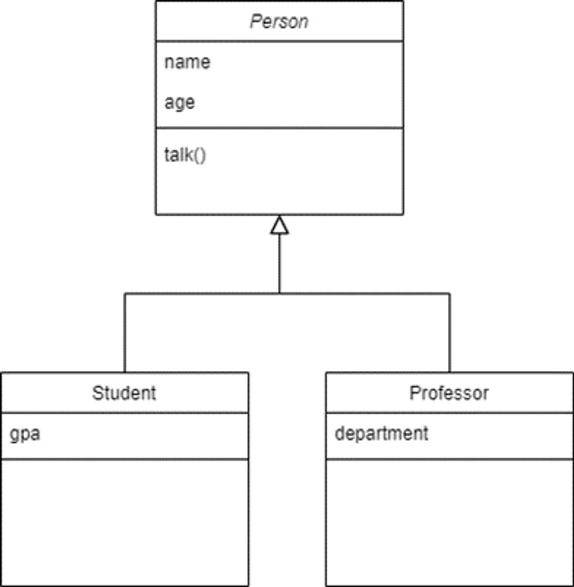

# 객체 지향 프로그래밍 OOP

## 1. 절차지향 vs 객체지향
### 1) 절차지향 `Procedural Programming`
- 프로그램을 ‘데이터’와 ‘절차’로 구성하는 방식의 프로그래밍 패러다임
- 데이터와 해당 데이터를 처리하는 함수(절차)가 분리
- 함수 호출의 흐름이 중요
- 데이터를 다시 재사용하기보다는 처음부터 끝까지 실행되는 결과물이 중요한 방식

### 2) 객체지향 `Object Oriented Programming`
- 데이터와 해당 데이터를 조작하는 메서드를 하나의 객체로 묶어 관리하는 방식의 프로그래밍 패러다임
- 데이터와 해당 데이터를 처리하는 메서드(메시지)를 하나의 객체(클래스)로 묶음
- 객체 간 상호작용과 메시지 전달이 중요

## 2. 객체
### 1) 클래스 `class`
- 파이썬에서 타입을 표현하는 방법
- 객체를 생성하기 위한 설계도 (blue print)
- 데이터와 기능을 함께 묶는 방법을 제공

### 2) 객체 `object`
- 클래스에서 정의한 것을 토대로 메모리에 할당된 것
- '속성'과 '행동'으로 구성된 모든 것

### 3) 인스턴스와 클래스, 객체
- 인스턴스 : 클래스로 만든 객체
    ```python
    name = 'Alice'
    print(type(name))  # <class 'str'>
    ```

  - 아이유는 객체다. (O)
  - 아이유는 인스턴스다. (X)
  - 아이유는 가수의 인스턴스다. (O)

### 4) 객체 정리
- 타입 (type) : 어떤 연산자(operator)와 조작(method)이 가능한가?
- 속성 (attribute) : 어떤 상태 (데이터)를 가지는가?
- 조작법 (method) : 어떤 행위 (함수)를 할 수 있는가?
  



## 3. 클래스 `class`
### 1) 클래스 정의
- class 키워드
- 클래스 이름은 파스칼 케이스 (대문자 카멜케이스) 방식으로 작성 (<-> 다른 함수와 구분하기 위해)


### 2) 인스턴스 생성 및 활용
- 행동과 주도적으로 활동하는 것은 인스턴스(객체)
- Person 클래스(블루프린트) 로 인해 만들어진 인스턴스가 주도적으로 나서야 함.
- blood_color는 속성이기 때문에 뒤에 ( ) 안붙음

### 3) 예시
```python
# 클래스 정의
class Person:
    blood_color = 'red' # 클래스변수

    def __init__(self, name):
        self.name = name

    def singing(self): # 메서드
        return f'{self.name}가 노래합니다.'


# 인스턴스 생성
singer1 = Person('iu')

# 메서드 호출
print(singer1.singing())  # iu가 노래합니다.

# 속성(변수) 접근
print(singer1.blood_color)  # red
```

### 4) 클래스의 구성요소
> 생성자 메서드 (함수)
- 객체 생성 시 자동으로 호출되는 특별한 메서드
- `__init__`이라는 이름의 메서드로 정의되며 객체의 초기화 담당
- 생성자 함수를 통해 인스턴스를 생성하고 필요한 초기값을 설정

> 인스턴스 변수
- 인스턴스(객체)마다 별도로 유지되는 변수
- 인스턴스마다 **독립적인 값**을 가지며, 인스턴스가 생성될 때마다 초기화됨.

> 클래스 변수
- 클래스 내부에 선언된 변수
- 클래스로 생성된 모든 인스턴스들이 공유하는 변수

> 인스턴스 메서드
- 각각의 인스턴스에서 호출할 수 있는 메서드
- 인스턴스 변수에 접근하고 수정하는 등의 작업을 수행

> 예시
```python
class Person:
    blood_color = 'red' # 클래스 변수

    def __init__(self, name): # 생성자 메서드
        self.name = name # 인스턴스 변수

    def singing(self): # 인스턴스 메서드
        return f'{self.name}가 노래합니다.'

# 인스턴스 정의
singer1 = Person('iu')

# 인스턴스 메서드 호출
print(singer1.singing())
```

## 4. 메서드 `method`
### 1) 인스턴스 메서드 `instance method`
- 클래스로부터 생성된 인스턴스에서 호출할 수 있는 메서드
- 인스턴스의 상태를 조작하거나 동작을 수행

> 인스턴스 메서드 구조
- 클래스 내부에 정의되는 메서드의 기본
- 반드시 첫 번째 매개변수로 인스턴스 자신(self)을 전달받음
- self는 매개변수 이름일 뿐, 다른 이름으로도 설정 가능. but 다른 이름 사용하지 말 것

> self 동작 원리
- upper 메서드를 사용해 문자열 'hello'를 대문자로 변경하기
`'hello'.upper()`
- 하지만, 실제 파이썬 내부 동작은 다음과 같이 진행됨.
- `str.upper('hello')`
- str 클래스가 upper 메서드를 호출했고, 그 첫번 째 인자로 문자열 인스턴스가 들어간 것 <br> -> 인스턴스 메서드의 첫 번째 매개변수가 반드시 인스턴스 자신인 이유
- `'hello'.upper()`은 `str.upper('hello')`를 객체지향방식의 메서드로 호출하는 표현 (단축형 호출)
- 'hello'라는 문자열 객체가 단순히 어딘가의 함수로 들어가는 인자가 아닌 객체 스스로 메서드를 호출하여 코드를 동작하는 객체지향적 표현

> 생성자 메서드 `constructor method`
- 인스턴스 객체가 생성될 때 자동으로 호출되는 메서드
- 인스턴스 변수들의 초기값을 설정
- 구조

### 2) 클래스 메서드 `class method`
- 클래스가 호출하는 메서드
- 인스턴스의 상태에 의존하지 않는 기능을 정의
- 클래스 변수를 조작하거나 클래스 레벨의 동작을 수행 (속성 변경) `자기 자신. ~`

> 클래스 메서드의 구조
- `@classmethod` 데코레이터를 사용하여 정의
- 호출 시, 첫 번째 인자로 호출하는 클래스 (`cls`)가 전달됨.
- `cls`는 매개변수 이름일 뿐, 다른 이름으로 설정 가능. but 다른 이름 사용하지 말 것

> 클래스 메서드 예시
```python
class Person:
    count = 0

    def __init__(self, name):
        self.name = name
        Person.count += 1

    @classmethod
    def number_of_population(cls):
        print(f'인구수는 {cls.count}입니다.')
        # print(f'인구수는 {person.count}입니다.')
        # person으로 쓰면 안됨. 상속된 클래스가 쓰는 데 문제가 있어서

person1 = Person('iu')
person2 = Person('BTS')

Person.number_of_population() # 인구수는 2입니다.
```

### 3) 스태틱 메서드 `static method`
- 클래스와 인스턴스와 상관 없이 독립적으로 동작하는 메서드
- 주로 클래스와 관련이 있지만 인스턴스와 상호작용이 필요하지 않은 경우에 사용

> 스태틱 메서드의 구조
- `@staticmethod` 데코레이터를 사용하여 정의
- 호출 시 필수적으로 작성해야 할 매개변수가 없음
- 객체 상태나 클래스 상태를 수정할 수 없으며 단지 기능(행동)만을 위한 메서드로 사용

> 스태틱 메서드 예시
- 단순히 문자열을 조작하는 메서드 예시
```python
class StringUtils:
    @staticmethod # 클래스가 호출함
    def reverse_string(string):
        return string[::-1]

    @staticmethod # 클래스가 호출함
    def capitalize_string(string):
        return string.capitalize()


text = 'hello, world'

reversed_text = StringUtils.reverse_string(text)
print(reversed_text) # dlrow ,olleh

capitalized_text = StringUtils.capitalize_string(text)
print(capitalized_text) # Hello, world
```

## 5. 메서드 정리
### 1) 누가 어떤 메서드를 사용해야 할까?
- 클래스가 사용해야 할 것
    - 클래스 메서드
    - 스태틱 메서드
- 인스턴스가 사용해야 할 것
    - 인스턴스 메서드

### 2) 클래스가 할 수 있는 것
- 클래스는 모든 메서드 호출 가능
- 하지만 클래스는 클래스 메서드와 스태틱 메서드만 사용하도록 한다 !!

### 3) 인스턴스가 할 수 있는 것
- 인스턴스는 모든 메서드 호출 가능
- 하지만 인스턴스는 인스터드 메서드만 사용하도록 한다 !!

## 6. 상속 `inheritance`
### 1) 정의
- 기존 클래스의 속성과 메서드를 물려받아 새로운 하위 클래스를 생성하는 것

### 2) 상속이 필요한 이유
- 코드 재사용
    - 기존 클래스의 속성과 메서드 재사용 가능
    - 새로운 클래스 작성 시, 기존 클래스의 기능을 그대로 활용 가능 -> 코드 중복을 줄일 수 있음
- 계층 구조
    - 상속을 통해 클래스 들 간의 계층 구조 형성
    - 부모 클래스와 자식 클래스 간의 관계를 표현하고, 구체적인 클래스를 만들 수 있음
- 유지보수의 용이성
    - 기존 클래스의 수정이 필요한 경우, 해당 클래스만 수정하면 되므로 유지보수가 용이해짐.
    - 코드의 일관성을 유지하고, 수정이 필요한 범위를 최소화할 수 있음.


## 7. 클래스 상속
### 1) 상속 없이 구현하는 경우
    - 학생 / 교수 정보를 나타내기 어려움
        ```python
        class Person:
        def __init__(self, name, age):
            self.name = name
            self.age = age

        def talk(self):
            print(f'반갑습니다. {self.name}입니다.')


        s1 = Person('김학생', 23)
        s1.talk() # 반갑습니다. 김학생입니다.

        p1 = Person('박교수', 59)
        p1.talk() # 반갑습니다. 박교수입니다.

        ```
    - 교수 / 학생 클래스로 분리했지만, 메서드가 중복으로 정의될 수 있음.
        - 해결 : 둘의 공통점을 찾기 (둘 다 사람임, 나이가 있음) -> 둘의 부모 클래스 만들기
        ```python
        class Professor:
            def __init__(self, name, age, department):
                self.name = name
                self.age = age
                self.department = department

            def talk(self): # 중복
                print(f'반갑습니다. {self.name}입니다.')

        class Student:
            def __init__(self, name, age, gpa):
                self.name = name
                self.age = age
                self.gpa = gpa

            def talk(self): # 중복
                print(f'반갑습니다. {self.name}입니다.')
        ```
    
### 2) 상속을 사용한 계층 구조 변경
    
    
    ```python
    class Person:
    def __init__(self, name, age):
        self.name = name
        self.age = age

    def talk(self):  # 메서드 재사용
        print(f'반갑습니다. {self.name}입니다.')

    class Professor(Person):
        def __init__(self, name, age, department):
            self.name = name
            self.age = age
            self.department = department


    class Student(Person):
        def __init__(self, name, age, gpa):
            self.name = name
            self.age = age
            self.gpa = gpa


    p1 = Professor('박교수', 49, '컴퓨터공학과')
    s1 = Student('김학생', 20, 3.5)

    # 부모 Person 클래스의 talk 메서드를 활용
    p1.talk() # 반갑습니다. 박교수입니다.

    # 부모 Person 클래스의 talk 메서드를 활용
    s1.talk() # 반갑습니다. 김학생입니다.
    ```
- 아직 (생성자함수에서) 중복이 완전히 없어지진 않았지만, 메서드의 중복은 없어짐


## 8. 다중 상속
### 1) 정의
- 둘 이상의 상위 클래스로부터 여러 행동이나 특징을 상속받을 수 있는 것
- 상속받은 모든 클래스의 요소를 활용 가능함.
- 중복된 속성이나 메서드가 있는 경우 상속 순서에 의해 결정됨.

### 2) 다중 상속 예시
```python
class Person:
    def __init__(self, name):
        self.name = name

    def greeting(self):
        return f'안녕, {self.name}'


class Mom(Person):
    gene = 'XX'

    def swim(self):
        return '엄마가 수영'


class Dad(Person):
    gene = 'XY'

    def walk(self):
        return '아빠가 걷기'

# FirstChild에는 위에 세개 클래스를 다 받음
class FirstChild(Dad, Mom): # Dad 부터니까, 순서대로 walk를 탐색
    def swim(self):
        return '첫째가 수영'

    def cry(self):
        return '첫째가 응애'


baby1 = FirstChild('아가')
print(baby1.cry()) # 첫째가 응애
print(baby1.swim()) # 첫째가 수영
print(baby1.walk()) # 아빠가 걷기 # walk가 어디 있나~~ Dad에 있네
print(baby1.gene) # XY # Mom에도 있지만 Dad 순서가 먼저니가 Dad의 gene 변수 출력
```
- 근데 여기서 문제 발생 !!!

### 3) 다이아몬드 문제
- 두 클래스 B와 C가 A에서 상속되고 클래스 D가 B와 C 모두에서 상속될 때 발생하는 **모호함**
- B와 C가 재정의한 메서드가 A에 있고 D가 이를 재정의하지 않은 경우라면
- D는 B의 메서드 중 어떤 버전을 상속하는가? 아니면 C의 메서드 버전을 상속하는가?

### 4) 파이썬에서의 해결책
- MRO(Method Resolution Order) 알고리즘을 사용하여 클래스 목록을 생성
- 부모 클래스로부터 상속된 속성들의 검색을 깊이 우선으로, 왼쪽에서 오른쪽으로, 계층 구조에서 겹치는 같은 클래스를 두 번 검색하지 않음
- 그래서, 속성이 D 에서 발견되지 않으면, B 에서 찾고, 거기에서도 발견되지 않으면, C 에서 찾고, 이런 식으로 진행됨
D→B→C→A

### 5) MRO (Method Resolution Order) : 메서드 결정 순서
> `super()` 메서드
- 부모 클래스 객체를 반환하는 내장 함수
- 다중 상속 시 MRO를 기반으로 현재 클래스가 상속하는 모든 부모 클래스 중 다음에 호출될 메서드를 결정하여 자동으로 호출

> `super()` 사용 예시 (단일 상속)
- 사용 전
    ```python
    class Person:
        def __init__(self, name, age, number, email):
            self.name = name
            self.age = age
            self.number = number
            self.email = email


    class Student(Person):
        def __init__(self, name, age, number, email, student_id):
            self.name = name
            self.age = age
            self.number = number
            self.email = email
            self.student_id = student_id
    ```
- 사용 후
    ```python
    class Person:
        def __init__(self, name, age, number, email):
            self.name = name
            self.age = age
            self.number = number
            self.email = email


    class Student(Person):
        def __init__(self, name, age, number, email, student_id):
            # Person의 init 메서드 호출
            super().__init__(name, age, number, email)
            self.student_id = student_id
    ```

> `super()` 사용 예시 (다중 상속)
    ```python
    class ParentA:
    def __init__(self):
        self.value_a = 'ParentA'

    def show_value(self):
        print(f'Value from ParentA: {self.value_a}')

    class ParentB:
        def __init__(self):
            self.value_b = 'ParentB'

        def show_value(self):
            print(f'Value from ParentB: {self.value_b}’)

    class Child(ParentA, ParentB):
        def __init__(self):
            super().__init__() # ParentA 클래스의 __init__ 메서드 호출 # self 안써도 됨
            self.value_c = 'Child’

        def show_value(self):
            super().show_value() # ParentA 클래스의 show_value 메서드 호출
            print(f'Value from Child: {self.value_c}')

    child = Child()
    child.show_value()
    ```

> `mro()` 메서드
- 해당 인스턴스의 클래스가 어떤 부모 클래스를 가지는지 확인하는 메서드
- 기존의 인스턴스 -> 클래스 순으로 이름 공간을 탐색하는 과정에서 상속관계에 있으면 인스턴스 -> 자식클래스 -> 부모클래스로 확장

```python
class A:
    def __init__(self):
        print('A Constructor')

class B(A):
    def __init__(self):
        super().__init__()
        print('B Constructor')

class C(A):
    def __init__(self):
        super().__init__()
        print('C Constructor')

class D(B, C):
    def __init__(self):
        super().__init__()
        print('D Constructor')

print(D.mro())
```

### 6) MRO가 필요한 이유
- 부모 클래스들이 여러 번 액세스 되지 않도록, 각 클래스에서 지정된 왼쪽에서 오른쪽으로 가는 순서를 보존하고, 각 부모를 오직 한 번만 호출하고, 부모들의 우선순위에 영향을 주지 않으면서 서브 클래스를 만드는 단조적인 구조 형성
- 프로그래밍 언어의 신뢰성 있고 확장성 있는 클래스를 설계할 수 있도록 도움
- 클래스 간의 메서드 호출 순서가 예측 가능하게 유지되며, 코드의 재사용성과 유지보수성이 향상

### 7) super의 2가지 사용 사례
- 단일 상속 구조
    - 명시적으로 이름을 지정하지 않고 부모 클래스를 참조할 수 있으므로, 코드를 더 유지관리하기 쉽게 만들 수 있음
    - 클래스 이름이 변경되거나 부모 클래스가 교체되어도 `super()` 를 사용하면 코드 수정이 더 적게 필요
- 다중 상속 구조
    - MRO를 따른 메서드 호출
    - 복잡한 다중 상속 구조에서 발생할 수 있는 문제를 방지