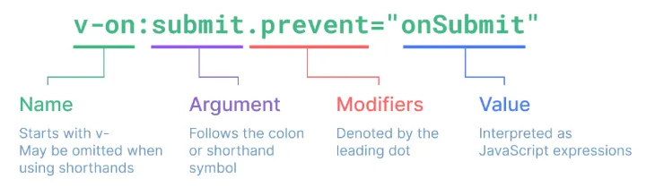

## 1. Template Syntax

- DOM을 기본 구성 요소 인스턴스에 데이터에 선언적으로 바인딩(Vue Instance와 DOM을 연결)할 수 있는 HTML 기반  템플릿 구문(확장된 문법 제공)을 사용

### 1) Template Syntax 종류

### 1-1) Text Interplation

- `<p>Message: {{ msg }}</p>`
- 데이터 바인딩의 가장 기본적인 형태
- 이중 중괄호 구문 (콧수염 구문을 사용)
- 콧수염 구문은 해당 구성요소 인스턴스의 msg 속성 값으로 대체
- msg 속성이 변경될 때마다 업데이트 됨

### 1-2) Raw HTML

- `<div v-html="rawHtml"></div>`
`const rawHtml = ref('<span style="color:red">This should be red.</span>')`
- 콧수염 구문은 데이터를 일반 텍스트로 해석하기 때문에 실제 HTML을 출력하려면 v-html을 사용해야 함

### 1-3) Attribute Bindings

- `<div v-bind:id="dynamicId"></div>`
`const dynamicId = ref('my-id')`
- 콧수염 구문은 HTML 속성 내에서 사용할 수 없기때문에 v-biund를 사용
- HTML id 속성 값을 vue의 dynamicId 속성과 동기화되도록 함
- 바인딩 값이 null이나 undefined인 경우 렌더링 요소에서 제거됨

### 1-4) JavaScript Expressions

```html
{{ number + 1 }}

{{ ok ? 'YES' : 'NO' }}

{{ message.split('').reverse().join('') }}

<div v-bind:id="`list-${id}`"></div>
```

- Vue는 모든 데이터 바인딩 내에서 JS 표현식의 모든 기능을 지원
- Vue 템플릿에서 JS 표현식을 사용할 수 있는 위치
    - 콧수염 구문 내부
    - 모든 directive의 속성 값 (”v-”로 시작하는 특수 속성)
- Expressions 주의사항
    - 각 바인딩에는 하나의 단일 표현식만 표함될 수 있음
    - 표현식은 값으로 평가할 수 있는 코드 조각 (return 뒤에 사용할 수 있는 코드여야 함.)
    - 작동하지 않는 경우
        
        ```html
        <!-- 표현식이 아닌 선언식 -->
        {{ const number = 1 }}
        
        <!-- 제어문은 삼항 표현식은 사용해야 함 -->
        {{ if (ok) {return message} }}
        ```
        

### 2) Directive

- `-v` 접두사가 있는 특수 속성

### 2-1) Driective 특징

- Directive의 속성 값은 단일 JavaScript 표현식이여야 함.
(`v-for`, `v-on` 제외)
- 표현식 값이 변경될 때 DOM에 반응적으로 업데이트를 적용
- 예시 : `<p v-if="seen">Hi There</p>`

### 2-2) Directive 전체 구문


- `Arguments`
    - 일부 directive는 directive 뒤에 콜론 `:`으로 표시되는 인자를 사용할 수 있음
    - 예시
        
        ```html
        <!-- href : HTML <a> 요소의 href 속성 값을 myUrl 값에 바인딩하도록 하는 v-bind 인자 -->
        <a v-bind:href="myUrl">Link</a>
        
        <!-- click : 이벤트 수신할 이벤트 이름을 작성하는 v-on의 인자 -->
        <button v-on: click="doSomething">Button</button>
        ```
        
- `Modifiers`
    - `.` (dot)로 표시되는 특수 접미사로, directive가 특별한 방식으로 바인딩되어야 함을 나타냄
    - 예시
    
      ```html
      <!-- .prevent : 발생한 이벤트에서 event.preventDefault()를 호출하도록 v-on에 지시하는 modifier -->
      
      <form @submit.prevent="onSubmit">
        <input type="submit">
      </form>
      ```
    

## 2. Dynamically data binding : `v-bind` (단방향 바인딩)

- 하나 이상의 속성 또는 컴포넌트 데이터를 표현식에 **동적**으로 바인딩(연결)
- 사용처
    - Attribute Bindings
    - Class and Style Bindings

### 1) Attribute Bindings

- HTML 속성 값을 Vue의 상태 속성 값과 동기화되도록 함
    
    ```html
    <!-- v-bind.html -->
    
    
    <a v-bind:href="myUrl">Move to url<a>
    ```
    
- `v-bind` shorthand (약어)
→ `:` (colon)
    
    ```html
    
    <a :href="myUrl">Move to url<a>
    ```
    
- **Dynamic attribute name** (동적 인자 이름)
    - 대괄호 `[]` 로 감싸서 directive argument에 JavaScript 표현식 사용 가능
    - 표현식에 따라 동적으로 평가된 값이 최종 argument값으로 사용됨
        
        ```html
        <button :[key]="myValue"></button>
        ```
        
        - 대괄호 안에 작성하는 이름은 반드시 소문자로만 구성할 수 있다.
        (브라우저가 속성 이름을 소문자로 강제변환하기 때문)
    - 예시
        
        ```jsx
        
        <a :href="myUrl">Move to url</a>
        <p :[dynamicattr]="dynamicValue">Dynamic Attr</p>
        const { createApp, ref } = Vue

        <script>        
        const app = createApp({
          setup() {
            const imageSrc = ref('https://picsum.photos/200')
            const myUrl = ref('https://www.google.co.kr/')
            const dynamicattr = ref('title')
            const dynamicValue = ref('Hello Vue.js')
            return {
              imageSrc,
              myUrl,
              dynamicattr,
              dynamicValue
            }
          }
        })
        </script>
        ```
        

### 2) Class and Style Bindings

- class와 style 모두 HTML 속성이므로 다른 속성과 마찬가지로 v-bind를 사용하여 동적으로 문자열 값 할당 가능
- Vue는 class 및 style 속성 값을 v-bind로 사용할 때 **객체** 또는 **배열**을 활용하여 작성할 수 있도록 함

### 2-1) Binding HTML Classes

> **Binding to Objects**
  - 객체를 `:class`에 전달하여 클래스를 동적으로 전환 가능
  - 객체에 더 많은 필드를 포함하여 여러 클래스 전환 가능
  - 반드시 inline 방식으로 작성하지 않아도 됨
        
  ```jsx
  <div class="active">Text</div>

  // isActive의 Boolean 값에 의해 active 클래스의 존재가 결정됨
  <div :class="{ active: isActive }">Text</div>
  
  // :class directive를 일반 클래스 속성과 함께 사용 가능
  <div class="static" :class="{ active: isActive, 'text-primary': hasInfo }">Text</div>

  // 반응형 변수를 활용해 객체를 한번에 작성하는 방법 
  <div class="static" :class="classObj">Text</div>

  <script>
  const { createApp, ref } = Vue
  
  const app = createApp({
    setup() {
      const isActive = ref(true)
      const hasInfo = ref(true)
      const classObj = ref({
        active: isActive,
        'text-primary': hasInfo
      })

      return {
        isActive,
        hasInfo,
        classObj
      }
    }
  })
  </scipt>
  ```

        
> **Binding to Arrays**
  - `:class` 를 배열에 바인딩하여 클래스 목록을 적용할 수 있음
      
    ```jsx
    <div :class="[activeClass, infoClass]">Text</div>
    
    <div :class="[{active: isActive}, infoClass]">Text</div>
    const { createApp, ref } = Vue
    
    const app = createApp({
      setup() {
        const activeClass = ref('active')
        const infoClass = ref('text-primary')
        return {
          activeClass,
          infoClass 
        }
      }
    })
    ```
    
    ```jsx
    // 배열 구문 내에서 객체 구문을 사용하는 경우
    
    <div :class="[{active: isActive}, infoClass]">Text</div>
    
    const { createApp, ref } = Vue
    
    const app = createApp({
      setup() {
        const isActive = ref(true)
        const hasInfo = ref(true)
        const activeClass = ref('active')
        const infoClass = ref('text-primary')
        return {
          isActive,
          hasInfo,
          activeClass,
          infoClass 
        }
      }
    })
    ```
    

### 2-2) Binding Inline Styles

> **Binding to Objects**
  - `:style`은 JavaScript 객체 값에 대한 바인딩을 지원
  (HTML style 속성에 해당)
      - 실제 CSS에서 사용하는 것처럼 `:style` 은 kebab-cased 키 문자열도 지원 (단, camelCase 권장)
    
    ```jsx
    <div style="color: crimson; font-size: 50px;">Text</div>
    <div :style="{ color: activeColor, fontSize: fontSize + 'px' }">Text</div>
    **<div :style="{ color: activeColor, 'font-size': fontSize + 'px' }">Text</div>**
    
    const { createApp, ref } = Vue
    
    const app = createApp({
      setup() {
        const activeColor = ref('crimson')
        const fontSize = ref(50)
        return {
          activeColor,
          fontSize
        }
      }
    })
    ```
      
  - inline 방식 말고, 반응형 변수를 활용해 객체를 한번에 작성하는 방법

    ```jsx
    <div style="color: crimson; font-size: 50px;">Text</div>
    <div :style="{ color: activeColor, fontSize: fontSize + 'px' }">Text</div>
    <div :style="{ color: activeColor, 'font-size': fontSize + 'px' }">Text</div>
    **<div :style="styleObj">Text</div>**
    
    const { createApp, ref } = Vue
    
    const app = createApp({
      setup() {
        const activeColor = ref('crimson')
        const fontSize = ref(50)
        **const styleObj = ref({
          color: activeColor,
          fontSize: fontSize.value + 'px'
        })**
        return {
          activeColor,
          fontSize,
          **styleObj**
        }
      }
    })
    ```
        
> **Binding to Arrays**
  - 여러 스타일 객체를 배열에 작성해서 `:style` 을 바인딩할 수 있음
    
    ```jsx
    <div style="color: crimson; font-size: 50px;">Text</div>
    <div :style="{ color: activeColor, fontSize: fontSize + 'px' }">Text</div>
    <div :style="{ color: activeColor, 'font-size': fontSize + 'px' }">Text</div>
    **<div :style="[styleObj, styleObj2]">Text</div>**
    
    const { createApp, ref } = Vue
    
    const app = createApp({
      setup() {
        const activeColor = ref('crimson')
        const fontSize = ref(50)
        const styleObj = ref({
          color: activeColor,
          fontSize: fontSize.value + 'px'
        })
        **const styleObj2 = ref({
          color: 'blue',
          border: '1px solid black'
        })**
        return {
          activeColor,
          fontSize,
          styleObj,
          **styleObj2**
        }
      }
    })
    ```

    - 작성한 객체는 병합되어 동일한 요소에 적용
    - 마지막 요소로 사용됨

## 3. Event Handling `v-on`

- DOM 요소에 이벤트 리스너를 연결 및 수신
- 구성

  

- 예시
    - `v-on:event="handler"`
- handler 종류
    - inline handlers : 이벤트가 트리거될 때 실행될 JS 코드
    - Method handlers : 컴포넌트에 정의된 메서드 이름
- `v-on` shorthand (약어) : `@`
    - `@event="handler"`

### 1) Inline handlers

- 주로 간단한 상황에 사용
    
    ```jsx
    <button v-on:click="count++">Add 1</button>
    <button @click="count++">Add 1</button>
    // <button @click="increase">Add 1</button>
    <p>Count: {{ count }}</p>
    
    const { createApp, ref } = Vue
    
    const app = createApp({
      setup() {
        const count = ref(0)
        const increase = function () {
    	    count.value += 1
        }
        return {
    	    count,
    	    increase
    	  }
    	})
    
    ```
    
- Inline Handlers에서의 메서드 호출
    
    ```jsx
    // Method Handlers
    <button @click="greeting('Hello')">Say Hello</button>
    <button @click="greeting('Bye')">Say Bye</button>
    
    const { createApp, ref } = Vue
    
    const app = createApp({
      setup() {
        const greeting = function (message) {
    			console.log(message)
        }
        return {
    	    greeting
    	  }
    	})
    ```
    
    - 메서드 이름에 직접 바인딩하는 대신 Inline Handlers에서 메서드 호출 가능
    - 기본 이벤트 대신 사용자 지정 인자를 전달 할 수 있음
- Inline Handlers에서의 event 인자에 접근하기
    - Inline Handlers에서 원래 DOM이벤트에 접근하기
    - `$evnet` 변수를 사용하여 메서드에 전달
    - 예시
        
        ```jsx
        // Accessing Event Argument in Inline Handlers
        <button @click="warning('경고입니다', $event)">Submit</button>
        
        const { createApp, ref } = Vue
        
        const app = createApp({
          setup() {
            const warning = function (message, event) {
        	    console.log(message)
        	    console.log(event)
            }
            return {
        	    warning 
        	  }
        	})
        ```
        

### 2) Method handlers

- Inline handlers 로는 불가능한 대부분의 상황에서 사용
- Method Handlers는 이를 트리거하는 기본 DOM Event 객체를 자동으로 수신
    
    ```jsx
    // Accessing Event Argument in Inline Handlers
    <button @click="myFunc">Hello</button>
    
    const { createApp, ref } = Vue
    
    const app = createApp({
      setup() {
    	  const name = ref('Alice')
    	  const myFunc = function (event) {
    		  console.log(event)
    		  console.log(event.currentTarget)
    		  console.log(name.value)
    		  console.log(`Hello ${name.value}!`)
    	  }
    	  
        return {
    	    myFunc 
    	  }
    	})
    ```
    

### 3) Modifiers

- Event Modifiers
    - Event Modifiers를 활용해 `event.preventDefault()` 와 같은 구문을 메서드에서 작성하지 않도록 함
    - stop, prevent, self 등 다양한 modifiers를 제공
    - 메서드는 DOM 이벤트에 대한 처리보다는 데이터에 관한 논리를 작성하는 것에 집중할 것
    
    ```jsx
    // event modifiers

    <form @submit.prevent="onSubmit">
      <input type="submit">
    </form>
    
    <div v-on:click="detectBubble">
      <a href="https://www.google.com/">onLink</a><br>
      <a @click.prevent="onLink" href="https://www.google.com/">onLink</a><br>
      <a @click.stop.prevent="onLink" href="https://www.google.com/">onLink</a>
    </div>
    
    const { createApp, ref } = Vue
    
    const app = createApp({
      setup() {
        const onSubmit = function () {
          console.log('onSubmit')
        }
        const onLink = function () {
    		  console.log('onLink')
    		}
    		
    		return {
    			onSubmit,
    			onLink
    			}
    		}
    	})
    ```
    
- Key Modifiers
    - 키보드 이벤트를 수신할 때 특정 키에 관한 별도 modifiers를 사용할 수 있음
    - enter 등등 쓸 수 있는 속성 값들이 정해져 있음
    - 예시
        
        ```jsx
        <!-- key modifiers -->
        <input @keyup.enter="onSubmit">
        ```
        

## 4. Form Input Bindings (양방향 바인딩)

- form을 처리할 때 사용자가 input에 입력하는 값을
실시간으로 JS 상태에 동기화해야 하는 경우 **(양방향 바인딩)**

### 1) 방법1 : v-bind와 v-on을 함께 사용

- v-bind를 사용하여 input 요소의 value 속성 값을 입력값으로 사용
- v-on을 사용하여 iput 이벤트가 발생할 때마다 input 요소의 value값을 별도 반응형 변수에 저장하는 핸들러를 호출

```jsx
<div id="app">
  <p>{{ inputText1 }}</p>
  <input :value="inputText1" @input="onInput">
</div>

const { createApp, ref } = Vue

const app = createApp({
  setup() {
    const inputText1 = ref('')
    const onInput = function (event) {
      inputText1.value = event.currentTarget.value
    }
    return {
      inputText1,
      onInput,
    }
  }
})

app.mount('#app')

```

### 2) 방법2 : v-model 사용

- form input 요소 또는 컴포넌트에서 양방향 바인딩을 만듦
- 사용자 입력 데이터와 반응형 변수를 실시간 동기화
- IME가 필요한 영어 (한국어, 중국어, 일본어 등)의 경우 v-model이 제대로 업데이트되지 않음
- 해당 언어에 대해 올바르게 응답하려면 v-bind와 v-on 방법을 상요해야 함

```jsx
<div id="app">
  <p>{{ inputText1 }}</p>
  <input :value="inputText1" @input="onInput">

  **<p>{{ inputText2 }}</p>
  <input v-model="inputText2">**

</div>

<script src="https://unpkg.com/vue@3/dist/vue.global.js"></script>
<script>
  const { createApp, ref } = Vue

  const app = createApp({
    setup() {
      const inputText1 = ref('')
      const onInput = function (event) {
        inputText1.value = event.currentTarget.value
      }
      **const inputText2 = ref('')**
      return {
        inputText1,
        onInput,
        **inputText2**
      }
    }
  })

  app.mount('#app')

```

### 2-1) v-model 활용

| v-model과 다양한 입력(input) 양식 <br> ⇒ Checkbox, Radio, Select 등

> Checkbox 활용
  - 단일 체크박스와 boolean 값 활용
  - 여러 체크박스와 배열 활용
  
  ```jsx
  <body>
    <div id="app">
      <!-- single checkbox -->
      <input type="checkbox" id="checkbox" v-model="checked">
      <label for="checkbox">{{ checked }}</label>
  
      <!-- multiple checkbox -->
      <div>Checked names: {{ checkedNames }}</div>
  
      <input type="checkbox" id="alice" value="Alice" v-model="checkedNames">
      <label for="alice">Alice</label>
  
      <input type="checkbox" id="bella" value="Bella" v-model="checkedNames">
      <label for="bella">Bella</label>
      
  
    <script src="https://unpkg.com/vue@3/dist/vue.global.js"></script>
    <script>
      const { createApp, ref } = Vue
  
      const app = createApp({
        setup() {
          const checked = ref(false)
          const checkedNames = ref([])
          return {
            checked,
            checkedNames,
          }
        }
      })
  
      app.mount('#app')
    </script>
  </body>
  
  ```
    
> Select 활용
  - select에서 v-model 표현식의 초기 값이 어떤 option과도 일치하지 않는 경우 select 요소는 **선택되지 않은 (unselected) 상태**로 렌더링됨
  
  ```jsx
  <body>
    <div id="app">
      <!-- single select -->
      <div>Selected: {{ selected }}</div>
  
      <select v-model="selected">
        <option disabled value="">Please select one</option>
        <option>Alice</option>
        <option>Bella</option>
        <option>Cathy</option>
      </select>
    </div>
  
    <script src="https://unpkg.com/vue@3/dist/vue.global.js"></script>
    <script>
      const { createApp, ref } = Vue
  
      const app = createApp({
        setup() {
          const selected = ref('')
          return {
            selected
          }
        }
      })
  
      app.mount('#app')
    </script>
  </body>
  
  ```


## 6. 참고

### 1) 접두어 `$` 가 붙은 변수

- Vue 인스턴스 내에서 제공되는 내부 변수
- 사용자가 지정한 반응형 변수나 메서드와 구분하기 위함
- 주로 Vue 인스턴스 내부 상태를 다룰 때 사용

### 2) IME (Input Method Editor)

- 사용자가 입력 장치에서 기본적으로 사용할 수 없는 문자 (비영어권 언어)를 입력할 수 있도록 하는 운영 체제 구성 프로그램
- 일반적으로 키보드 키보다 자모가 더 많은 언어에서 사용해야 함
- IME가 동작하는 방식과 Vue의 양방향 바인딩 (v-model) 동작 방식이 상충하기 때문에 한국어 입력 시 예상대로 동작하지 않았던 것