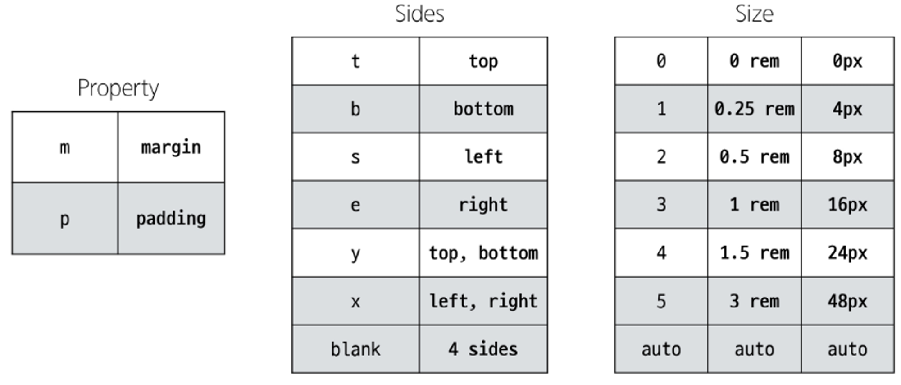
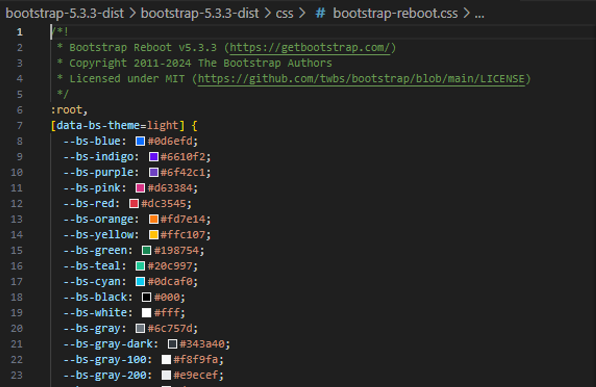
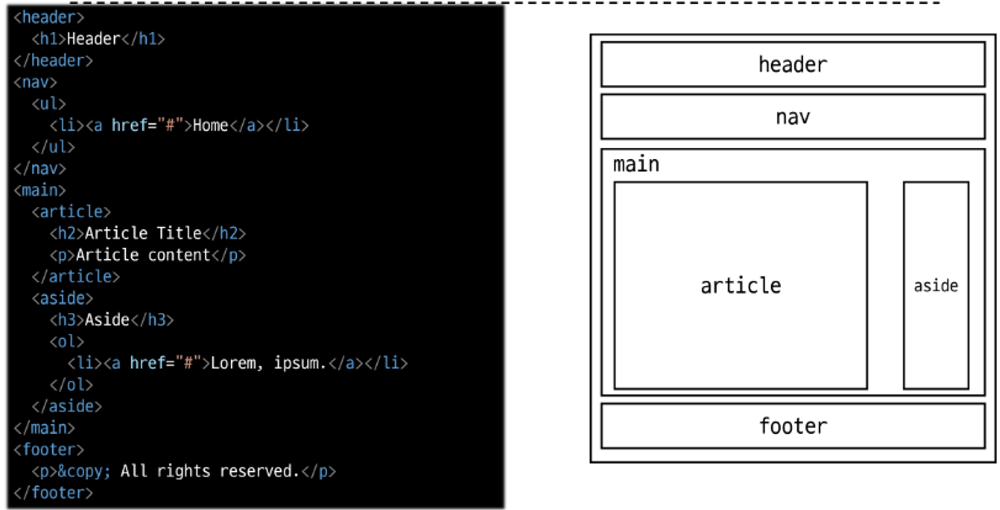
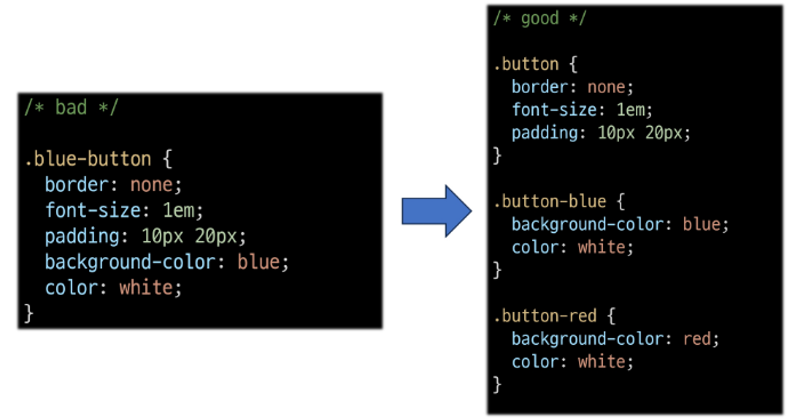
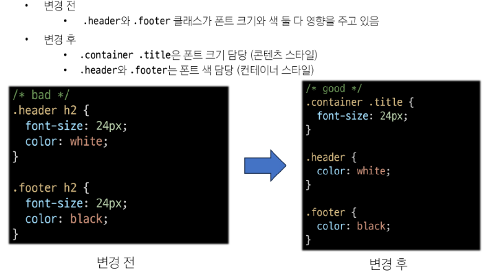

# BootStrap

## 1. Bootstrap

- CSS 프론트엔드 프레임워크 (Toolkit)
- 미리 만들어진 다양한 디자인 요소들을 제공하여 웹사이트를 빠르고 쉽게 개발할 수 있도록 함

### 1) Bootstrap 사용해보기

- Bootstrap 공식 문서
    
    [Get started with Bootstrap](https://getbootstrap.com/docs/5.3/getting-started/introduction/)
    
- head와 body에 bootstrap CDN이 포함된 코드 블록

```html
<!doctype html>
<html lang="en">
  <head>
    <meta charset="utf-8">
    <meta name="viewport" content="width=device-width, initial-scale=1">
    <title>Bootstrap demo</title>
    <link href="https://cdn.jsdelivr.net/npm/bootstrap@5.3.3/dist/css/bootstrap.min.css" rel="stylesheet" integrity="sha384-QWTKZyjpPEjISv5WaRU9OFeRpok6YctnYmDr5pNlyT2bRjXh0JMhjY6hW+ALEwIH" crossorigin="anonymous">
  </head>
  <body>
    <h1>Hello, world!</h1>
    <script src="https://cdn.jsdelivr.net/npm/bootstrap@5.3.3/dist/js/bootstrap.bundle.min.js" integrity="sha384-YvpcrYf0tY3lHB60NNkmXc5s9fDVZLESaAA55NDzOxhy9GkcIdslK1eN7N6jIeHz" crossorigin="anonymous"></script>
  </body>
</html>
```

### 2) CDN

- Content Delivery Network
- 지리적 제약 없이 빠르고 안전하게 콘텐츠를 전송할 수 있는 전송 기술
- 부트스트랩의 서버는 미국에 있다. → 각 국 CDN 업체들에 올려놓음
- 서버와 사용자 사이의 물리적인 거리를 줄여 콘텐츠 로딩에 소요되는 시간을 최소화 (웹페이지 로드 속도를 높임)
- 지리적으로 사용자와 가까운 CDN 서버에 콘텐츠를 저장해서 사용자에게 전달

### 3) Bootstrap 기본 사용법

- mt-5 : `{property}{sides}-{size}`
    
    ```html
    <p class="mt-5">Hell, world!</p>
    ```
    
- Bootstrap에서 클래스 이름으로 Spacing을 표현하는 방법
    
  
    
- Bootstrap에는 특정한 규칙이 있는 클래스 이름으로 스타일 및 레이아웃이 미리 작성되어 있음

<br>

## 2. Reset CSS

- 모든 HTML 요소 스타일을 일관된 기준으로 재설정하는 간결하고 압축된 규칙 세트
- HTML Element, Table, List 등의 요소들에 일관성 있게 스타일을 적용시키는 기본 단계

### 1) Reset CSS 사용배경

- 모든 브라우저는 각자의 ‘user agent stylesheet’를 가지고 있음
    - 웹사이트를 보다 읽기 편하게 하기 위해
- 문제는 이 설정이 브라우저마다 상이하다는 것
- 모든 브라우저에서 웹사이트를 동일하게 보이게 만들어야 하는 개발자에겐 매우 골치 아픈 일
- → 모두 똑같은 스타일 상태로 만들고 스타일 개발을 시작하자!
- reset 하는 방법에는 여러가지가 있다.

### 2) Normalize CSS

- Reset CSS 방법 중 대표적인 방법
- **웹 표준 기준**으로 브라우저 중 하나가 불일치한다면 차이가 있는 브라우저를 수정하는 방법
- 경우에 따라 IE 또는 EDGE 브라우저는 표준에 따라 수정할 수 없는 경우도 있는데 이 경우 IE 또는 EDGE의 스타일을 나머지 브라우저에 적용시킴

### 3) Bootstrap에서의 Reset CSS

- bootstrap은 `bootstrap-reboot.css`라는 파일명으로 `normalize.css` 를 자체적으로 커스텀해서 사용하고 있음
    
  
    
- `bootstrap.css` 파일에서 기본적으로 reset을 하고 시작함.

<br>

## 3. Bootstrap 활용

### 1) Typography

> 제목, 본문 텍스트, 목록 등
> 
- Display headings : 기존 Heading보다 더 눈에 띄는 제목이 필요할 경우 (더 크고 약간 다른 스타일)
- Inline text elements : HTML inline 요소에 대한 스타일
- Lists : HTML list 요소에 대한 스타일

### 2) Colors

> - Bootstrap Color system : Bootstrap이 지정하고 제공하는 색상 시스템
- Colors : Text, Border, Background 및 다양한 요소에 사용하는 Bootstrap의 색상 키워드
> 
- Text colors : `<p class="text-primary">.text-primary</p>`
- Background colors `<div class="p-3 mb-2 bg-primary text-white">.bg-primary</div>`

### 3) Component

> Bootstrap Component : Bootstrap에서 제공하는 UI 관련 요소
- 버튼, 네비게이션 바, 카드, 폼, 드롭다운 등
> 
- Alerts
- Badge
- Buttons
- Cards
- Navbar
- carousel
    
    ```
    <!DOCTYPE html>
    <html lang="en">
    
    <head>
      <meta charset="UTF-8">
      <meta name="viewport" content="width=device-width, initial-scale=1.0">
      <link href="https://cdn.jsdelivr.net/npm/bootstrap@5.3.3/dist/css/bootstrap.min.css" rel="stylesheet"
        integrity="sha384-QWTKZyjpPEjISv5WaRU9OFeRpok6YctnYmDr5pNlyT2bRjXh0JMhjY6hW+ALEwIH" crossorigin="anonymous">
    </head>
    
    <body>
      <div class="container">
        <!-- carousel1 -->
        <!-- carousel id 속성 값과 각 버튼의 data-bs-target 속성 값이 각각 올바르게 일치하는지 확인 -->
        <div id="carouselExample1" class="carousel slide">
          <div class="carousel-inner">
            <div class="carousel-item active">
              
            </div>
            <div class="carousel-item">
              
            </div>
            <div class="carousel-item">
              
            </div>
          </div>
          <button class="carousel-control-prev" type="button" data-bs-target="#carouselExample1" data-bs-slide="prev">
            <span class="carousel-control-prev-icon" aria-hidden="true"></span>
            <span class="visually-hidden">Previous</span>
          </button>
          <button class="carousel-control-next" type="button" data-bs-target="#carouselExample1" data-bs-slide="next">
            <span class="carousel-control-next-icon" aria-hidden="true"></span>
            <span class="visually-hidden">Next</span>
          </button>
        </div>
    
        <!-- carousel2 -->
        <div id="carouselExample2" class="carousel slide">
          <div class="carousel-inner">
            <div class="carousel-item active">
              
            </div>
            <div class="carousel-item">
              
            </div>
            <div class="carousel-item">
              
            </div>
          </div>
          <button class="carousel-control-prev" type="button" data-bs-target="#carouselExample2" data-bs-slide="prev">
            <span class="carousel-control-prev-icon" aria-hidden="true"></span>
            <span class="visually-hidden">Previous</span>
          </button>
          <button class="carousel-control-next" type="button" data-bs-target="#carouselExample2" data-bs-slide="next">
            <span class="carousel-control-next-icon" aria-hidden="true"></span>
            <span class="visually-hidden">Next</span>
          </button>
        </div>
    
      </div>
    
      <script src="https://cdn.jsdelivr.net/npm/bootstrap@5.3.3/dist/js/bootstrap.bundle.min.js"
        integrity="sha384-YvpcrYf0tY3lHB60NNkmXc5s9fDVZLESaAA55NDzOxhy9GkcIdslK1eN7N6jIeHz"
        crossorigin="anonymous"></script>
    </body>
    
    </html>
    
    ```
    
- Model
    
    ```
    <!DOCTYPE html>
    <html lang="en">
    
    <head>
      <meta charset="UTF-8">
      <meta name="viewport" content="width=device-width, initial-scale=1.0">
      <link href="https://cdn.jsdelivr.net/npm/bootstrap@5.3.3/dist/css/bootstrap.min.css" rel="stylesheet"
        integrity="sha384-QWTKZyjpPEjISv5WaRU9OFeRpok6YctnYmDr5pNlyT2bRjXh0JMhjY6hW+ALEwIH" crossorigin="anonymous">
    </head>
    
    <body>
      <!-- modal -->
      <!-- 1. modal id 속성 값과 각 버튼의 data-bs-target 속성 값이 각각 올바르게 일치하는지 확인 -->
      <!-- 2. modal 버튼과 model 본체가 함께 다닐 필요가 없다. -->
      <!-- 3. model 본체는 버튼을 눌러야만 활성화되는 코드이기 때문에 코드 최하단에 모아두는 것을 권장 -->
      
      <!-- Button trigger modal -->
      <button type="button" class="btn btn-primary" data-bs-toggle="modal" data-bs-target="#exampleModal">
        Launch demo modal
      </button>
    
      <!-- Modal -->
      <div class="modal fade" id="exampleModal" tabindex="-1" aria-labelledby="exampleModalLabel" aria-hidden="true">
        <div class="modal-dialog">
          <div class="modal-content">
            <div class="modal-header">
              <h1 class="modal-title fs-5" id="exampleModalLabel">Modal title</h1>
              <button type="button" class="btn-close" data-bs-dismiss="modal" aria-label="Close"></button>
            </div>
            <div class="modal-body">
              ...
            </div>
            <div class="modal-footer">
              <button type="button" class="btn btn-secondary" data-bs-dismiss="modal">Close</button>
              <button type="button" class="btn btn-primary">Save changes</button>
            </div>
          </div>
        </div>
      </div>
      <script src="https://cdn.jsdelivr.net/npm/bootstrap@5.3.3/dist/js/bootstrap.bundle.min.js"
        integrity="sha384-YvpcrYf0tY3lHB60NNkmXc5s9fDVZLESaAA55NDzOxhy9GkcIdslK1eN7N6jIeHz"
        crossorigin="anonymous"></script>
    </body>
    
    </html>
    
    ```
    

<aside>
💡 Component  이점
: 일관된 디자인을 제공하여 웹 사이트의 구성 요소를 구축하는 데 유용하게 활용

</aside>

<br>

## 4. Semantic Web

- 웹데이터를 의미론적으로 구조화된 형태로 표현하는 방식
- “이 요소가 가진 목적과 역할은 무엇일까?”

### 1) HTML Semantic Element

- 기본적인 모양과 기능 이외에 의미를 가지는 HTML 요소
- 검색엔진 및 개발자가 웹 페이지 콘텐츠를 이해하기 쉽도록
- 대표적인 Semantic Element
⇒ div와 기능상 100% 같음
    - header
    - nav
    - main
    - article
    - section
    - aside
    - footer
- Semantic Element 사용 예시
    
  

### 2) Semantic in CSS

- CSS 방법론 : CSS를 효율적으로 유지 보수가 용이하기 작성하기 위한 일련의 가이드라인
(규칙은 아님)
- OOCSS (Object Oriented CSS) : 객체 지향적 접근법을 적용하여 CSS를 구성하는 방법론
- OOCSS 기본 원칙
    - 구조와 스킨을 분리
    - 컨테이너와 콘텐츠를 분리
        - 모든 버튼의 공통 구조를 정의 + 각각의 스킨 (배경색과 폰트 색상)을 정의
        
          
        
        - 객체에 직접 적용 대신 객체를 둘러싸는 컨테이너에 스타일을 적용.
        스타일 정의할 때 위치에 의존적인 스타일을 사용하지 않도록 함.
        콘텐츠를 다른 컨테이너로 이동시키거나 재배치할 때 스타일이 깨지는 것을 방지
        
        
        
<br>

## 5. 참고

### 1) Bootstrap을 사용하는 이유

- 가장 많이 사용되는 CSS 프레임워크
- 사전에 디자인된 다양한 컴포넌트 및 기능
    - 빠른 개발과 유지보수
- 손쉬운 반응형 웹 디자인 구현
- 커스터마이징 (customizing)이 용이
- 크로스 브라우징 (Cross browsing) 지원
    - 모든 주요 브라우저에서 작동하도록 설계되어 있음

### 2) 책임과 역할

- HTML : 콘텐츠의 구조와 의미
- CSS : 레이아웃과 디자인

### 3) 의미론적인 마크업이 필요한 이유

- 검색엔진 최적화 (SEO)
: 검색 엔진이 해당 웹 사이트를 분석하기 쉽게 만들어 검색 순위에 영향을 줌
- 웹 접근성 (Web Accessibility)
    - 웹사이트, 도구, 기술이 고령자나 장애를 가진 사용자들이 사용할 수 있도록 설계 및 개발하는 것
    - ex) 스크린 리더를 통해 전맹 시각장애 사용자에게 웹의 글씨를 읽어줌