# CSS Layout

# Web02. CSS Layout

## 1. CSS Box Model

### 1) 개요

- CSS Box Model : 웹페이지의 모든 HTML 요소를 감싸는 사각형 상자 모델
- 박스 타입 : 페이지에서의 배치 흐름 및 다른 박스와 관련하여 박스가 동작하는 방식이 달라짐
    - Block box
    - Inline box

### 2) 박스 표시 (Display) 타입

- Outer display type : 외부
    - 박스가 문서 흐름에서 어떻게 동작할지를 결정
    - 속성 : block, inline
        - block 특징
            - 항상 새로운 행으로 나뉨
            - width와 height 속성 사용 가능
            - padding, margin, border로 인해 다른 요소를 상자로부터 밀어냄
            - width 속성을 지정하지 않으면 박스는 inline방향으로 사용 가능한 공간을 모두 차지함 (상위 컨테이너 너비 100%로 채우는 것)
            - 대표적인 block 타입 태그 (h1~6, p, div)
        - inline 특징
            - 새로운 행으로 넘어가지 않음
            - width와 height 속성을 사용할 수 없음
            - 수직 방향 : padding, margin, border가 적용되지만 다른 요소를 밀어낼 순 없음
            - 수평 방향: padding, margins, borders가 적용되어 다른 요소를 밀어낼 수 있음
            - 대표적인 inline 타입 태그 : a, img, span, strong, em
- Inner display type : 내부
    - 박스 내부의 요소들이 어떻게 배치될지를 결정
    - 속성 : flex
    - Flexbox
    
    ```css
    .container{
        display: flex;
    }
    ```
    

### 3) 박스 구성 요소 (CSS Box Model)

- 웹페이지의 모든 HTML 요소를 감싸는 사각형 상자 모델
- 구성 요소
    - Content box 내용
        - 실제 콘텐츠가 표시되는 영역 크기
        - width 및 height 속성을 사용하여 크기 조정 (border 아님)
    - Padding box 안쪽 여백
        - 콘텐츠 주위에 공백
        - padding 관련 속성을 사용하여 크기 조정
    - Border box 테두리
        - 콘텐츠와 패딩을 래핑
        - border 관련 속성을 사용하여 크기 조정
    - Margin box 외부 간격
        - 콘텐츠, 패딩 및 테두리를 래핑
        - 박스와 다른 요소 사이의 공백
        - margin 관련 속성을 사용하여 크기 조정
        - `auto` 는 자동으로 가운데 정렬하게 함.

### 4)  shorthand 속성

- border : `border-width` , `border-style` , `border-color` 를 한번에 설정하기 위한 속성

```html
border : 2px solid black;
```

- margin, padding : 4방향의 속성을 각각 지정하지 않고 한번에 지정할 수 있는 속성
    - 4개 : 상우하좌
    - 3개 : 상/좌우/하
    - 2개 : 상하/와우
    - 1개 : 공통
    
    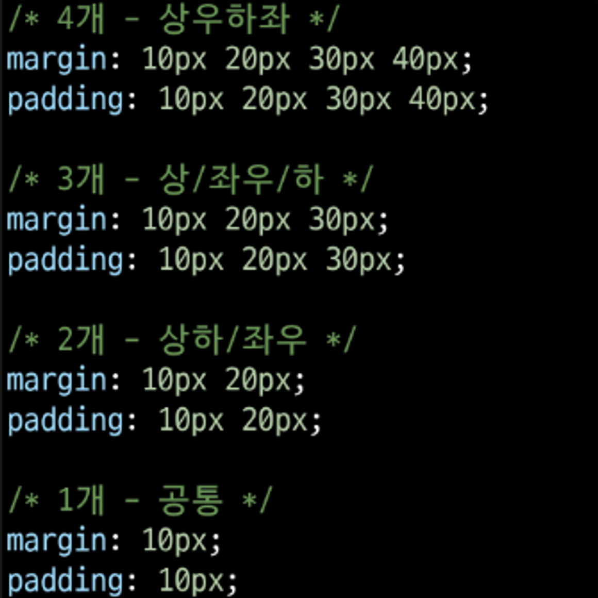
    

### 4) box-sizing 속성

- The standard CSS box model : 표준 상자 모델에서 width와 height 속성 값을 설정하면 이 값은 **content box의 크기**를 조정하게 됨. ⇒ 문제점 !!!!!
→ border box의 크기를 조정하게끔 옵션을 줄 수 있다.
    
    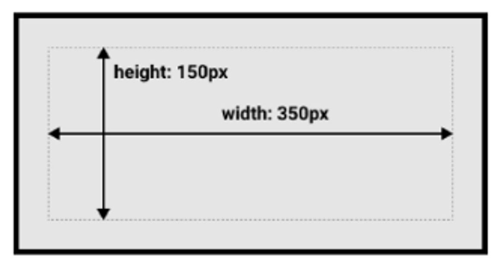
    
    - 실제 박스 크기는 350px이 아닌 테두리, 패딩 값을 모두 더한 값을 가짐
- The alternative CSS box model : 대체 상자 모델에서 모든 width와 height는 실제 상자의 너비 실제 박스 크기를 정하기 위해 테두리와 패딩을 조정할 필요 없음
    
    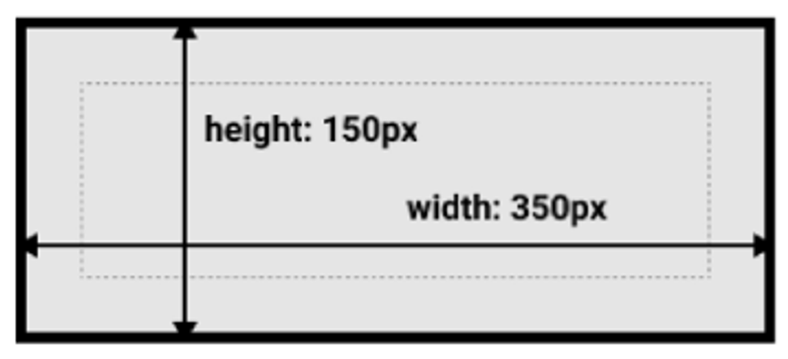
    
- 대체 상자 모델로 변경 : box-sizing 속성 !!
    - 무조건 테두리 기준이 편함. content box 기준은 생각하기 어려움
    
    ```html
    box-sizing : border-box
    ```
    

### 5) 기타 display 속성

- inline-block : inline과 block을 혼합시킨 것
    - inline과 block 요소 사이의 중간 지점을 제공하는 display 값
    - width 및 height 속성 사용 가능 (block의 특징)
    - padding, margin 및 border로 인해 다른 요소가 상자에서 밀려남 (block의 특징)
    - 새로운 행으로 넘어가지 않음 (inline의 특징)
    - **요소가 줄바꿈되는 것을 원하지 않으면서 너비와 높이를 적용하고 싶은 경우에 사용**
- none (표시를 안함)
    - 요소를 화면에 표시하지 않고, 공간조차 부여되지 않음
    - 예시
        
        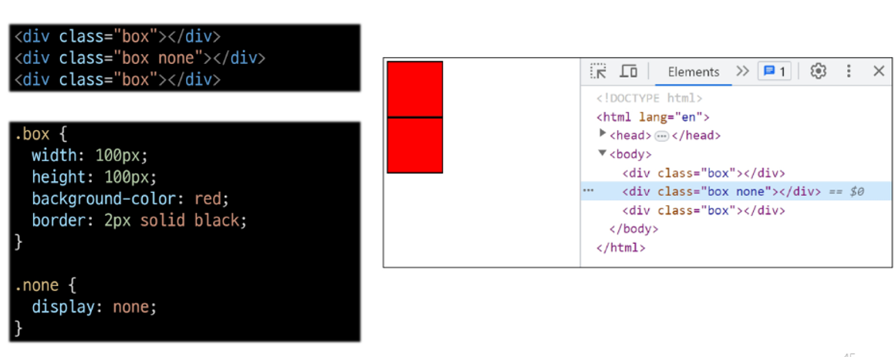
        
<br>

## 2. CSS position

### 1) 개요

- CSS Layout : 각 요소의 위치와 크기를 조정하여 웹페이지의 디자인을 결정하는 것
    - Display, Position, Flexbox (오른쪽으로 갈 수록 최신)
- CSS Position : 요소를 **Normal Flow에서 제거**하여 다른 위치로 배치하는 것
    - 다른 요소 위에 올리기(이미지 위에 뱃지), 화면의 특정 위치에 고정시키기,
- Position 이동 방향
    
    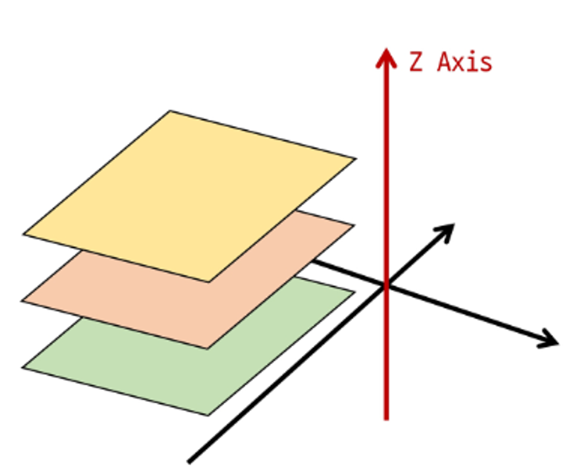
    

### 2) Position 유형

- static
    - 요소를 Normal Flow에서 제거
    - top, right, bottom, left 속성이 적용되지 않음
    - 기본 값
- relative
    - 요소를 Normal Flow에 따라 배치 (뜯어내지 않음. 밑에 있는게 차고 올라오지 않음)
    - 자신의 원래 위치(static)를 기준으로 이동
    - top, right, bottom, left 속성으로 위치를 조정
    - 다른 요소의 레이아웃에 영향을 주지 않음 (요소가 차지하는 공간은 static일 때와 같음)
    본인의 위치를 버리지 않음
- absolute
    - 요소를 Normal Flow에서 제거
    - 가장 가까운 relative 부모 요소를 기준으로 이동
        - 만족하는 부모 요소가 없다면 body 태그를 기준으로 함
    - top, right, bottom, left 속성으로 위치를 조정
    - 문서에서 요소가 차지하는 공간이 없어짐
- fixed
    - 요소를 Normal Flow 에서 제거
    - 현재 화면영역(view port)을 기준으로 이동
    - 스크롤해도 항상 같은 위치에 유지됨
    - top, right, bottom, left 속성으로 위치를 조정
    - 문서에서 요소가 차지하는 공간이 없어짐
- sticky
    - relative와 fixed의 특성을 결합한 속성
    - 스크롤 위치가 임계점에 도달하기 전에는 relative처럼 동작
    - 스크롤이 특정 임계점에 도달하면 fixed처럼 동작하여 화면에 고정됨
    - 만약 다음 sticky요소가 나오면 다음 sticky 요소가 이전 sticky 요소의 자리를 대체
        - 이전 sticky 요소가 고정되어 있던 위치와 다음 sticky 요소가 고정되어야 할 위치가 겹치게 되기 때문

### 3) z-index

- 요소의 쌓임 순서 (stack order)를 정의하는 속성
- 정수 값을 사용해 Z축 순서를 지정
- 값이 클수록 요소가 위에 쌓이게 됨
- static이 아닌 요소에만 적용됨

### 4) Position의 목적

- 전체 페이지에 대한 레이아웃을 구성하는 것보다는 페이지 특정 항목의 위치를 조정하는 것
- Position이 할 수 있는 일은 따로 있는 것. 전체 페이지의 구성을 그리는 일은 아님.

<br>

## 3. CSS Flexbox

### 1) 개요

- 박스 표시 (Display) 타입 : Inner display type에 해당
    - Outer display type
    - **Inner display type** : 박스 내부의 요소들이 어떻게 배치될지를 결정
        - 속성  : flex
- CSS Flexbox : 요소를 행과 열 형태로 배치하는 1차원 레이아웃 방식
    - 공간배열 & 정렬

### 2) Flexbox 구성요소

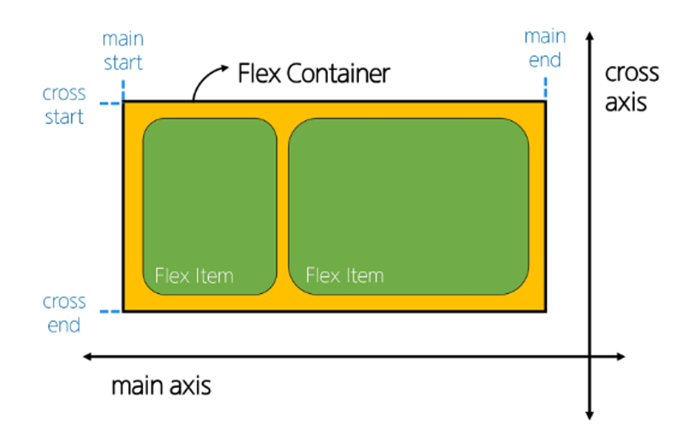

- main axis (주 축)
    - flex item들이 배치되는 기본 축
    - main start에서 시작하여 main end 방향으로 배치 (기본 값) → 고정X 변경 가능
        
    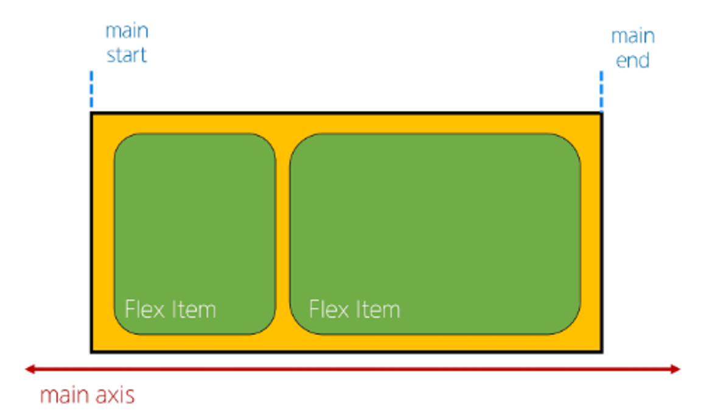
        
- cross axis (교차 축)
    - main axis에 수직인 축
    - cross start에서 시작하여 cross end 방향으로 배치 (기본 값)
        
    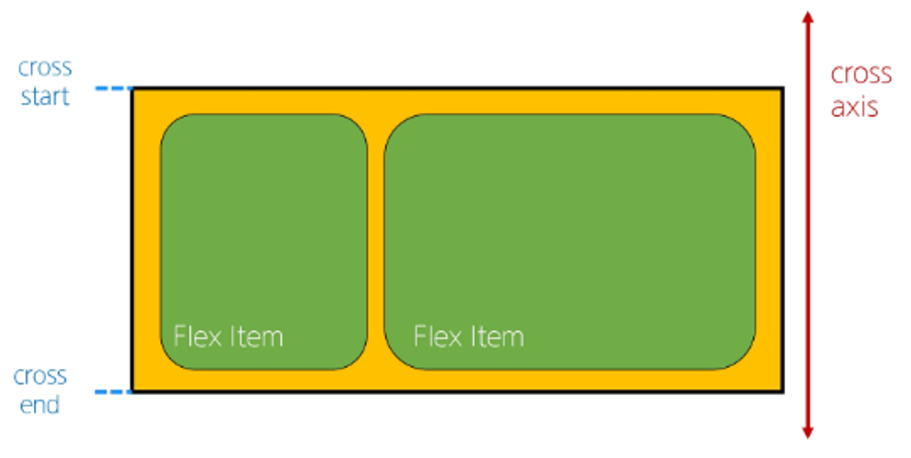
        
- Flex  Container (부모요소)
    - `display: flex;` 혹은 `display: inline-flex;`가 설정된 부모 요소
    - 이 컨테이너의 **1차 자식 요소들이 Flex Item이 됨**
    부모에게 옵션을 주면 자동으로 Flex Item이 됨
    - flexbox 속성 값들을 사용하여 자 식 요소 Flex Item들을 배치하는 주제
    
    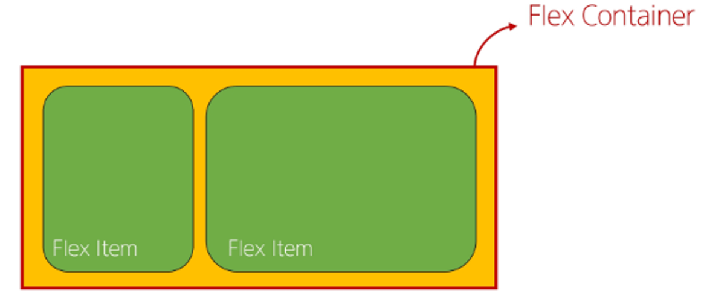
    
- Flex Item
    - Flex Container 내부에 레이아웃되는 항목
    
    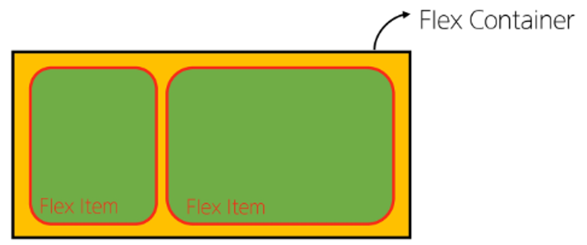
    

### 3) Flexbox 속성

- Flex Container 관련 속성
    - Flex Container 지정
        - flex item은 기본적으로 행 (주 축의 기본값인 가로 방향)으로 나열
        - flex item은 주 축의 시작선에서 시작
        - flex item은 교차 축의 크기를 채우기 위해 늘어남
    
    ```css
    .container {
        height: 500px;
        border: 1px solid black;
        display: flex;
    }
    ```
    
    - Flex-direction
        - flex item이 나열되는 방향을 지정
        - column으로 지정할 경우 주 축이 변경됨
        - `-reverse`로 지정하면 flex item 배치의 시작 선과 끝 선이 서로 바뀜
    
    ```css
    .container {
        flex-direction: row;
        flex-direction: column;
        flex-direction: rew-reverse;
        flex-direction: column-reverse;
    }
    ```
    
    - flex-wrap
        - flex item 목록이 flex container의 한 행에 들어가지 않을 경우, 다른 행에 배치할지 여부 설정
        
        ```css
        .container {
          flex-wrap: nowrap;
          flex-wrap: wrap;
        }
        ```
        
    - justify-content
        - 주 축을 따라 flex item과 주위에 공간을 분배
        
        ```css
        .container {
            justify-content: flex-start;
            justify-content: center;
            justify-content: flex-end;
        }
        ```
        
    - align-content
        - 교차 축을 따라 flex item과 주위에 공간을 분배
        - flex-wrap이 wrap 또는 wrap-reverse로 설정된 여러 행에만 적용됨
        - 한 줄 짜리 행에는 효과 없음 (flex-wrap이 nowrap으로 설정된 경우)
        
        ```css
        .container {
            align-content: flex-start;
            align-content: flex-center;
            align-content: flex-end;
        }
        ```
        
    - align-items
        - 교차 축을 따라 flex item 행을 정렬
        
        ```css
        .container {
            align-items: center;
        }
        ```
        
    - align-self
        - 교차 축을 따라 개별 flex item을 정렬
        - 부모 영역이 아닌, 안에 개별 item을 정렬하는 것
        
        ```css
        .item1 {
            align-self: center;
        }
        
        .item2 {
            align-self: flex-end;
        }
        ```
        
    - flex-grow
        - 남는 행 여백을 비율에 따라 각 flex item에 분배
        - 아이템이 컨테이너 내에서 확장하는 비율을 지정
        - flex-grow의 반대는 flex-shrink
        - 배율을 따지는게 아님. 남은 공간을 나눠서 개수로 분배
    - flex-basis
        - flex item의 초기 크기 값을 지정
        - flex-basis와 width 값을 동시에 적용한 경우 flex-basis가 우선

- Flex Item 관련 속성

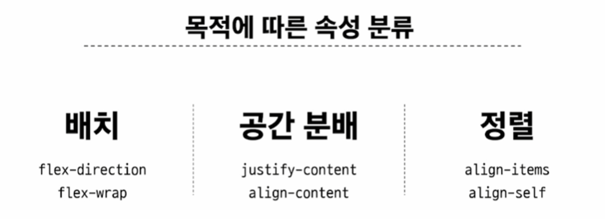

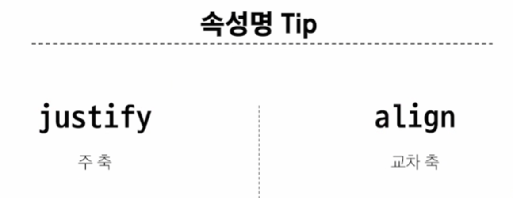

### 4) Flexbox 속성

- flex-wrap 응용 → 반응형 레이아웃 짤 수 있음.
- 다양한 디바이스와 화면 크기에 자동으로 적응하여 콘텐츠를 최적으로 표시하는 웹 레이아웃 방식