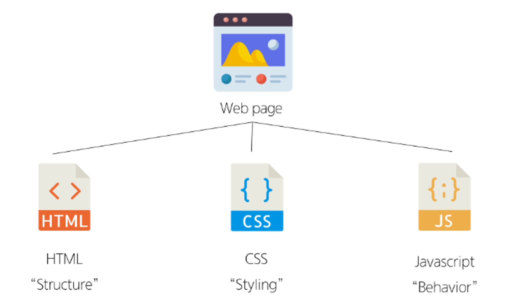
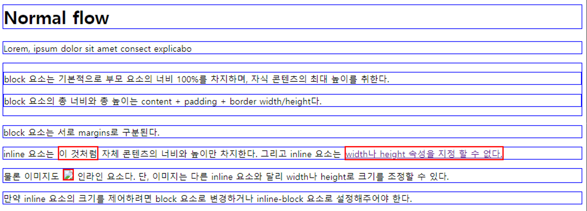

# HTML&CSS

## 1. 웹

### 1) 개요

- World Wide Web : 인터넷으로 연결된 컴퓨터들이 정보를 공유하는 거대한 정보 공간
- Web : Web site, Web application 등을 통해 사용자들이 정보를 검색하고 상호작용하는 기술
- Web site : 인터넷에서 여러 개의 Web page가 모인 것으로, 사용자들에게 정보나 서비스를 제공하는 공간
- Web page : HTML, CSS 등의 웹 기술을 이용하여 만들어진 “Web site”를 구성하는 하나의 요소

### 2) Web page 구성요소


<br>

## 2. 웹 구조화 (HTML)

### 1) HTML

- HyperText Markup Language : 웹페이지의 **의미와 구조**를 정의하는 언어 (참조)
- Hypertext : 웹페이지를 다른 페이지로 연결하는 링크. 참조를 통해 사용자가 한 문서에서 다른 문서로 즉시 접근할 수 있는 텍스트
    - 비선형성
    - 상호연결성
    - 사용자 주도적 탐색
- Markup Language : 태그 등을 이용하여 문서나 데이터의 구조를 명시하는 언어
    - ex) HTML, Markdown

### 2) HTML 구조

- `<!DOCTYPE html>`
    - 해당 문서가 html로 문서라는 것을 나타냄.
- `<html> </html>`
    - 전체 페이지의 콘텐츠를 포함
- `<title> </title>`
    - 브라우저 탭 및 즐겨찾기 시 표시되는 제목으로 사용
- `<head> </head>`
    - HTML 문서에 관련된 설명, 설정 등 컴퓨터가 식별하는 메타데이터를 작성
    - 사용자에게 보이지 않음 (태그값)
- `<body> </body>`
    - HTML 문서의 내용을 나타냄
    - 페이지에 표시되는 **모든 콘텐츠**를 작성
    - 한 문서에 하나의 body 요소만 존재

### 3) HTML Element (요소)

- 하나의 요소는 여는 태그와 닫는 태그 그리고 그 안의 내용으로 구성됨.
- 닫는 태그는 태그 이름 앞에 슬래시가 포함됨.
    - 닫는 태그가 없는 태그도 존재 : **Content가 있는 태그는 무조건 닫아야 함.**

### 4) HTML Attributes (속성)

- 사용자가 원하는 기준에 맞도록 요소를 설정하거나 다양한 방식으로 요소의 동작을 조절하기 위한 값
- 목적
    - 나타내고 싶지 않지만 추가적인 기능, 내용을 담고 싶을 때 사용
    - CSS에서 스타일 적용을 위해 해당 요소를 선택하기 위한 값으로 활용됨.
- 작성 규칙
    - 속성은 요소 이름과 속성 사이에 공백이 있어야 함.
    - 하나 이상의 속성들이 있는 경우엔 속성 사이에 공백으로 구분함
    - 속성 값은 열고 닫는 따옴표로 감싸야 함. (””)
- ! + tab : 기본 코드 제공

### 5) HTML Text structure

- 문단
    - `<h1>Heading</h1>` : 예를 들어 h1 요소는 단순히 텍스트를 크게만 만드는 것이 아닌 현재 문서의 최상위 제목이라는 의미를 부여하는 것
    - `<p> Paragraphs </p>` : 문단
- Lists
    - ol (ordered list)
    - ul (unordered list)
    - li
- Emphasis & Importance
    - em
    - strong

<br>

## 3. 웹 스타일링

### 1) CSS

- Cascading Style Sheet
- 웹페이지의 디자인과 레이아웃을 구성하는 언어
- 구문
    
    ```css
    h1 {
    	color: red;
    	font-size: 30px;
    }
    ```
    

### 2) CSS 적용 방법

- **인라인 (Inline) 스타일**
    - HTML 요소 안에 style 속성 값으로 작성
    
- **내부 (Internal) 스타일 시트**
    - head 태그 안에 style 태그에 작성
    
- **외부 (External) 스타일 시트**
    - 별도 CSS 파일 생성 수 HTML link 태그를 사용해 불러오기
    - 확장성이 크다
    

### 3) CSS 선택자 (CSS Selectors)

- 정의 : HTML 요소를 선택하여 스타일을 적용할 수 있도록 하는 선택자
- 종류
    - 기본 선택자
        - 전체(*)선택자 : HTML 모든 요소를 선택
        - 요소(tag)선택자 : 지정한 모든 태그를 선택 (전체선택자와 함께 쓸 경우 더 강력)
        - **클래스**(class) 선택자 (.) : 주어진 클래스 속성을 가진 모든 요소를 선택
        - **아이디**(id) 선택자 : 주어진 아이디 속성을 가진 요소 선택. 문서에는 주어진 아이디를 가진 요소가 하나만 있어야 함.
        - 속성(attr)선택자 등
    - 결합자 (Combinators)
        - 자손 결합자 (” “(공백)) : 첫 번째 요소의 자손 요소들 선택
            - ex) `p span`은 <p>안에 있는 모든 <span>을 선택 (하위 레벨 상관 없이)
        - 자식 결합자 (”>”) : 첫 번째 요소의 직계 자식만 선택
            - ex) `ul > li` 은 <ul> 안에 있는 모든 <li>를 선택 (한단계 아래 자식들만)

### 4) 명시도 (specifity)

- 결과적으로 요소에 적용할 CSS 선언을 결정하기 위한 알고리즘
- CSS Selector에 가중치를 계산하여 어떤 스타일을 적용할지 결정
    - 동일한 요소를 가리키는 2개 이상의 CSS 규칙이 있는 경우
    가장 높은 명시도를 가진 Selector가 승리하여 승리하여 스타일이 적용됨
    - 한 요소에 동일한 가중치를 가진 선택자가 적용될 때 CSS에서 마지막에 나오는 선언이 사용됨
- 명시도가 높은 순
    - importance `!important`
        - 다른 우선순위 규칙보다 우선하여 적용하는 키워드
        - Cascade의 구조를 무시하고 강제로 스타일을 적용하는 방식이므로 사용을 권장하지 않음
    - Inline스타일
    - 선택자 : id선택자 > **class선택자** > 요소선택자
    - 소스 코드 선언 순서

<br>

## 4. 상속

### 1) CSS 상속

- 기본적으로 CSS는 상속을 통해 부모 요소의 속성을 자식에게 상속해 재사용성을 높임
- 상속 여부 확인 : MDN의 각 속성별 문서 하단에서 상속 여부를 확인할 수 있음

### 2) CSS 속성 2가지 분류

- 상속되는 속성
    - Text 관련 요소 (font, color, text-align), opacity, visibility 등
- 상속되지 않는 속성
    - Box model 관련 요소 (width, height, border, box-sizing)
    - position 관련 요소 (position, top/right/bottom/left, z-index) 등

<br>

## 5. CSS Box Model

> 웹페이지의 모든 HTML 요소를 감싸는 사각형 상자 모델
> 

### 1) 박스 타입

> 박스 타입에 따라 페이지에서의 배치 흐름 및 다른 박스와 관련하여 박스가 동작하는 방식이 달라짐
> 
- Block box
- Inline box

### 2) 박스 표시 (Display) 타입

- Outer display type
    - 박스가 문서 흐름에서 어떻게 동작할지를 결정
    - 속성
        - block
        - inline
    
    ```css
    .index {
    	display: block;
    }
    
    .index {
    	display: inline;
    }
    ```
    
- Inner display type
    - Flexbox
        
        ```css
        .container {
        	display: flex;
        }
        ```
        

### 3) Normal flow

- 일반적인 흐름 또는 레이아웃을 변경하지 않은 경우 웹 페이지 요소가 배치되는 방식
- 예시
    
    
    
<br>

## 6. 참고

### 1) HTML 스타일 가이드

- 대소문자 구분
    - HTML은 대소문자를 구분하지 않지만, 소문자 사용을 강력히 권장
    - 태그명과 속석명 모두 소문자로 작성
- 속성 따옴표 : 속성 값에는 큰 따옴표(”)를 사용하는 것이 일반적
- 공백 처리
    - HTML은 연속된 공백을 하나로 처리
    - Enter키로 줄바꿈을 해도 브라우저에서 인식하지 않음 (줄바꿈태그를 사용해야 함)
- 에러 출력 없음 : HTML 은 문법 오류가 있어도 별도의 에러 메시지를 출력하지 않음
- 코드 구조와 포맷팅
    - 일관된 들여쓰기를 사용 (보통 2칸 공백)
    - 각 요소는 한 줄에 한씩 작성
    - 중첩된 요소는 한 단계 더 들여쓰기

### 2) CSS 스타일 가이드

- 코드 구조와 포맷팅
    - 일관된 들여쓰기를 사용 (보통 2칸 공백)
    - 선택자와 속성은 각각 새 줄에 작성
    - 중괄호 앞에 공백 넣기
    - 속성 뒤에는 콜론과 공백 넣기
    - 마지막 속성 뒤에는 세미콜론 넣기
- 선택자 사용
    - class 선택자를 우선적으로 사용
    - id, 요소 선택자 등은 가능한 피할 것
    - 여러 선택자들과 함께 사용할 경우 우선순위 규칙에 따라 예기치 못한 스타일 규칙이 적용되어 전반적인 유지보수가 어려워지기 때문
- 속성과 값
    - 속성과 값은 소문자로 작성
    - 0값에는 단위를 붙이지 않음
- 명명 규칙
    - 클래스 이름은 의미 있고 목적을 나타내는 이름 사용
    - 케밥 케이스 (kebab-case)를 사용
    - 약어보다는 전체 단어를 사용
- CSS 적용 스타일
    - 인라인 (inline)스타일은 되도롤 사용하지 말 것
    - CSS와 HTML 구조 정보가 혼합되어 작성되기 때문에 코드를 이해하기 어렵게 만듦