# Responsive Web

## 1. Bootstrap Grid system

### 1) Grid system 개요

- 웹페이지의 레이아웃을 조정하는 데 사용되는 12개의 컬럼으로 구성된 시스템
- Grid sysyem 목적
: 반응형 디자인을 지원해 웹 페이지를 모바일, 태블릿, 데스크탑 등 다양한 기기에서 적절하게 표시할 수 있도록 도움
- **반응형 웹 디자인** : 디바이스 종류나 화면 크기에 상관없이, 어디서든 일관된 레이아웃 및 사용자 경험을 제공하는 디자인 기술

### 2) Grid system 구조

- Grid system 기본 요소
    - Container : Column들을 담고 있는 공간
    - Column : 실제 컨텐츠를 포함하는 부분
    - Gutter : 컬럼과 컬럼 사이의 여백 영역
    - 1개의 row 안에 12개의 column 영역이 구성
    → 각 요소는 12개 중 몇 개를 차지할 것인지 지정됨.

    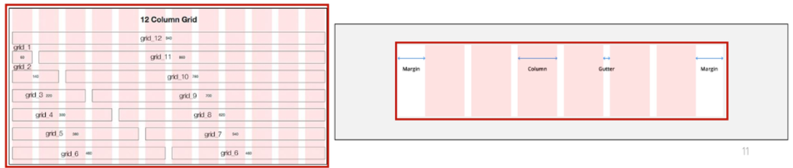

### 3) Grid System 실습

- 기본

    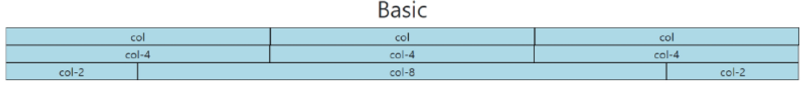
    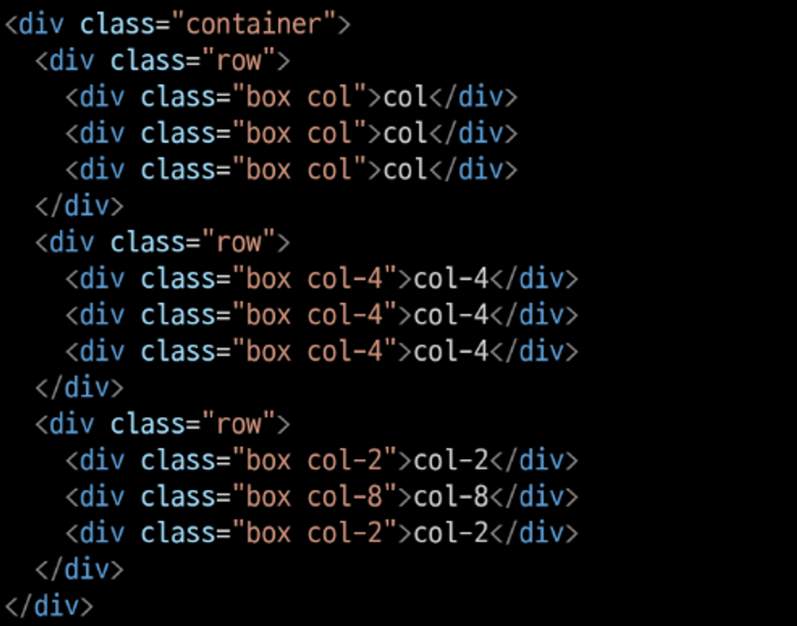

- 중첩 (Nesting)

    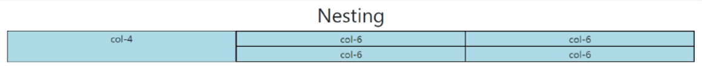

    ![image.png]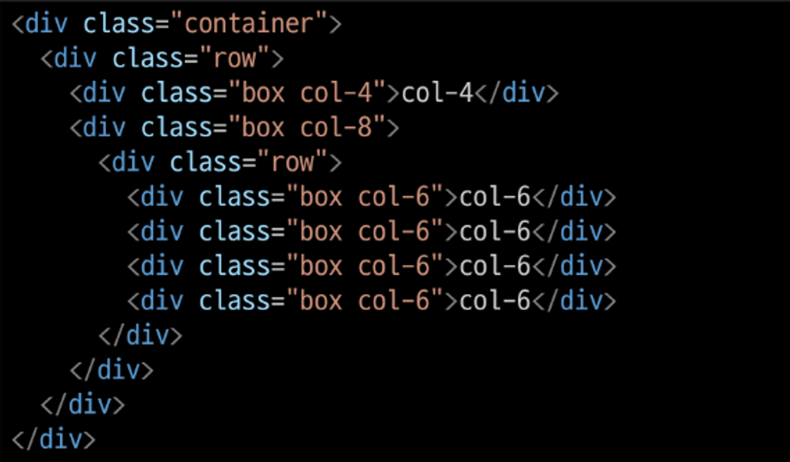

- 상쇄 (Offset)

    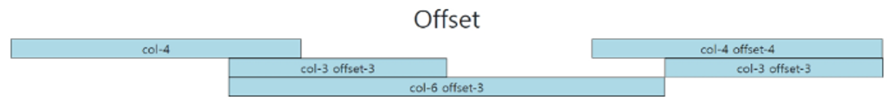

    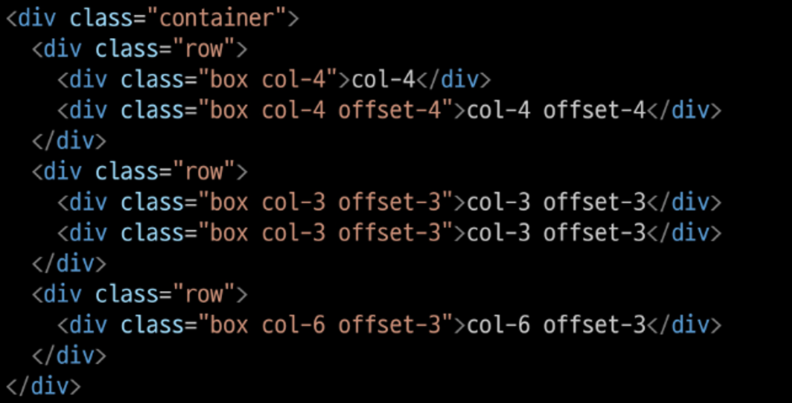

- Gutters
    - Grid system에서 column 사이에 여백 영역
    - x축은 padding, y축은 margin으로 여백 생성 (margin은 12가 넘어가버리면 터지기 때문)
    
    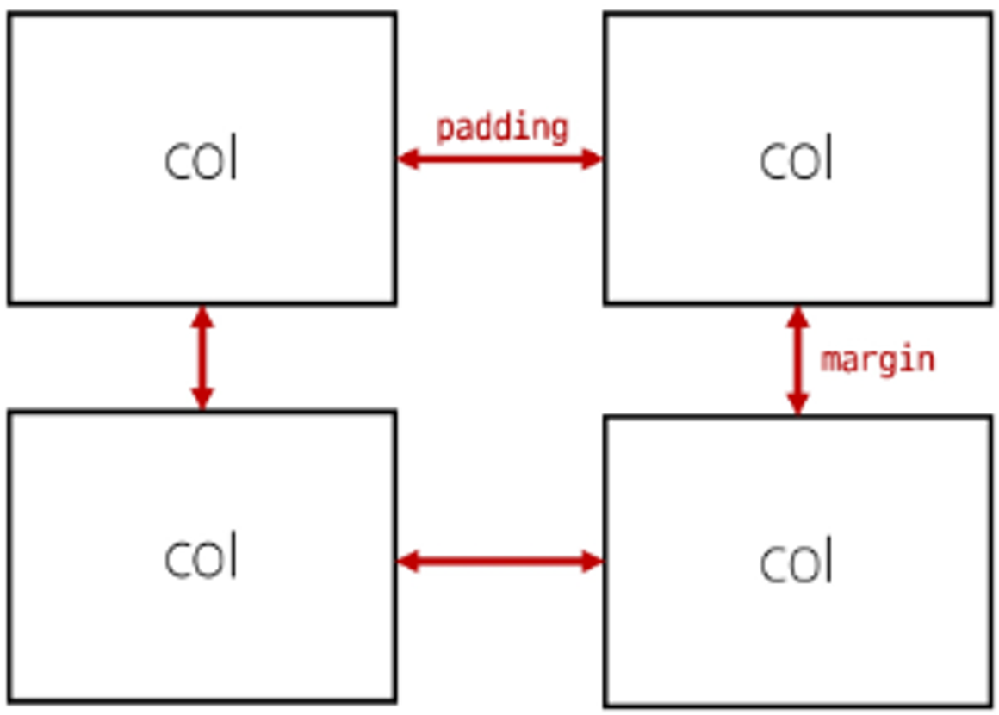
    
    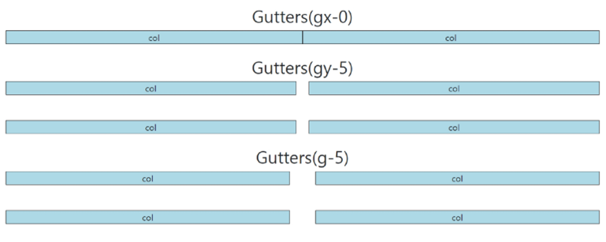
        
    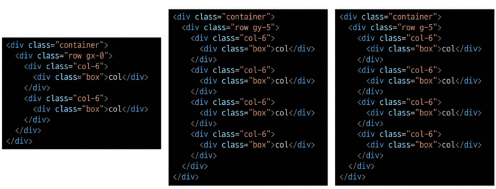
    
 

## 2. Grid system for responsive web

### 1) 개요

- Resposponsive Web
- Bootstrap grid system에서는 12개 column과 **6개의 breakpoints**를 사용하여 반응형 웹 디자인을 구현

### 2) Grid system breakpoints

- 웹페이지를 다양한 화면 크기에서 적절하게 배치하기 위한 분기점
    - 화면 너비에 따라 6개의 분기점 제공 (xs, sm, md, lg, xl, xxl)
- 각 breakpoints마다 설정된 최대 너비 값 “이상으로” 화면이 커지면 grid system 동작이 변경됨

### 3) Breakpoints 실습

- Breakpoints
    
    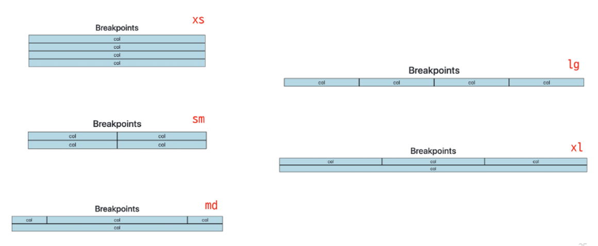
    
    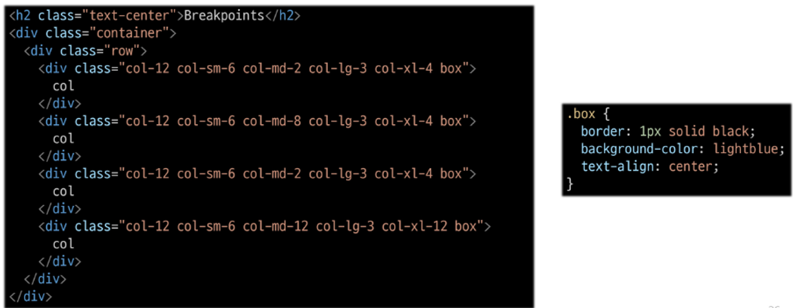
    
- Breakpoints + offset
    
    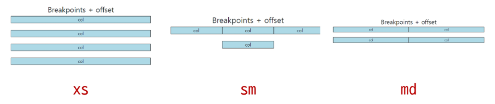
    
    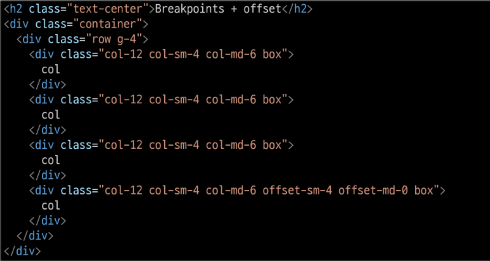
    

## 3. CSS Layout 종합 정리

- CSS 레이아웃 기술들은 각각 고유한 특성과 장단점을 가지고 있음
- 이들은 상호보완적이며, 특정 상황에 따라 적합한 도구가 달라짐
- 최적의 기술을 선택하고 효과적으로 활용하기 위해서는 다양한 실제 개발 경험이 필수적

## 4. UX&UI

### 1) UX

- 제품이나 서비스를 사용하는 사람들이 느끼는 전체적인 경험과 만족도를 개선하고 최적화하기 위한 디자인과 개발 분야
- UX 설계
    - 사람들의 마음과 생각을 이해하고 정리해서 제품에 녹여내는 과정
    - 유저 리서치, 데이터 설계 및 정제, 유저 시나리오, 프로토타입 설계

### 2) UI

- 서비스와 사용자 간의 상호작용을 가능하게 하는 디자인 요소들을 개발하고 구현하는 분야
- UI 설계
    - 예쁜 디자인보다는 사용자가 더 쉽고 편리하게 사용할 수 있도록 고려
    - 이를 위해서는 디자인 시스템, 중간 산출물, 프로토타입 등이 필요

## 5. 참고

### 1) emmet

https://docs.emmet.io/cheat-sheet/

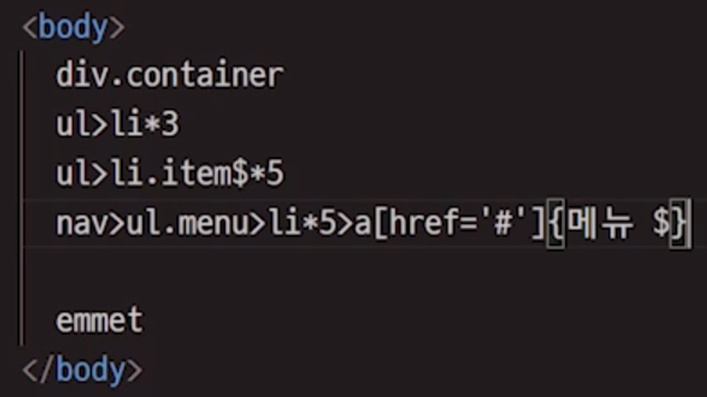

### 2) The Grid System

- CSS가 아닌 편집 디자인에서 나온 개념으로 구성 요소를 잘 배치해서 시각적으로 좋은 결과물을 만들기 위함.
- 기본적으로 안쪽에 있는 요소들의 오와 열을 맞추는 것에서 기인
- 정보 구조와 배열을 체계적으로 작성하여 정보의 질서를 부여하는 시스템